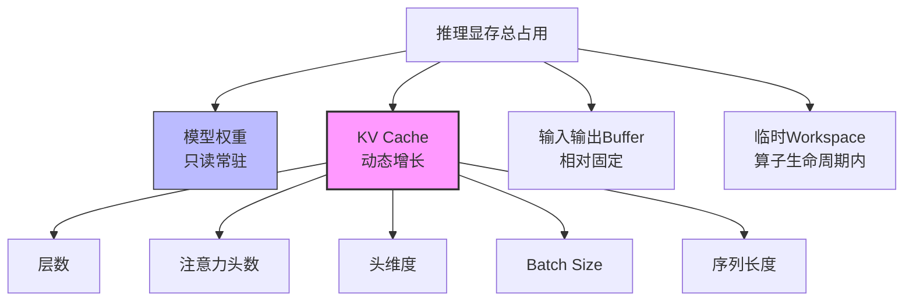
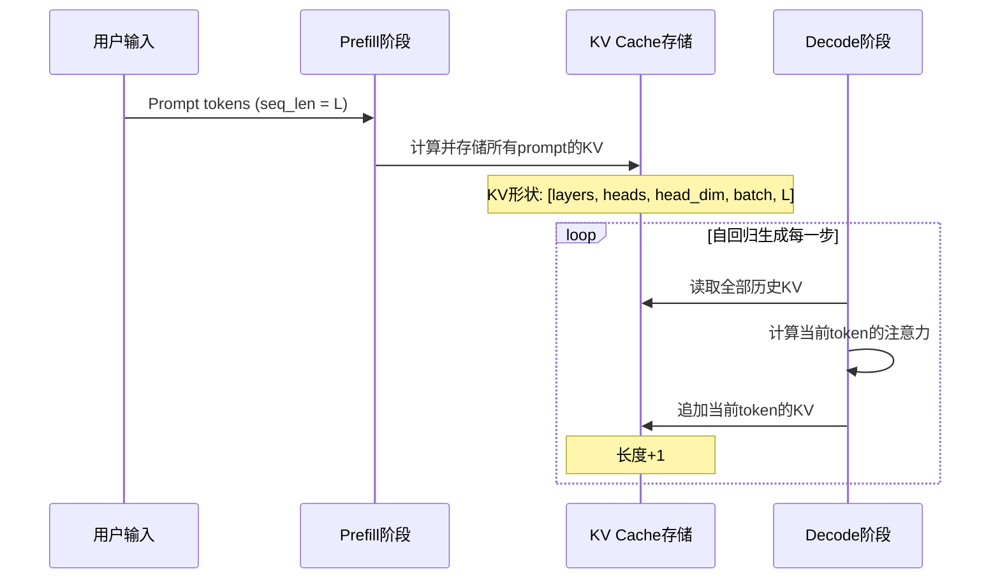

深度学习推理阶段的GPU内存管理与训练阶段存在本质差异。训练时的显存账单由参数、梯度、优化器状态和激活值共同构成，而推理时既没有反向传播产生的梯度，也不存在优化器状态的持久驻留，但多了一个训练阶段无需面对的显存巨头：KV cache。本章将建立推理显存的结构化认知，分析KV cache的膨胀规律，区分不同推理模式下的内存特征，并为工程决策提供可操作的估算框架。如果你尚未建立GPU内存硬件层次的基础认知，建议先回顾[GPU硬件内存层次解析](4-gpuying-jian-nei-cun-ceng-ci-jie-xi)与[地址空间、页表与虚拟内存](5-di-zhi-kong-jian-ye-biao-yu-xu-ni-nei-cun)。

Sources: [gpu_memory_management_tutorial.md](gpu_memory_management_tutorial.md#L6153-L6167)

## 推理显存账单：四大构成项

推理阶段的显存占用由四个核心部分构成，它们的关系可以用下图表示。与训练阶段不同，推理不存在梯度和优化器状态，但KV cache作为动态增长项，其规模可能远超模型权重本身。

模型权重在推理时通常以只读方式常驻显存，其大小由参数量和精度决定，例如一个13B参数的模型在FP16下占用约26GB。输入输出buffer包括token IDs、logits、位置编码等辅助张量，规模相对较小。临时workspace则由具体算子实现决定，如softmax、layernorm或矩阵乘的split-k buffer，通常在算子执行期间申请并释放。真正让推理显存管理变得复杂的是KV cache：在自回归生成过程中，它需要持续累积历史token的key和value张量，且规模与batch size和序列长度成正比扩张。

Sources: [gpu_memory_management_tutorial.md](gpu_memory_management_tutorial.md#L6188-L6234)

## KV Cache：自回归生成的显存核心

KV cache的存在源于Transformer自回归解码的计算依赖特性。当模型生成第N个token时，注意力机制需要访问之前所有token的key和value，以避免重复计算。如果不做缓存，每次生成都需要重新计算历史token的KV，计算复杂度将随序列长度平方增长。推理框架通过将已生成token的KV张量显式缓存，将计算复杂度降为线性，但代价是显存占用随序列持续累积。

自回归生成的两个阶段在显存行为上截然不同。Prefill阶段（也称prompt processing阶段）一次性并行处理输入prompt的所有token，计算并存储它们的KV值；此阶段激活值较大，但KV cache是一次性写入。Decode阶段则逐个生成新token，每次将新生成token的KV追加到cache中；此阶段激活值较小，但KV cache随生成步数持续增长。下图展示了decode阶段KV cache的累积过程：

这种"读全量、追加一行"的访问模式，使得KV cache的显存占用可以用以下简化公式估算：

$$KV\_cache\_size = 2 \times num\_layers \times num\_heads \times head\_dim \times batch\_size \times seq\_len \times sizeof(dtype)$$

其中系数2表示key和value各一份。以具体数字感知其规模：假设80层、64头、头维度128、batch size 32、序列长度4096、FP16精度，KV cache将达到约343.6 GB。这仅是一个batch的占用，如果同时服务多个请求或处理更长上下文，KV cache轻松超过模型权重本身，成为推理系统的首要显存瓶颈。

Sources: [gpu_memory_management_tutorial.md](gpu_memory_management_tutorial.md#L6239-L6276)

## 结构性优化：GQA与MQA如何压缩KV Cache

Grouped-Query Attention (GQA) 和 Multi-Query Attention (MQA) 是从模型架构层面降低KV cache显存占用的关键设计。标准多头注意力（MHA）中每个查询头对应独立的key头和value头，而MQA让所有查询头共享同一组key和value，将KV cache直接降至原来的 $1/num\_heads$。GQA则采取中间路线，让查询头分组共享KV头，在压缩率和模型质量之间取得平衡。

这种结构性优化与后续介绍的量化、分页缓存等技术不同：它不是运行时策略，而是模型设计阶段就确定的内存契约。如果模型已经采用MQA架构，推理系统的KV cache预算天然就远小于同规模的MHA模型。这意味着推理显存规划不能脱离模型结构孤立进行，工程师需要在选型阶段就将注意力机制配置纳入容量评估。

Sources: [gpu_memory_management_tutorial.md](gpu_memory_management_tutorial.md#L6277-L6284)

## 推理模式决定显存特征

不同的推理部署模式在显存行为上表现出显著差异，理解这些差异是避免"平均情况设计"陷阱的前提。

| 推理模式 | 显存特征 | KV cache行为 | 主要瓶颈 | 典型场景 |
|:---|:---|:---|:---|:---|
| 单次推理 | 占用低，生命周期短 | 随单条序列线性增长 | 延迟 | 本地实验、脚本调用 |
| 离线批处理 | batch size大，显存压力大 | 与batch size成正比膨胀 | 容量 | 数据集推理、离线评估 |
| 流式服务 | 多请求共存，长度动态变化 | 动态分配与释放，碎片化风险高 | 容量+碎片 | 在线LLM服务 |
| 长文本推理 | 序列长度极大 | 可能超过权重的最大单项 | 容量 | 文档分析、代码生成 |

单次推理模式下，显存通常不是首要矛盾，因为batch size为1且请求完成后立即释放。离线批处理通过增大batch size提升吞吐，但KV cache与batch size的线性关系会迅速触及显存墙。流式服务是最复杂的场景：不同请求到达时间不同、生成长度不可预测、KV cache需要服务整个请求生命周期，这导致内存碎片问题可能比训练阶段更严重，也是PagedAttention等分页缓存技术诞生的核心驱动力。长文本推理则直接将序列长度推向极端，使得KV cache压缩、驱逐或分层策略成为必要选项。

Sources: [gpu_memory_management_tutorial.md](gpu_memory_management_tutorial.md#L6317-L6342)

## Prefill与Decode：两阶段显存辩证法

许多推理性能问题源于对prefill和decode阶段显存特征的混淆。Prefill阶段虽然计算密度高，但本质是一次性前向传播，其激活值较大而KV cache写入是一次性的；此阶段的显存峰值通常来自中间激活张量。Decode阶段计算密度低，但每一步都在扩大KV cache的足迹，且因逐token生成导致GPU计算单元利用率不足。

这种差异意味着两阶段的优化策略不能混用。Prefill阶段更关注激活值的临时显存峰值和并行计算效率；Decode阶段则更关注KV cache的存储效率和内存分配策略。在工程实践中，某些推理框架会对两阶段采用不同的kernel实现、不同的batch策略甚至不同的显存分配器行为。如果你在 profiling 时发现显存曲线呈现"先陡后缓持续增长"的形态，那正是prefill阶段完成、decode阶段持续累积KV cache的典型签名。

Sources: [gpu_memory_management_tutorial.md](gpu_memory_management_tutorial.md#L6379-L6384)

## 常见误区与工程建议

在推理显存管理实践中，有四个误区反复出现，它们往往源于用训练阶段的直觉直接套用到推理场景。

| 误区 | 实际情况 | 风险 |
|:---|:---|:---|
| 推理显存一定比训练少 | 大batch长序列推理中，KV cache可使总显存超过训练单步显存 | 离线部署时低估显存需求导致OOM |
| 模型量化只影响权重 | 若KV cache保持FP16，它会成为量化后的新瓶颈 | 权重减半但KV cache仍占主导，优化收益不及预期 |
| batch size越大越好 | KV cache线性增长，存在硬性的显存墙上限 | 盲目增大batch导致服务崩溃或频繁换入换出 |
| 推理不需要关心内存碎片 | 流式服务的动态请求导致碎片问题可能比训练更严重 | 长时间运行后可用显存"虚高"，大请求分配失败 |

针对这些误区，工程实践中有四条核心建议。第一，始终把KV cache纳入显存预算的首项评估，不要仅按模型权重的固定值规划容量。第二，掌握简化版KV cache公式，在设计阶段就能快速判断batch size和序列长度的可行边界。第三，在模型选型阶段就关注GQA/MQA配置，因为架构层面的压缩比事后任何运行时优化都更稳定。第四，流式服务必须按峰值情况预留显存余量，动态请求的不可预测性意味着平均负载估算具有误导性。

Sources: [gpu_memory_management_tutorial.md](gpu_memory_management_tutorial.md#L6345-L6388)

## 本章小结与延伸阅读

推理场景的GPU内存管理可以归结为一句话：**权重是常量，KV cache是变量，而变量常常比常量更大**。本章建立了以下核心认知：

1. 推理显存构成与训练本质不同：没有梯度和优化器状态，KV cache是新增的核心项。
2. KV cache规模与层数、头数、头维度、batch size、序列长度成正比，长序列大batch下可超过权重。
3. GQA/MQA通过架构层面的KV头共享，从根本上降低cache容量。
4. 单次推理、离线批处理、流式服务、长文本推理四种模式的显存特征差异显著，需差异化设计。
5. Prefill阶段关注激活峰值，Decode阶段关注KV累积，两阶段优化策略不可混用。
6. 流式服务中的动态请求使内存碎片成为真问题，不能照搬训练的静态分配假设。

本章聚焦于推理显存的**构成与规律**分析。关于如何实际优化这些显存开销——包括权重量化与KV cache量化的位宽选择、PagedAttention分页缓存的内存管理原理、以及Continuous Batching连续批处理的调度机制——请参考下一章[推理优化：量化、分页缓存与连续批处理](16-tui-li-you-hua-liang-hua-fen-ye-huan-cun-yu-lian-xu-pi-chu-li)。如果你想理解训练场景与推理场景的显存差异对比，亦可回溯阅读[训练场景GPU内存构成分析](13-xun-lian-chang-jing-gpunei-cun-gou-cheng-fen-xi)。