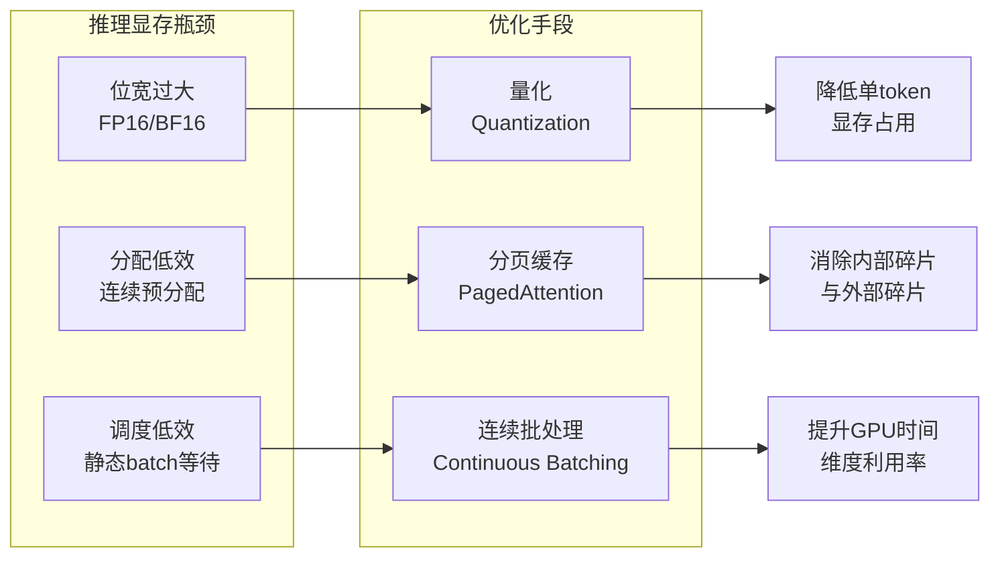
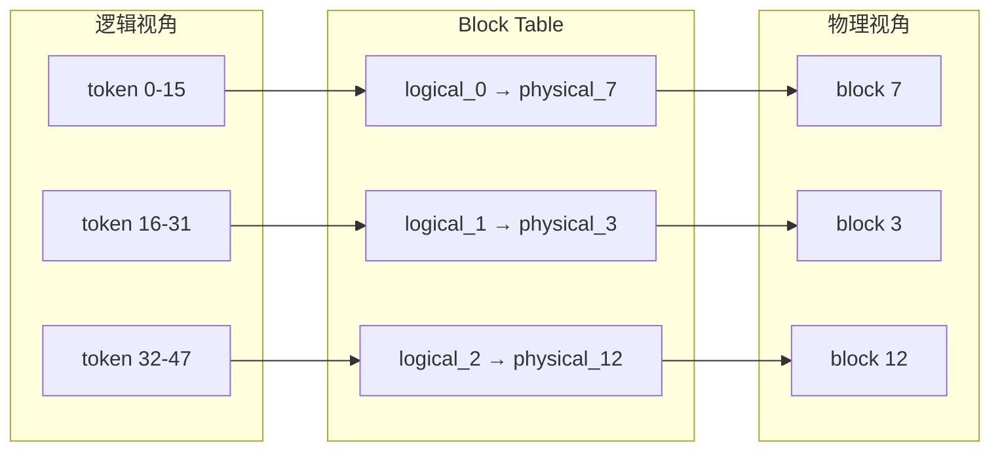
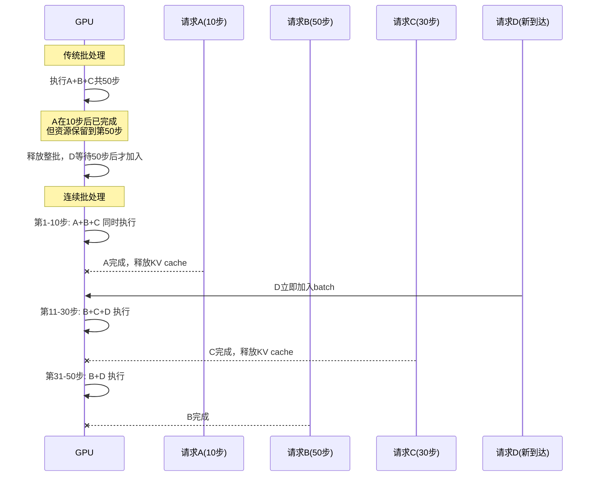

在理解了推理显存由权重、KV cache、输入输出 buffer 和临时 workspace 四项构成的基础上（详见[推理场景GPU内存管理](15-tui-li-chang-jing-gpunei-cun-guan-li)），本章将深入三个能够实质性改变推理系统吞吐与容量边界的核心优化方向：**量化**通过压缩位宽直接削减显存 footprint；**分页缓存（PagedAttention）**借鉴操作系统虚拟内存思想，将 KV cache 从连续预分配改造为按需离散分配；**连续批处理（Continuous Batching）**则打破静态 batch 的等待壁垒，让请求在时间维度上动态进出。三者既可独立使用，又存在深刻的互补关系——量化降低单请求的显存密度，分页缓存消除空间浪费，连续批处理提升时间利用率，组合起来构成了当前大模型推理服务的主流技术栈。

Sources: [gpu_memory_management_tutorial.md](gpu_memory_management_tutorial.md#L6407-L6432)

---

## 核心框架：三大优化的作用域

推理显存优化的本质，是分别从**位宽**、**空间分配效率**和**时间调度效率**三个维度对显存账单进行重构。下面这张图展示了三种技术各自瞄准的瓶颈层级：

量化的作用是"把每个数变小"，直接作用于张量元素的位宽；分页缓存的作用是"把空间切细、按需取用"，作用于 KV cache 的物理存储布局；连续批处理的作用是"不让 GPU 空等"，作用于请求在 batch 中的生命周期调度。理解这三者的作用域边界，是避免"用一种技术去解决另一种问题"的前提。

Sources: [gpu_memory_management_tutorial.md](gpu_memory_management_tutorial.md#L6426-L6432)

---

## 量化：用精度换容量

量化的直觉非常直接：FP16 每个参数占 2 字节，INT8 占 1 字节，INT4 占 0.5 字节。显存占用与位宽成正比下降。但量化并非简单的"存储截断"，而是一个将浮点数映射到低位宽整数空间的系统工程，涉及 scale、zero_point 的选择，以及 per-channel、per-token、per-block 等不同粒度的校准策略。

从显存影响的角度，量化可以在不同层次实施：

| 量化层次 | 作用对象 | 权重显存 | KV cache 显存 | 计算类型 |
|:---|:---|:---|:---|:---|
| 权重量化 (W) | 仅模型参数 | 50% (INT8) / 25% (INT4) | 100% | FP16/INT8 |
| 权重+激活量化 (WA) | 参数与激活值 | 50% | 50% | INT8 |
| KV cache 量化 | 仅 KV cache | 100% | 50% (INT8) | FP16/INT8 |
| 全量化 | 上述全部 | 25% | 50% | INT8/INT4 |

以 70B 参数模型为例，FP16 权重约 140 GB；INT8 权重量化后降至 70 GB；INT4 权重量化后仅 35 GB。如果同时把 KV cache 量化到 INT8，则 KV cache 也能减半。需要特别注意的是，上一章提到的误区——"模型量化只影响权重"——在 INT4 权重量化后尤其危险：若 KV cache 仍保持 FP16，长序列大 batch 场景下 KV cache 将迅速反超权重成为新的显存瓶颈。

量化的代价体现在三个层面。首先是精度损失，低位宽的动态范围有限，某些对数值敏感的任务（如代码生成、数学推理）可能出现质量退化。其次是计算复杂度，量化后的张量需要反量化或专用 kernel（如 CUTLASS、Marlin、AWQ kernel）支持才能正确参与矩阵乘法。最后是工程复杂度，需要校准数据集、评估指标和回滚策略。

Sources: [gpu_memory_management_tutorial.md](gpu_memory_management_tutorial.md#L6435-L6485)

---

## 分页缓存：把 KV cache 当"虚拟内存"管理

传统推理系统为每个请求预分配一块连续的 KV cache 内存，大小按最大可能序列长度计算。这种策略在请求实际长度远小于最大长度时产生严重的**内部碎片**，在请求动态释放后产生**外部碎片**，两者共同导致显存利用率低下。

PagedAttention 的核心灵感来自操作系统的分页内存管理。它将 KV cache 切割为固定大小的 block（典型如 16 个 token 一块），通过**block table**建立逻辑块到物理块的映射，使得逻辑上连续的 KV cache 在物理上可以分散存储。

这种设计带来了四项显存收益：第一，**消除内部碎片**，只分配实际需要的 block，最后一个 block 内的未用位置是唯一浪费；第二，**减少外部碎片**，固定大小的 block 回收和复用更容易；第三，**支持按需增长**，序列长度动态扩展时追加 block 即可，无需预先申请最大长度；第四，**支持共享**，不同序列（如 beam search 的多个候选、parallel sampling 的多个输出）可以共享相同的物理 block，只在发生 divergence 时才 copy-on-write。

假设最大序列长度 4096、block size 16，传统方式为一个实际只生成 100 tokens 的请求预分配 4096 个位置，浪费 97.5%；PagedAttention 仅需 ceil(100/16) = 7 个 block，浪费压缩到最后一个 block 内的 6 个 token 位置。vLLM 正是基于这一机制，使 GPU 显存中可同时容纳的请求数量大幅提升。

Sources: [gpu_memory_management_tutorial.md](gpu_memory_management_tutorial.md#L6488-L6548)

---

## 连续批处理：不让 GPU 闲着

传统静态批处理的流程是：收集一批请求 → 一起执行 → 等最慢的请求完成 → 整批释放 → 收集下一批。这种模式的致命缺陷在于，快的请求必须等待慢的请求，新请求必须等待当前 batch 结束，GPU 在"整批收尾"阶段存在明显的空闲窗口。

连续批处理（Continuous Batching，也称 in-flight batching 或 iterative scheduling）的核心思想是：**不等待整批完成，每当有请求完成或新请求到达，就重新组织当前 batch**。这类似于操作系统的时间片轮转调度——进程不是跑完一个再跑下一个，而是在就绪队列中动态切换。

对显存管理而言，连续批处理提出了新的要求：请求动态进出意味着 KV cache 的生命周期各不相同，需要底层内存管理机制支持**按需分配**和**即时回收**。这正是 PagedAttention 与连续批处理天然互补的原因——block 级别的细粒度管理使请求退出时只需归还若干 block，无需等待整批释放。如果底层仍是连续预分配，一个请求的退出无法释放其内部的连续大段内存，新请求也无法利用这些碎片化的空间。

Sources: [gpu_memory_management_tutorial.md](gpu_memory_management_tutorial.md#L6551-L6596)

---

## 组合关系：1+1+1 > 3

三种优化不是互斥选项，而是可以叠加的互补层。它们的组合效应如下：

| 组合 | 协同机制 | 典型收益 |
|:---|:---|:---|
| **量化 + 分页缓存** | 量化降低每个 token 的 KV cache 大小；分页缓存提高 KV cache 的分配效率 | 同样显存容量下服务更多并发请求 |
| **分页缓存 + 连续批处理** | 分页缓存提供灵活的 KV cache 增删能力；连续批处理需要这种灵活性动态调整 batch | 消除空间浪费与时间等待的双重损失，vLLM 即为此组合 |
| **三者叠加** | 量化压缩单请求 footprint；分页缓存消除分配浪费；连续批处理提升时间利用率 | 当前大模型在线推理服务的主流优化方向 |

从工程角度看，分页缓存与连续批处理构成了在线服务的"基础设施层"：分页缓存解决空间管理的灵活性问题，连续批处理解决时间调度的效率问题，二者缺一不可。量化则是"压缩层"，在基础设施之上进一步放大容量边界。离线批处理场景（如数据集推理、离线评估）由于没有动态到达和请求长度差异，量化的收益最大，而连续批处理的收益相对有限。

Sources: [gpu_memory_management_tutorial.md](gpu_memory_management_tutorial.md#L6600-L6635)

---

## 场景延伸：不同部署模式的优化优先级

| 场景 | 量化优先级 | 分页缓存优先级 | 连续批处理优先级 | 关键考量 |
|:---|:---|:---|:---|:---|
| **离线批处理** | 极高 | 中 | 低 | 请求长度相对均匀，无动态到达；量化降低峰值显存，允许更大 batch size |
| **在线聊天服务** | 高 | 极高 | 极高 | 请求长度差异大、到达时间随机；分页缓存和连续批处理对服务质量的提升通常大于单纯量化 |
| **代码生成服务** | 中（需谨慎评估） | 极高 | 高 | 生成长度差异极大；代码任务对精度敏感，INT4 权重量化需更严格的质量测试 |
| **长文本推理** | 高 | 极高 | 中 | 序列长度极大时 KV cache 是主要矛盾；分页缓存消除过度预留至关重要 |

场景选择的本质是对**精度敏感度**与**显存压力**的权衡。离线评估通常可以容忍更大的精度损失以换取吞吐；在线对话服务需要在延迟、并发和精度之间寻找平衡点；代码生成等对逻辑严谨性要求高的任务，则应对量化持保守态度，优先投资分页缓存和连续批处理来改善效率。

Sources: [gpu_memory_management_tutorial.md](gpu_memory_management_tutorial.md#L6623-L6642)

---

## 常见误区与纠正

| 误区 | 实际情况 | 风险 |
|:---|:---|:---|
| **量化总是无损的** | 低位宽必然损失精度，只是某些任务对精度不敏感 | 在需要数值稳定性的任务上盲目量化导致输出质量显著下降 |
| **分页缓存让 KV cache 消失** | 分页缓存解决的是分配效率问题，不是 KV cache 的容量问题 | 误以为上了 PagedAttention 就无需关注序列长度，导致容量规划失误 |
| **连续批处理一定更好** | 调度本身有开销；请求高度同步、长度均匀时，传统批处理可能更简单高效 | 在离线同质任务上引入不必要的调度复杂度 |
| **三种优化都要上** | 应根据场景选择；精度敏感场景不能量化，简单脚本调用无需分页缓存 | 过度工程化增加维护成本，甚至引入稳定性风险 |

这些误区的共同根源是用"技术栈完整性"替代"问题驱动选型"。正确的做法是先做显存 profiling，明确权重、KV cache、activation 各自的占比与瓶颈位置，再决定投资方向。

Sources: [gpu_memory_management_tutorial.md](gpu_memory_management_tutorial.md#L6645-L6662)

---

## 工程建议

**建议一：先做显存 profiling，再决定优化方向。** 知道权重、KV cache、activation 和临时 workspace 各占据多少显存，是避免盲目调参的前提。如果 KV cache 不是瓶颈，投资分页缓存的收益将远低于预期。

**建议二：把量化视为"有代价的午餐"而非"免费的午餐"。** INT8 权重量化在大多数生成任务上精度损失较小，通常是首选；INT4 权重量化需要更仔细的任务级评估。KV cache 量化相对安全，因为注意力机制对 KV 的数值精度敏感度通常低于权重。

**建议三：流式服务优先投资分页缓存和连续批处理。** 对于在线 LLM 服务，这两个技术对吞吐和延迟的影响通常大于单纯量化。vLLM 的成功已经证明，空间管理的灵活性（分页缓存）与时间调度的灵活性（连续批处理）是在线服务的基础能力。

**建议四：量化不只是存储问题，更是计算 kernel 问题。** 选择量化方案时必须确认推理框架是否具备对应的计算 kernel（如 INT8 GEMM、INT4 dequantization kernel、Marlin/AWQ 专用 kernel）。存储位宽降低但计算仍用 FP16，意味着运行时存在频繁的 dequantize 开销，可能抵消带宽收益。

**建议五：建立持续监控体系。** 优化后的系统需要监控：实际 KV cache 占用与理论峰值的比值（衡量分页缓存效率）、block 利用率（衡量碎片程度）、batch 中请求的平均等待时间与 GPU 空闲比例（衡量连续批处理效率）、以及请求排队延迟和 TTFT（Time To First Token）。

Sources: [gpu_memory_management_tutorial.md](gpu_memory_management_tutorial.md#L6665-L6689)

---

## 本章小结

推理阶段的显存优化是一项围绕**位宽压缩**、**空间灵活分配**和**时间动态调度**的三维工程。本章的核心结论可以归纳为十条：

1. **量化**通过降低位宽减少权重和/或 KV cache 的显存占用，代价是精度损失和实现复杂度。
2. 权重量化、激活量化、KV cache 量化可以独立选择、组合使用，不同层次的显存收益不同。
3. **PagedAttention** 将操作系统的分页思想引入 KV cache 管理，通过 block table 实现逻辑连续、物理分散的存储布局。
4. 分页缓存消除了内部碎片和外部碎片，支持按需分配、动态增长和序列间共享。
5. **连续批处理**让请求在迭代粒度上动态进出 batch，避免整批等待的资源浪费。
6. 分页缓存与连续批处理天然互补：前者提供灵活的空间管理能力，后者依赖这种能力实现请求的动态生命周期管理。
7. 三种优化可以组合，但应根据场景选择——离线批处理侧重量化，在线服务侧重分页缓存和连续批处理。
8. 量化不是无损的，需要根据具体任务评估质量退化是否在可接受范围内。
9. 分页缓存不减少 KV cache 的理论总量，只提高分配效率和实际利用率；长序列场景下 KV cache 仍可能远超权重。
10. 推理优化的终极目标是：在显存预算、延迟约束和精度要求的三重边界内，服务尽可能多的请求。

Sources: [gpu_memory_management_tutorial.md](gpu_memory_management_tutorial.md#L6693-L6706)

---

## 延伸阅读与阅读路径

如果你已完成本章阅读，建议按照以下路径继续深入：

- 若需回顾推理显存的基本构成、KV cache 的计算方式以及 Prefill/Decode 两阶段的显存特征，回阅[推理场景GPU内存管理](15-tui-li-chang-jing-gpunei-cun-guan-li)。
- 若希望理解量化技术背后的低精度计算原理与 GPU Tensor Core 的位宽支持，可深入[GPU硬件内存层次解析](4-gpuying-jian-nei-cun-ceng-ci-jie-xi)中的计算单元章节。
- 若关注分页缓存与连续批处理之外的多请求并发调度策略，以及多 GPU、多租户环境下的显存隔离与超售机制，继续阅读[多GPU、多进程与多租户环境](19-duo-gpu-duo-jin-cheng-yu-duo-zu-hu-huan-jing)。
- 若需要一份面向部署的显存优化检查清单，参考[实战优化清单](22-shi-zhan-you-hua-qing-dan)。