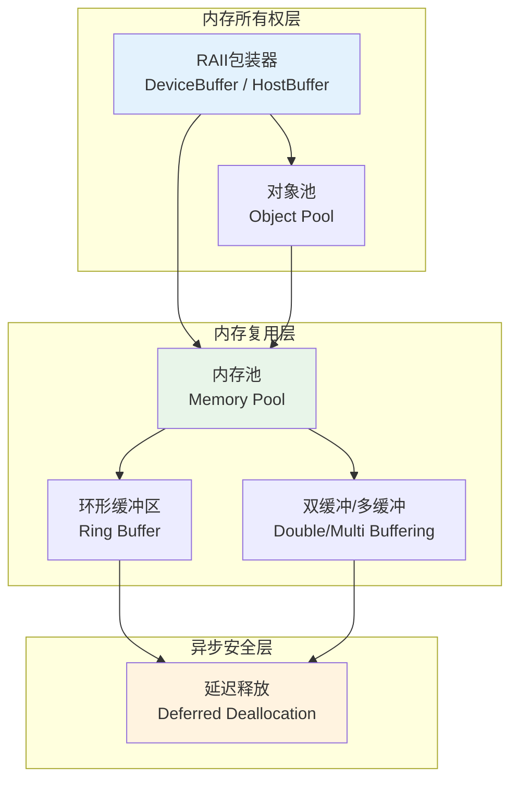
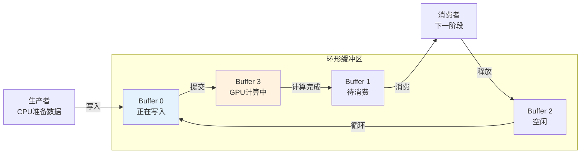
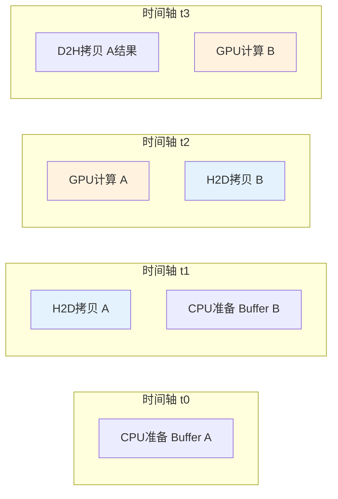

深度学习框架和推理引擎中的显存管理策略固然引人注目，但GPU内存管理的工程实践远不止于PyTorch或TensorFlow的内部机制。在科学计算、视频处理、信号处理、图计算以及各类通用CUDA/C++应用中，开发者同样需要面对一个核心问题：**如何让GPU内存的分配、使用和回收既安全又高效**。本章从通用CUDA/C++开发的视角出发，系统梳理六种经过工程验证的内存设计模式，并建立主机端与设备端协同设计的完整原则框架。这些模式不仅适用于独立的CUDA程序，也是理解深度学习框架底层内存行为的必要基础。

Sources: [gpu_memory_management_tutorial.md](gpu_memory_management_tutorial.md#L6710-L6723)

## 核心结论：六个模式与四条原则

在进入具体模式之前，先建立整体认知框架。通用CUDA/C++内存设计可以归纳为**六大模式**和**四条协同原则**。六大模式分别是RAII包装器、内存池、环形缓冲区、对象池、双缓冲/多缓冲、延迟释放；四条原则则覆盖主机端pinned memory的稀缺性管理、异步传输的前提条件、统一内存的适用边界，以及常驻数据与临时数据的策略分离。这些模式不是孤立的技术点，而是一个分层解决不同生命周期和访问特征问题的工具箱。

Sources: [gpu_memory_management_tutorial.md](gpu_memory_management_tutorial.md#L6725-L6732)



这张图揭示了模式之间的依赖关系：**RAII是所有权的基础语义，内存池和环形缓冲区解决复用效率问题，而延迟释放则为异步执行环境下的安全回收提供保障**。缺少任何一层，整个设计都可能出现泄漏、碎片或同步瓶颈。

Sources: [gpu_memory_management_tutorial.md](gpu_memory_management_tutorial.md#L6734-L6951)

## 模式一：RAII包装器

### 问题本质

`cudaMalloc`与`cudaFree`是纯C风格API，它们不携带所有权语义，也不在异常发生时自动清理。在C++程序中，这意味着每一条`cudaMalloc`都隐含一个契约：调用者必须在所有退出路径上执行对应的`cudaFree`。一旦代码中出现异常、提前返回或逻辑分支遗漏，显存泄漏就几乎不可避免。

Sources: [gpu_memory_management_tutorial.md](gpu_memory_management_tutorial.md#L6736-L6738)

### 设计实现

RAII（Resource Acquisition Is Initialization）的核心思想是将资源生命周期绑定到对象生命周期。一个完整的设备内存包装器应当具备以下特征：构造函数中分配、析构函数中释放、禁止拷贝语义以避免重复释放、支持移动语义以兼容标准容器和函数返回值。以下是经过工程化扩展的实现模板，包含错误检查和对齐处理：

```cpp
#include <cuda_runtime.h>
#include <cstddef>
#include <utility>

#define CUDA_CHECK(call) do { \
    cudaError_t err = call; \
    if (err != cudaSuccess) { \
        throw std::runtime_error(cudaGetErrorString(err)); \
    } \
} while(0)

template <typename T>
class DeviceBuffer {
    T* ptr_ = nullptr;
    size_t size_ = 0;
    
public:
    explicit DeviceBuffer(size_t n) : size_(n) {
        if (n > 0) {
            CUDA_CHECK(cudaMalloc(&ptr_, n * sizeof(T)));
        }
    }
    
    ~DeviceBuffer() {
        if (ptr_) {
            cudaFree(ptr_);
        }
    }
    
    // 禁止拷贝：避免双重释放
    DeviceBuffer(const DeviceBuffer&) = delete;
    DeviceBuffer& operator=(const DeviceBuffer&) = delete;
    
    // 允许移动：支持容器和返回值优化
    DeviceBuffer(DeviceBuffer&& other) noexcept
        : ptr_(other.ptr_), size_(other.size_) {
        other.ptr_ = nullptr;
        other.size_ = 0;
    }
    
    DeviceBuffer& operator=(DeviceBuffer&& other) noexcept {
        if (this != &other) {
            if (ptr_) cudaFree(ptr_);
            ptr_ = other.ptr_;
            size_ = other.size_;
            other.ptr_ = nullptr;
            other.size_ = 0;
        }
        return *this;
    }
    
    T* data() const { return ptr_; }
    size_t size() const { return size_; }
    bool empty() const { return size_ == 0; }
};
```

### 为什么必须禁用拷贝

GPU设备指针代表的是特定CUDA context下的地址空间资源。如果允许拷贝，两个`DeviceBuffer`实例将持有同一个底层指针，在析构时导致双重释放（double-free）。移动语义则不同，它转移所有权而非共享所有权，这完全符合GPU内存的独占性特征。基于同样的逻辑，你也应当为`cudaHostAlloc`分配的pinned memory和`cudaMallocManaged`分配的统一内存建立对应的`PinnedBuffer`和`ManagedBuffer`包装器。

Sources: [gpu_memory_management_tutorial.md](gpu_memory_management_tutorial.md#L6743-L6769)

## 模式二：内存池

### 从系统分配到池化复用

如[内存池与缓存分配器原理](11-nei-cun-chi-yu-huan-cun-fen-pei-qi-yuan-li)中所揭示的，`cudaMalloc`不是简单的"设备版malloc"，而是一次涉及Runtime、Driver、Context和地址空间的多层资源建立过程。当程序在热路径上频繁进行小规模分配和释放时，系统级分配器的开销会成为显著瓶颈，且频繁分配释放会加剧显存碎片问题。

Sources: [gpu_memory_management_tutorial.md](gpu_memory_management_tutorial.md#L6705-L6710), [gpu_memory_management_tutorial.md](gpu_memory_management_tutorial.md#L2687-L2698)

### 内存池的架构逻辑

内存池的本质是**空间换时间**的预分配策略：预先向CUDA申请一大块连续显存，内部维护空闲块列表，上层请求时从池中切分，释放时回收到池中而非立即归还CUDA。一个简化的内存池接口如下：

```cpp
class MemoryPool {
    void* pool_base_ = nullptr;
    size_t pool_size_ = 0;
    // 空闲块列表，按地址或大小排序
    std::vector<FreeBlock> free_blocks_;
    
public:
    explicit MemoryPool(size_t initial_size);
    ~MemoryPool();
    
    void* allocate(size_t size);
    void deallocate(void* ptr);
    
    // 过量保留时向系统归还
    void trim();
};
```

### 工程实现的四个关键点

| 工程要点 | 说明 | 不处理的后果 |
|:---|:---|:---|
| **对齐要求** | GPU全局内存访问通常需要256字节对齐以满足合并访问条件 | 未对齐导致访问性能下降或硬件错误 |
| **合并空闲块** | 回收时检查相邻空闲块，合并为更大的连续区域 | 产生外部碎片，出现"总空闲足够但大块分配失败" |
| **大小分级** | 小对象（<1MB）与大对象采用不同策略，如小对象用slab、大对象用buddy | 小分配在大池中产生严重内部碎片 |
| **线程安全** | 多线程环境下的`allocate`/`deallocate`需要同步 | 竞争条件下空闲列表损坏，导致重复分配或泄漏 |

在工程实践中，除非有极强的定制化需求，否则应优先使用RAPIDS Memory Manager（RMM）、thrust的分配器或框架内置的缓存分配器，而非从零实现。这些库已经处理了上述复杂问题，并且在多GPU环境下经过充分验证。

Sources: [gpu_memory_management_tutorial.md](gpu_memory_management_tutorial.md#L6772-L6798), [gpu_memory_management_tutorial.md](gpu_memory_management_tutorial.md#L6919-L6924)

## 模式三：环形缓冲区

### 适用场景

环形缓冲区（Ring Buffer）特别适合**流式数据处理**场景，其中数据以固定大小的帧或批次连续产生和消费。典型应用包括视频处理中的帧队列、传感器数据流、以及多阶段流水线中的中间结果传递。与内存池不同，环形缓冲区的核心目标不是解决分配开销，而是消除动态分配的不确定性，使显存占用完全可预测。

Sources: [gpu_memory_management_tutorial.md](gpu_memory_management_tutorial.md#L6801-L6808)

### 设计原理

固定分配N个等大小的buffer，生产者按顺序写入，消费者按顺序读取。当索引到达末尾时绕回开头，形成逻辑上的环形结构。由于所有buffer在初始化时一次性分配，运行期间没有任何`cudaMalloc`/`cudaFree`调用。



### 显存预算的确定性优势

总显存占用严格等于`N × buffer_size`，这一特性在嵌入式系统或显存受限的服务器环境中极具价值。配合CUDA stream使用，环形缓冲区可以实现**生产者-消费者异步流水线**：CPU在stream上准备第k帧数据的同时，GPU在另一个stream上计算第k-1帧，而数据拷贝引擎（Copy Engine）在后台传输第k-2帧结果。三阶段重叠的执行效率，正是环形缓冲区与异步流结合的核心收益。

Sources: [gpu_memory_management_tutorial.md](gpu_memory_management_tutorial.md#L6809-L6819)

## 模式四：对象池

### 与内存池的本质区别

内存池管理的是**原始字节**，不关心这些字节被解释为哪种类型。对象池管理的则是**有构造和析构语义的对象**。在CUDA生态中，对象池的常见应用包括CUDA graph对象、纹理对象、cudnn/cublas句柄、以及自定义的GPU端数据结构。

Sources: [gpu_memory_management_tutorial.md](gpu_memory_management_tutorial.md#L6821-L6834)

### 设计考量

对象池除了需要管理显存或句柄的复用外，还必须处理对象生命周期的语义完整性。例如，从池中获取一个对象时，可能需要重置其内部状态；归还时，可能需要清理与当前stream的关联。这比纯内存池多了一个**状态重置**维度，因此在设计上通常采用"获取-初始化-使用-清理-归还"的五阶段模型，而非内存池的"分配-使用-释放"三阶段模型。

Sources: [gpu_memory_management_tutorial.md](gpu_memory_management_tutorial.md#L6821-L6834)

## 模式五：双缓冲与多缓冲

### 用空间换时间的经典策略

双缓冲的核心目标是**隐藏主机到设备的传输延迟**。在没有双缓冲的 naive 实现中，CPU准备数据→拷贝到GPU→GPU计算→拷贝回CPU这四个阶段是串行执行的。引入双缓冲后，可以形成如下流水线：



在这个模型中，Buffer A和Buffer B交替扮演"GPU计算目标"和"CPU准备目标"的角色。代价是显存占用翻倍：输入需要`2 × input_size`，输出同样需要`2 × output_size`。如果显存预算允许，这种空间换时间的策略通常能显著提升流水线吞吐量。

Sources: [gpu_memory_management_tutorial.md](gpu_memory_management_tutorial.md#L6837-L6855)

### 三缓冲扩展

当生产者和消费者的节奏差异更大时，可以引入第三个buffer作为"待显示/待消费"的缓冲。三缓冲进一步解耦了生产、处理和消费三个阶段，但代价是更高的显存占用和更复杂的同步逻辑。选择双缓冲还是三缓冲，取决于具体场景中哪一段延迟是瓶颈，以及显存预算是否允许。

Sources: [gpu_memory_management_tutorial.md](gpu_memory_management_tutorial.md#L6850-L6855)

## 模式六：延迟释放

### 异步执行带来的安全难题

GPU执行是异步的。CPU端调用kernel后立刻返回，但kernel可能还在stream中排队或正在执行。此时如果CPU端"逻辑上"认为某个buffer已经没用了，并立即调用`cudaFree`，就可能出现**释放后使用（use-after-free）**的严重错误：GPU kernel在实际执行到该内存访问时，发现对应的物理显存已经被回收或重新分配给其他对象。

Sources: [gpu_memory_management_tutorial.md](gpu_memory_management_tutorial.md#L6857-L6863)

### Stream-Ordered的释放语义

延迟释放（Deferred Deallocation）的核心机制是：**不立即释放内存，而是记录"这个buffer在stream的某个点之后可以释放"，等GPU执行越过那个点再真正执行释放**。CUDA提供了`cudaLaunchHostFunc`来实现这一模式：

```cpp
// 在stream上插入一个host callback，在GPU执行到该点时触发
cudaLaunchHostFunc(stream, [](void* userData) {
    void* ptr = static_cast<void*>(userData);
    cudaFree(ptr);
}, buffer_ptr);
```

从CUDA 11.2开始，`cudaFreeAsync`提供了更原生的stream-ordered释放语义，它直接集成在stream的执行顺序中，无需通过host callback间接实现。这两种方式的本质都是让释放操作参与到stream的依赖图中，确保释放发生在所有使用该buffer的kernel完成之后。

Sources: [gpu_memory_management_tutorial.md](gpu_memory_management_tutorial.md#L6864-L6875), [gpu_memory_management_tutorial.md](gpu_memory_management_tutorial.md#L4082-L4146)

## 主机端与设备端的协同设计

通用CUDA/C++程序中的内存管理不能只看设备端。主机端的内存策略直接影响数据传输效率和整体系统稳定性。

### 原则一：Pinned Memory是稀缺资源

Pinned memory（page-locked memory）是高效DMA和真正异步H2D/D2H传输的前提条件，但它不是越多越好。被钉住的物理页会削弱操作系统对主机内存的管理灵活性，过量使用可能导致系统整体性能下降甚至内存压力。工程上的最佳实践是：只pin真正需要频繁与GPU交互的buffer，对于一次性或低频传输的数据，使用普通的pageable memory即可。

Sources: [gpu_memory_management_tutorial.md](gpu_memory_management_tutorial.md#L6880-L6883), [gpu_memory_management_tutorial.md](gpu_memory_management_tutorial.md#L2107-L2115)

### 原则二：异步传输需要Pinned Buffer作为前提

`cudaMemcpyAsync`的"异步"是有前提的：主机端内存必须是pinned的。如果传入pageable memory，CUDA驱动会默默执行一个三步操作——先临时分配pinned staging区、把数据从pageable区拷到staging区、再启动真正的异步传输。这个隐式过程不仅增加了延迟，还可能引入额外的同步点。因此，在设计异步流水线时，必须确保传输路径上的主机buffer是通过`cudaHostAlloc`或`cudaHostRegister`建立的pinned memory。

Sources: [gpu_memory_management_tutorial.md](gpu_memory_management_tutorial.md#L6884-L6891), [gpu_memory_management_tutorial.md](gpu_memory_management_tutorial.md#L2963-L2995)

### 原则三：统一内存的适用边界

统一内存（UVM / Managed Memory）通过`cudaMallocManaged`提供"单指针、双端访问"的便利性，在原型开发和复杂数据结构场景中能显著减少显式`cudaMemcpy`的代码量。但如[统一内存UVM机制与代价](12-tong-nei-cun-uvmji-zhi-yu-dai-jie)中所分析的，这种便利性背后存在page migration、page fault和不可预测延迟的隐性代价。对于访问模式稳定、性能敏感的生产环境，显式管理往往比统一内存更可控；对于访问模式复杂、开发速度优先的场景，统一内存配合`cudaMemPrefetchAsync`和`cudaMemAdvise`的主动引导，可以取得较好的平衡。

Sources: [gpu_memory_management_tutorial.md](gpu_memory_management_tutorial.md#L6893-L6896), [gpu_memory_management_tutorial.md](gpu_memory_management_tutorial.md#L2170-L2296)

### 原则四：区分常驻数据与临时数据

一个稳健的CUDA程序应当明确区分两类数据：**常驻数据**（如模型权重、查找表、持久化缓存）和**临时数据**（如kernel中间结果、帧缓冲、工作区）。常驻数据倾向于长期持有、预分配、甚至跨stream共享；临时数据则适合由内存池管理、延迟释放、或使用环形缓冲区循环复用。混用这两类策略会导致常驻数据被意外回收，或临时数据长期占用本可释放的显存。

Sources: [gpu_memory_management_tutorial.md](gpu_memory_management_tutorial.md#L6933-L6936)

## 常见误区

在通用CUDA/C++开发中，以下四个误区出现频率最高，且后果往往难以调试：

| 误区 | 错误认知 | 正确理解 |
|:---|:---|:---|
| **GPU上也能用std::vector** | `std::vector<T>`可以在device代码中使用 | `std::vector`管理的是主机堆内存，GPU端没有标准库容器支持；设备端数组需要自己管理或使用thrust |
| **`cudaFree`后立即可重用指针** | 释放后的地址马上可以被安全读取或重新分配 | `cudaFree`在某些路径下是异步的；立即在另一stream中分配可能得到相同地址，但旧数据不一定已清空 |
| **所有数据都应该放在GPU** | GPU计算快，所以数据应尽可能常驻显存 | CPU内存更大、更便宜；只有频繁访问、并行计算的数据才需要常驻GPU，其余数据应按需传输 |
| **忽略纹理内存和常量内存** | 全局内存足够快，不需要考虑特殊内存类型 | 对于2D空间局部性访问和只读广播访问，纹理缓存与常量缓存的访问效率显著高于全局内存 |

Sources: [gpu_memory_management_tutorial.md](gpu_memory_management_tutorial.md#L6899-L6916)

## 工程建议

将上述模式落地到实际项目时，以下四条建议能帮助你避免常见的工程陷阱：

**优先使用现有库**。thrust、RMM、cuDF等库已经实现了经过充分测试的内存管理抽象。除非你的应用有极其特殊的分配特征（如硬实时约束、自定义NUMA策略），否则重复造轮子的收益通常低于维护成本。

**显存分配要有日志和统计**。在debug或profiling模式下，记录每一次`cudaMalloc`、`cudaFree`、池内分配和池内回收的调用栈与大小。这是定位显存泄漏、异常峰值和碎片问题的最有效手段。

**设计时考虑对齐和合并访问**。buffer大小应按warp大小（通常为32）和缓存行粒度对齐，数据结构布局应遵循coalescing友好原则。如[访问模式优化：合并访问与局部性](10-fang-wen-mo-shi-you-hua-he-bing-fang-wen-yu-ju-bu-xing)中所强调的，访问模式的优劣对性能的影响往往超过算法复杂度本身。

**为不同生命周期选择不同模式**。不要试图用内存池解决所有问题，也不要在所有场景都使用RAII包装器。根据数据的生命周期特征（一次性、循环复用、长期常驻、流式传递）选择最匹配的模式，是高效内存设计的核心。

Sources: [gpu_memory_management_tutorial.md](gpu_memory_management_tutorial.md#L6919-L6936)

## 模式选型决策参考

面对具体问题时，可以依据以下决策路径快速定位合适的模式：

| 场景特征 | 推荐模式 | 关键考量 |
|:---|:---|:---|
| 单次分配、明确作用域 | RAII包装器 | 异常安全、所有权清晰 |
| 高频小对象动态分配 | 内存池 / 缓存分配器 | 减少`cudaMalloc`开销、控制碎片 |
| 流式帧/批次处理 | 环形缓冲区 | 显存可预测、零动态分配 |
| GPU句柄/对象频繁创建销毁 | 对象池 | 构造析构开销、状态重置 |
| 需要隐藏H2D传输延迟 | 双缓冲/多缓冲 | 显存预算允许、stream同步 |
| 异步执行下安全释放 | 延迟释放 / `cudaFreeAsync` | Stream-ordered语义、避免use-after-free |

Sources: [gpu_memory_management_tutorial.md](gpu_memory_management_tutorial.md#L6939-L6951)

## 本章小结

通用CUDA/C++内存设计的核心不是掌握尽可能多的API，而是建立**生命周期-异步性-访问模式**三位一体的决策框架。RAII是所有所有权管理的基础语义；内存池和环形缓冲区分别解决动态分配和流式场景的复用效率；双缓冲用可控的显存开销换取流水线吞吐量；延迟释放填补了异步执行与同步释放之间的安全鸿沟。在此基础上，主机端pinned memory的审慎使用、统一内存的边界认知、以及常驻与临时数据的策略分离，共同构成了跨场景适用的GPU内存设计原则。

Sources: [gpu_memory_management_tutorial.md](gpu_memory_management_tutorial.md#L6939-L6951)

---

**后续阅读建议**：如果你正在从事图形渲染相关工作，下一章[图形渲染中的GPU内存管理](18-tu-xing-xuan-ran-zhong-de-gpunei-cun-guan-li)将介绍framebuffer、texture、vertex buffer等图形特有对象的显存管理策略。如果你在多卡或多进程环境中工作，可以参考[多GPU、多进程与多租户环境](19-duo-gpu-duo-jin-cheng-yu-duo-zu-hu-huan-jing)中的显存隔离与竞争管理方法。