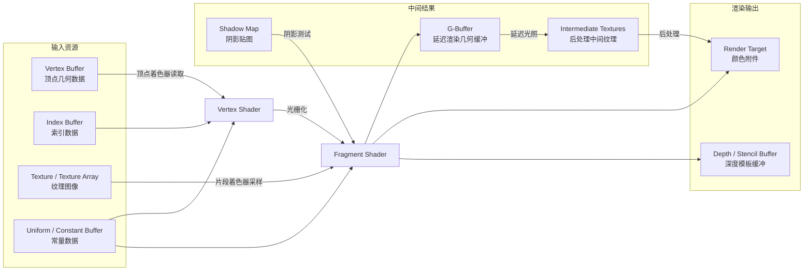
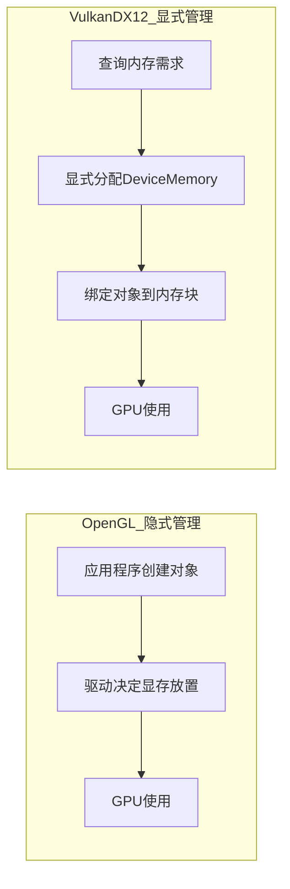
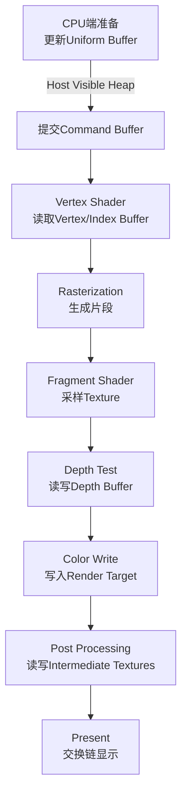

GPU最初为图形渲染而设计，这一事实决定了图形场景中的内存管理与通用CUDA计算存在本质差异。在深度学习训练或通用计算中，显存管理的核心矛盾往往是"容量是否足够放下模型和数据"；而在实时图形渲染中，额外的硬约束是时间——以60 FPS为例，每帧仅有约16.6毫秒来完成从场景提交到像素呈现的完整管线，其中显存分配、带宽利用和访问延迟直接决定了帧率稳定性与画面质量。因此，图形开发者需要一种与计算开发者不同的显存认知框架：不仅要关心"能不能放下"，更要关心"能不能在预算时间内读写到"。如果你尚未建立GPU硬件内存层次的基础认知，建议先阅读[GPU硬件内存层次解析](4-gpuying-jian-nei-cun-ceng-ci-jie-xi)和[CPU与GPU内存思维差异](6-cpuyu-gpunei-cun-si-wei-chai-yi)，它们为理解本章的图形专用概念提供了必要铺垫。

Sources: [gpu_memory_management_tutorial.md](gpu_memory_management_tutorial.md#L6956-L6976)

## 渲染一帧的显存全景

为了建立这种认知，可以先从直觉层面拆解一帧画面所需的显存对象。一个典型的3D场景渲染至少涉及六类核心对象：存储顶点位置和法线的Vertex Buffer、承载表面细节的Texture、作为像素写入目标的Render Target、用于遮挡剔除的Depth Buffer、后处理阶段产生的Intermediate Textures，以及每帧更新的Uniform/Constant Buffer。这些对象并非孤立存在，而是在渲染管线的不同阶段被读取、写入和复用，共同构成一帧的显存footprint。下图展示了这些对象在图形管线中的概念关系，其中输入资源在管线前端被消耗，中间结果在管线中段产生，最终汇聚到渲染输出。

Sources: [gpu_memory_management_tutorial.md](gpu_memory_management_tutorial.md#L6978-L6989)

## 核心图形显存对象

从底层机制看，这些对象在读写模式、生命周期和硬件访问路径上各有鲜明特征。Vertex Buffer和Index Buffer通常是只读的，在顶点着色阶段被批量读取；Texture支持硬件采样和过滤，具备专门的纹理缓存路径；Render Target作为颜色附件，是片段着色器的写入目的地；Depth/Stencil Buffer则需要同时支持读写，因为深度测试既要读取已有深度值进行比较，又可能在通过测试后写入新的深度值；Uniform/Constant Buffer存储每帧或每对象的常量数据，更新频率高但体量小；Shader Storage Buffer（SSBO）则提供更通用的读写能力，常在计算着色器中使用。理解这些差异是进行显存优化的前提，因为错误的对象类型选择或内存堆放置会直接导致带宽浪费或延迟激增。

| 对象类型 | 典型用途 | 读写特性 | 带宽敏感度 | 生命周期 |
|---|---|---|---|---|
| Vertex / Index Buffer | 模型几何数据 | 只读（顶点阶段） | 中 | 关卡/场景级 |
| Texture / Texture Array | 表面贴图、天空盒 | 只读（采样） | 极高 | 关卡/流送级 |
| Render Target | 帧缓冲、离屏纹理 | 只写/读写 | 极高 | 帧级 |
| Depth / Stencil Buffer | 深度测试、模板测试 | 读写 | 极高 | 帧级 |
| Uniform / Constant Buffer | 变换矩阵、材质参数 | CPU写，GPU只读 | 中 | 帧/对象级 |
| SSBO | 计算着色器通用数据 | 读写 | 高 | 可变 |

Sources: [gpu_memory_management_tutorial.md](gpu_memory_management_tutorial.md#L6993-L7018)

## 现代图形API的内存模型

过去二十年，图形API的内存管理范式经历了从隐式到显式的根本转移。OpenGL风格的API中，驱动程序扮演中间层角色：应用程序创建对象后，驱动自主决定显存放置、迁移和释放时机。这种模式降低了开发门槛，但也意味着开发者无法针对特定硬件架构进行精细优化，驱动的"黑箱"决策常常导致不必要的内存拷贝或延迟分配。与之相对，Vulkan和DirectX 12将显存控制权完全交还开发者：应用程序需要显式查询物理设备的内存类型和堆，手动分配DeviceMemory块，再将Buffer或Image对象绑定到具体的内存地址，并自行管理对象的生命周期和复用。下图对比了两种范式的控制流差异。

两种范式在控制权、复杂度和优化空间上的差异可归纳为下表。

| 维度 | OpenGL风格（隐式） | Vulkan/DX12风格（显式） |
|---|---|---|
| 分配时机 | 驱动自动决定 | 开发者显式调用 |
| 内存放置 | 驱动内部优化 | 开发者选择Memory Heap |
| 对象绑定 | 自动绑定 | 手动绑定到DeviceMemory |
| 生命周期 | 驱动管理 | 开发者完全控制 |
| 优化空间 | 有限 | 极大 |
| 复杂度 | 低 | 高 |
| 典型适用 | 原型开发、教学 | 商业引擎、极致优化 |

Sources: [gpu_memory_management_tutorial.md](gpu_memory_management_tutorial.md#L7021-L7048)

## Memory Heap与Memory Type

显式管理的核心概念是Memory Heap和Memory Type。以Vulkan为例，物理设备会暴露多个内存堆，最常见的三类包括：Device Local Heap，这是GPU专属的高带宽显存，适合放置Texture、Render Target等GPU独占访问的对象；Host Visible Heap，允许CPU直接映射写入，适合需要每帧动态更新的Uniform Buffer或粒子数据；Host Cached Heap，在Host Visible基础上增加了CPU缓存，适合CPU需要回读GPU结果的场景。一个内存堆内部又可细分为多种内存类型，代表不同的访问属性组合。开发者的关键决策在于：根据对象的访问模式选择正确的内存类型，而不是盲目将所有资源塞进Device Local。对于需要CPU每帧更新的数据，强行放在Device Local可能因频繁的CPU-GPU迁移而比直接放在Host Visible更慢。

| Heap类型 | CPU可访问 | CPU缓存 | 典型带宽 | 最佳用途 |
|---|---|---|---|---|
| Device Local | 否 | 否 | 最高 | Texture、Render Target、Depth Buffer |
| Host Visible | 是 | 否 | 中 | 每帧更新的Uniform Buffer、动态顶点数据 |
| Host Cached | 是 | 是 | 中 | CPU回读GPU结果、暂存缓冲区 |

Sources: [gpu_memory_management_tutorial.md](gpu_memory_management_tutorial.md#L7050-L7059)

## 渲染管线中的显存流动

理解了对象类型和内存模型后，可以将视角拉回到管线层面，观察显存在一帧内的流动路径。在管线的最前端，CPU通过Host Visible内存更新Uniform Buffer中的相机矩阵和灯光参数，随后将这些命令提交到GPU。进入GPU端后，Vertex Shader从Device Local的Vertex/Index Buffer读取几何数据；光栅化阶段生成片段后，Fragment Shader采样Texture并执行着色计算；紧接着，Depth Test阶段读写Depth Buffer进行遮挡判断；通过测试的片段写入Render Target；最后，后处理阶段多次读写Intermediate Textures，完成Bloom、色调映射等效果，最终结果通过交换链呈现。这一流程揭示了图形渲染中一个关键的内存特征：同一帧内，显存对象往往被多次、交替地读写，且读写阶段之间存在严格的管线依赖。

Sources: [gpu_memory_management_tutorial.md](gpu_memory_management_tutorial.md#L6978-L7018)

## 一帧的显存预算

这种高频交替读写使得显存预算的精确估算变得尤为重要。以一个1080p、60 FPS的3D游戏为例，仅基础缓冲就需要约16 MB（8 MB RGBA8颜色缓冲 + 8 MB D32F深度缓冲）；延迟渲染的G-Buffer通常占用32-64 MB；后处理中间纹理再增加约24 MB；阴影贴图根据级联数量和分辨率需要16-64 MB；而场景纹理资源和顶点数据则是更大的常驻开销，分别可达数百MB到数GB和50-200 MB。综合估算，一帧的显存footprint大约在650 MB到2.5 GB之间。这只是一个基准场景，实际项目中的显存波动往往更大，因此建立每帧显存监控机制是工程上的必要措施。

| 对象类型 | 估算大小 | 说明 |
|---|---|---|
| 颜色Buffer | 8 MB | 1920×1080 × 4 bytes (RGBA8) |
| 深度Buffer | 8 MB | 1920×1080 × 4 bytes (D32F) |
| 后处理纹理×3 | 24 MB | 多个中间结果 |
| 阴影贴图 | 16-64 MB | 取决于级联数量和分辨率 |
| G-Buffer（延迟渲染） | 32-64 MB | 多通道几何信息 |
| 纹理资源 | 500 MB - 2 GB | 场景纹理总和 |
| 顶点数据 | 50-200 MB | 模型几何 |
| **总计** | **650 MB - 2.5 GB** | 粗略估算，实际因项目差异较大 |

Sources: [gpu_memory_management_tutorial.md](gpu_memory_management_tutorial.md#L7062-L7077)

## 典型场景的内存挑战

不同应用场景对显存管理的挑战各有侧重。移动设备渲染面临极端的容量限制（几百MB到几GB），必须 aggressively 使用ETC2、ASTC等纹理压缩，并精细管理LOD层级，后处理效果往往大幅受限。VR/AR渲染需要为双眼分别渲染，显存和带宽压力理论上翻倍，同时低延迟要求极高，因此注视点渲染（foveated rendering）成为节省资源的关键技术。光线追踪场景则需要额外的加速结构（BVH、TLAS/BLAS），这些结构的显存占用大且需要动态更新，加上降噪后处理pass，整体显存需求显著高于传统光栅化。引擎编辑器场景更为复杂：运行时与编辑器共享同一GPU，大量资源预览、实时编辑和视口渲染并存，导致显存碎片化问题比纯运行时更为严重。

Sources: [gpu_memory_management_tutorial.md](gpu_memory_management_tutorial.md#L7081-L7107)

## 常见误区

在图形显存管理的实践中，存在几个反复出现的认知陷阱。第一，认为纹理大小仅由分辨率决定，忽略了像素格式的巨大影响：RGBA32F每个像素16字节，RGBA8为4字节，而BC7压缩后仅约1字节，同样分辨率的纹理显存占用可相差16倍。第二，假设图形API的对象释放会立即回收显存，实际上驱动常常延迟释放以优化复用，这与CUDA的延迟释放行为类似。第三，追求极致性能而将所有Buffer都放在Device Local Heap，但对于需要CPU每帧更新的数据（如骨骼动画、粒子系统），Host Visible内存反而能避免迁移开销。第四，低估MSAA的显存成本，4x MSAA会让颜色缓冲和深度缓冲的占用增加约4倍，在显存紧张时可能成为压垮骆驼的最后一根稻草。

| 误区 | 实际情况 | 纠偏建议 |
|---|---|---|
| 纹理大小只和分辨率有关 | 像素格式影响可达16倍 | 优先使用ASTC/BC7压缩格式 |
| 释放对象后显存立即回收 | 驱动可能延迟释放以备复用 | 不依赖立即回收，建立显存监控 |
| 所有Buffer都应放Device Local | CPU频繁更新的数据迁移开销更高 | 动态数据使用Host Visible |
| 忽略MSAA的显存开销 | 4x MSAA使Buffer占用增加约4倍 | 显存紧张时谨慎使用或改用后处理抗锯齿 |

Sources: [gpu_memory_management_tutorial.md](gpu_memory_management_tutorial.md#L7110-L7132)

## 工程优化策略

针对上述挑战和误区，工程实践中有五项策略值得优先实施。首先是纹理压缩，ASTC和BC7等格式在视觉质量和压缩比上表现优异，应作为纹理资源的默认选择。其次是纹理流送（Texture Streaming），根据相机距离和物体可见性动态加载和卸载mipmap层级，避免一次性载入整个场景的纹理。第三是Render Target复用，不同后处理阶段在满足依赖关系的前提下可以共用同一块纹理内存作为输入和输出，从而压缩峰值显存占用。第四是利用Vulkan的transient attachment机制，将某些中间缓冲置于tile memory（on-chip）而非全局显存中，这对移动端GPU尤为有效。最后是建立持续的显存监控，通过RenderDoc、NVIDIA Nsight Graphics等工具捕获单帧，分析各类对象的显存分布和波动趋势。

Sources: [gpu_memory_management_tutorial.md](gpu_memory_management_tutorial.md#L7135-L7156)

## 图形与CUDA计算的共存

在现代GPU上，图形渲染与通用计算（CUDA）往往共享同一硬件。这种共存带来了灵活性，但也引入了资源竞争和上下文切换开销。当CUDA计算任务与图形管线同时运行时，两者会竞争显存容量、计算单元和内存带宽。因此，在混合负载场景中，显存管理需要从全局视角进行统筹：避免图形管线的高峰期与计算kernel的显存分配峰值重叠，合理规划常驻资源与临时资源的分配策略。关于GPU内存设计模式的更多通用原则，可参考[通用CUDA/C++内存设计模式](17-tong-yong-cuda-c-nei-cun-she-ji-mo-shi)，其中讨论的RAII包装器和内存池模式同样适用于图形与计算混合的工程架构。

Sources: [gpu_memory_management_tutorial.md](gpu_memory_management_tutorial.md#L7159-L7171)

## 下一步阅读

掌握了图形渲染的显存管理基础后，如果你需要处理多GPU或编辑器与运行时共享GPU的复杂场景，建议继续阅读[多GPU、多进程与多租户环境](19-duo-gpu-duo-jin-cheng-yu-duo-zu-hu-huan-jing)。如果你的工作涉及将图形与CUDA计算深度结合，可先回顾[通用CUDA/C++内存设计模式](17-tong-yong-cuda-c-nei-cun-she-ji-mo-shi)中的RAII和内存池模式。对于显存故障排查，[排障方法与工具链](21-pai-zhang-fang-fa-yu-gong-ju-lian)提供了RenderDoc和Nsight等工具的实战指南，而[实战优化清单](22-shi-zhan-you-hua-qing-dan)则是一份可直接落地的检查表。