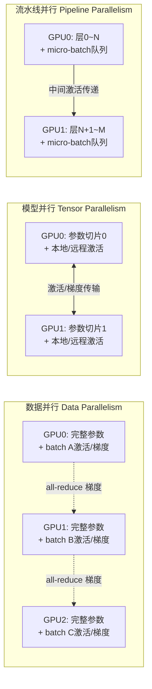
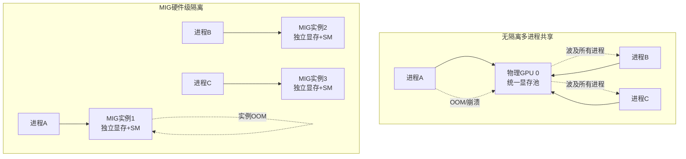

前面的章节围绕单GPU、单进程场景建立了显存管理的基础认知——从硬件内存层次到CUDA API选型，从统一内存机制到训练推理的显存账单。然而生产环境从来不是干净的实验室：一台节点上插着8块A100，同时跑着多个训练任务；一个Kubernetes集群把GPU切成碎片租给不同用户；一个进程的`cudaMalloc`失败拖垮了整个节点上的其他进程。本章的目标是把单卡视角扩展到**多实体共存场景**，建立对隔离性、可预测性和每卡显存预算的精确认知。核心结论是：多GPU不等于显存简单相加，多进程共享没有隔离是危险的，而MIG等硬件级虚拟化机制是多租户环境中最可靠的防线。

Sources: [gpu_memory_management_tutorial.md](gpu_memory_management_tutorial.md#L7174-L7186)

## 多GPU并行策略与显存特征

在多GPU训练中，并行策略的选择直接决定了每张卡上实际存储的参数、激活和通信buffer的构成。这不是简单的"显存乘以卡数"的算术题，而是**存储分布与通信开销的权衡设计**。

### 数据并行（Data Parallelism）

数据并行是最直观的扩展方式：每个GPU持有完整的模型副本，处理不同的数据批次。从显存视角看，每卡的占用等于模型参数、该卡对应的激活与梯度、以及优化器状态的总和。参数在每卡上是独立持有的相同副本，不存在跨卡存储冗余，但梯度同步阶段需要all-reduce通信。通信本身还会消耗临时buffer，这部分必须在显存预算中预留。

Sources: [gpu_memory_management_tutorial.md](gpu_memory_management_tutorial.md#L7200-L7208)

### 模型并行与流水线并行

当单卡容不下完整模型时，就需要把模型切分到多个GPU上。**模型并行（Model / Tensor Parallelism）**将参数按维度切片，每张卡只持有部分参数。这虽然降低了单卡参数压力，但中间激活需要跨卡传输，每张卡可能同时持有本地参数和接收到的远程激活切片，还需要额外的通信buffer来存储这些中间结果。**流水线并行（Pipeline Parallelism）**则按层切分模型，不同GPU负责不同阶段。它的显存特征与pipeline深度和micro-batch数量强相关——为了填充流水线，需要存储多个micro-batch的中间激活（即pipeline bubble的代价），不过可以通过activation checkpointing来缓解。

Sources: [gpu_memory_management_tutorial.md](gpu_memory_management_tutorial.md#L7209-L7226)

### 混合并行：大模型训练的显存现实

实际的大模型训练不会只选一种策略，而是组合使用。典型配置是：节点内用tensor parallelism（利用高带宽NVLink），节点间用pipeline parallelism（适应中等带宽网络），最外层再用data parallelism（获得最好的扩展性）。这种混合策略意味着每张卡的显存账单需要逐项核算——本地参数切片、远程激活缓存、集合通信buffer、优化器状态分区——任何一项超出单卡容量，整个任务就会OOM。因此，**设计并行策略时必须先算显存账，再决定怎么切分**，而不是反过来。

Sources: [gpu_memory_management_tutorial.md](gpu_memory_management_tutorial.md#L7227-L7238)

下图展示了三种并行策略在参数分布和通信模式上的本质差异：

## 多进程共享GPU：无隔离的危险地带

### 默认行为的真相

CUDA驱动允许多个进程同时向同一块GPU提交操作，但这不等于安全共享。默认情况下，**显存没有隔离，计算没有隔离，错误也没有隔离**。一个进程可以分配任意大小的显存直到物理上限，可以占满所有SM导致其他进程饥饿，甚至一个进程的崩溃可能波及整个GPU上下文，让所有共享该卡的进程失败。

Sources: [gpu_memory_management_tutorial.md](gpu_memory_management_tutorial.md#L7241-L7248)

### 显存竞争的典型表现

无隔离共享下的故障模式非常直观：进程A分配了大块显存后，进程B的`cudaMalloc`直接失败；总显存超过物理容量后，驱动开始驱逐或交换，性能断崖式下跌；某个进程存在显存泄漏，最终会拖垮所有共享该GPU的进程。这些问题的根源在于CUDA的调度模型把多进程当作"友好合作"的实体，而非需要边界保护的租户。

Sources: [gpu_memory_management_tutorial.md](gpu_memory_management_tutorial.md#L7250-L7255)

### 软件级限制的局限性

开发者常用的`CUDA_VISIBLE_DEVICES`只是控制进程能看到哪些卡，**完全不提供隔离**——两个进程都设置为GPU 0时，它们在硬件层面仍然是竞争关系。框架层面的显存配额（如PyTorch的`max_memory_allocated`）也只是自我约束，无法阻止其他进程或裸CUDA程序抢占资源。这意味着在不可信的多进程环境中，软件限制本质上是一种"君子协定"。

Sources: [gpu_memory_management_tutorial.md](gpu_memory_management_tutorial.md#L7256-L7268)

下图对比了无隔离共享与硬件隔离在故障传播路径上的根本差异：

## MIG：硬件级GPU虚拟化

### 核心架构与切分粒度

MIG（Multi-Instance GPU）是NVIDIA从Ampere架构开始引入的硬件虚拟化机制。它的核心思想是将一块物理GPU（如A100 80GB）**在硬件层面切分成多个完全独立的实例**。每个实例拥有专属的计算单元（SM）、专属的显存（带带宽保证）以及独立的错误隔离域。A100支持的切分配置包括1g.10gb（1/7计算+10GB显存）、2g.20gb、3g.40gb等，直至整卡的7g.80gb。这种切分不是软件模拟，而是硬件资源的真实分区。

Sources: [gpu_memory_management_tutorial.md](gpu_memory_management_tutorial.md#L7271-L7291)

### 对显存管理的意义

MIG对显存管理的价值体现在三个维度。**真正的隔离**意味着一个MIG实例OOM只会影响该实例内部，不会导致其他实例失败；**可预测的性能**意味着实例的显存带宽有硬件保证，不受邻居进程的流量冲击；**云环境友好**意味着同一块A100可以安全地租给7个不同用户，每个用户看到的都是一块"完整的、独立的小GPU"。这与时间切片等软件共享方案有本质区别。

Sources: [gpu_memory_management_tutorial.md](gpu_memory_management_tutorial.md#L7292-L7303)

### 必须知道的限制

MIG并非万能。首先，它**只支持CUDA计算**，不支持OpenGL/Vulkan等图形API。其次，切分配置是静态的，调整实例大小需要重启GPU配置，无法动态弹性伸缩。最后，并非所有GPU都支持MIG——需要Ampere及之后的专业计算卡（如A100、H100）。在架构设计时，必须确认硬件代际和驱动版本是否满足要求。

Sources: [gpu_memory_management_tutorial.md](gpu_memory_management_tutorial.md#L7298-L7303)

## 多租户云环境的显存调度

### 显存超售与风险

和CPU内存超售逻辑类似，云平台在多租户GPU环境中可能将总显存分配给多个用户，使得逻辑分配总和超过物理显存容量。这基于"不是所有用户同时满载"的统计假设。然而一旦租户行为偏离预期，**同时满载会导致OOM或严重的性能降级**。在GPU场景下，这种降级的代价尤其高昂，因为显存无法像主机内存那样方便地换出到磁盘。

Sources: [gpu_memory_management_tutorial.md](gpu_memory_management_tutorial.md#L7306-L7315)

### 显存抢占、迁移与时间切片

某些虚拟化方案支持更激进的调度策略：**显存抢占和迁移**通过暂停一个VM或容器，将其显存状态保存到主机内存，把GPU分配给另一个租户，待需要时再恢复。这个暂停-恢复过程存在显著延迟，不适合延迟敏感型任务。**时间切片（time-slicing）**则是让多个容器共享同一块物理GPU，由驱动快速切换CUDA上下文。但时间切片不是真正的并行，多个任务的总吞吐通常低于单独顺序执行，因为上下文切换本身有开销。

Sources: [gpu_memory_management_tutorial.md](gpu_memory_management_tutorial.md#L7316-L7330)

### Kubernetes中的GPU调度实践

在云原生环境中，NVIDIA GPU Operator提供设备插件，使Kubernetes能够识别和调度GPU资源。调度粒度可以是整卡、MIG实例，甚至是时间切片。对于多租户生产环境，**优先选择整卡或MIG实例调度**，只有在完全信任工作负载且吞吐不敏感时才考虑时间切片。显存管理在这里上升为集群资源调度问题：不仅要考虑单卡预算，还要考虑节点拓扑、NVLink互联结构、以及Pod的亲和性/反亲和性约束。

Sources: [gpu_memory_management_tutorial.md](gpu_memory_management_tutorial.md#L7325-L7330)

## 典型例子：8卡A100训练集群的显存推演

假设一个配备8x A100 80GB、通过NVLink + NVSwitch全互联的节点，要训练一个175B参数的模型并使用FP16精度。参数本身的存储需求为175B × 2字节 = 350GB。如果采用**纯数据并行**，每卡需要存储完整的350GB参数，远超单卡80GB容量，直接不可行。如果采用**Tensor Parallelism=8（纯模型并行）**，每卡参数降至43.75GB，但加上激活、梯度和优化器状态后，已非常接近80GB上限。若尝试**TP=4 + PP=2**，TP组内每卡参数为87.5GB，仍然超过单卡容量。这个推演清晰地说明：**大模型训练不是简单地堆GPU，而是需要ZeRO、更细粒度切分或激活重计算等显存优化技术与并行策略的精密配合**。

Sources: [gpu_memory_management_tutorial.md](gpu_memory_management_tutorial.md#L7333-L7356)

## 常见误区

| 误区 | 真相 |
|---|---|
| 多GPU总显存 = 单卡显存 × 卡数 | 模型并行和通信buffer会引入额外开销，不是简单相加 |
| MIG实例和物理GPU完全一样 | MIG实例间不能直联通信（无NVLink），不支持图形API |
| 时间切片等于真正的并行 | 时间切片是快速切换上下文，总吞吐通常低于单独执行 |
| 多进程安全只要框架处理好就行 | 框架层面的限制无法阻止裸CUDA程序的竞争和抢占 |

Sources: [gpu_memory_management_tutorial.md](gpu_memory_management_tutorial.md#L7360-L7379)

## 工程建议

在多GPU、多进程与多租户环境中，显存管理从"单卡编程问题"升级为"系统架构问题"。以下建议来自生产实践的反复验证：

**第一，生产环境优先使用MIG或整卡分配。** 避免无隔离的多进程共享，除非你能完全信任所有进程且能接受资源竞争风险。

**第二，设计并行策略时先算显存账。** 不要先定TP/PP/DP维度再算显存，而是先明确每卡能放下什么（参数切片、激活峰值、通信buffer、优化器状态），再反推切分策略。

**第三，监控每卡显存，而非只看总和。** 在多卡场景中，一张卡OOM就会导致整个分布式任务失败，即使其他卡还有大量余量。NCCL的通信buffer、框架的缓存分配器行为都需要纳入单卡监控。

**第四，预留通信buffer显存。** all-reduce、all-gather等集合通信需要临时buffer，NCCL内部也会分配通信缓存。在大规模集群中，这部分开销不可忽视。

**第五，理解拓扑对P2P和NVLink的影响。** GPU-GPU传输的代价与硬件拓扑强相关。有NVSwitch全互联的节点内可以大胆使用tensor parallelism，而跨节点则必须考虑网络带宽对pipeline stage划分的约束。

Sources: [gpu_memory_management_tutorial.md](gpu_memory_management_tutorial.md#L7383-L7404)

## 本章小结与延伸路径

本章从三个维度重构了多实体共存环境下的显存管理认知：多GPU并行策略决定了显存如何在卡间分布，多进程共享暴露了缺乏隔离的风险，而MIG与云调度机制提供了不同层次的解决方案。核心心智模型是：**隔离带来可预测性，可预测性支撑精确的每卡预算，而精确的预算是大模型分布式训练可扩展的根基**。

如果你正在设计分布式训练系统，建议继续阅读[训练优化：混合精度、重计算与ZeRO](14-xun-lian-you-hua-hun-he-jing-du-zhong-ji-suan-yu-zero)以深入理解如何在单卡层面压缩显存账单，从而放宽并行策略的约束。如果你在构建推理服务或GPU云平台，[推理优化：量化、分页缓存与连续批处理](16-tui-li-you-hua-liang-hua-fen-ye-huan-cun-yu-lian-xu-pi-chu-li)会帮助你理解如何在多租户场景下进一步压榨显存效率。最后，若你需要排查多进程环境下的OOM或性能抖动，[常见故障与典型误区](20-chang-jian-gu-zhang-yu-dian-xing-wu-qu)提供了针对多竞争场景的排障清单。