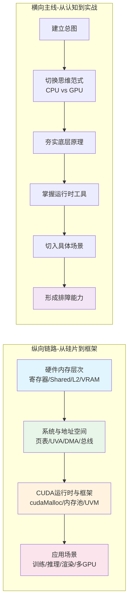
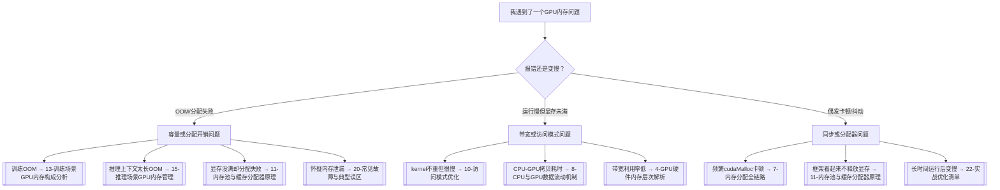

本文档是整个 GPU 内存管理教程的导航中心。面对从硬件寄存器到深度学习框架的完整知识体系，初学者最大的困扰往往不是内容太深，而是不知道该从哪里切入、按什么顺序阅读、哪些章节可以跳过。本页的核心目标就是消除这种选择焦虑：先为你展示教程的全景架构，再提供按读者背景预设的阅读路线，最后给出一张"遇到问题该查哪章"的快速索引表。无论你打算系统学习还是按需查阅，都可以把本页当作书签反复回来定位。

Sources: [gpu_memory_management_tutorial.md](gpu_memory_management_tutorial.md#L1-L7)

## 教程全景：四层架构与两条主线

在规划阅读路线之前，你需要先理解本教程的内容是如何组织的。全部 24 个页面被组织成一条**从底层到顶层**的纵向链路，以及一条**从原理到场景**的横向展开。纵向链路确保你理解任何现象都有根可溯，横向展开确保你学到的东西能落地到真实工作中。

纵向链路包含四个层次：**硬件内存层次**（寄存器、共享内存、L2、全局显存）构成物理基础；**系统与地址空间层**（页表、UVA、DMA、PCIe/NVLink）构成映射与传输基础；**CUDA 运行时与框架层**（`cudaMalloc`、内存池、UVM、数据搬运）构成编程接口；**应用场景层**（训练、推理、通用 CUDA、图形渲染、多 GPU 环境）构成最终交付价值。这个分层模型对应教程原文中第 2 章的系统总图，建议所有读者在进入具体章节前先建立这一框架印象，否则后续术语容易散落成孤立知识点。

Sources: [gpu_memory_management_tutorial.md](gpu_memory_management_tutorial.md#L418-L500)

横向展开则遵循"先建立总图 → 切换思维范式 → 夯实底层原理 → 掌握运行时工具 → 切入具体场景 → 形成排障能力"的六步学习节奏。原文在第一章末尾明确提出了这一节奏，其核心逻辑是：没有总图就会迷路，没有思维切换就会用 CPU 直觉误判 GPU 行为，没有底层原理就无法解释框架层面的奇怪现象，没有运行时工具就只会调包而不敢定制，没有场景实践就无法将知识转化为工程判断，没有排障训练就会在遇到 OOM 或性能暴跌时束手无策。

Sources: [gpu_memory_management_tutorial.md](gpu_memory_management_tutorial.md#L338-L403)

## 预设阅读路线：五条按角色定制的路径

不同背景的读者对 GPU 内存管理的痛点完全不同。深度学习工程师常被训练 OOM 或推理 KV Cache 爆显存困扰；CUDA/C++ 开发者需要精确控制分配与数据搬运；图形开发者更关心纹理与几何资源的预算管理。以下五条路线不是强制顺序，而是根据常见角色特征裁剪出的最小必要路径，每条路线都标注了"必读"与"扩展"章节。

| 角色定位 | 核心痛点 | 必读章节（按顺序） | 扩展阅读 |
|:---|:---|:---|:---|
| **完全初学者** | 术语太多、不知如何入手 | [教程概述](1-jiao-cheng-gai-shu-yu-xue-xi-jie-zhi) → [五大核心概念速览](3-wu-da-he-xin-gai-nian-su-lan) → [GPU硬件内存层次解析](4-gpuying-jian-nei-cun-ceng-ci-jie-xi) → [CPU与GPU内存思维差异](6-cpuyu-gpunei-cun-si-wei-chai-yi) → [内存分配全链路](7-nei-cun-fen-pei-quan-lian-lu-cong-cudamallocdao-qu-dong) | [访问模式优化](10-fang-wen-mo-shi-you-hua-he-bing-fang-wen-yu-ju-bu-xing)、[内存池与缓存分配器原理](11-nei-cun-chi-yu-huan-cun-fen-pei-qi-yuan-li) |
| **深度学习训练工程师** | 模型OOM、batch size受限、优化器状态占显存 | [五大核心概念速览](3-wu-da-he-xin-gai-nian-su-lan) → [GPU硬件内存层次解析](4-gpuying-jian-nei-cun-ceng-ci-jie-xi) → [内存分配全链路](7-nei-cun-fen-pei-quan-lian-lu-cong-cudamallocdao-qu-dong) → [训练场景GPU内存构成分析](13-xun-lian-chang-jing-gpunei-cun-gou-cheng-fen-xi) → [训练优化：混合精度、重计算与ZeRO](14-xun-lian-you-hua-hun-he-jing-du-zhong-ji-suan-yu-zero) → [实战优化清单](22-shi-zhan-you-hua-qing-dan) | [内存池与缓存分配器原理](11-nei-cun-chi-yu-huan-cun-fen-pei-qi-yuan-li)、[多GPU、多进程与多租户环境](19-duo-gpu-duo-jin-cheng-yu-duo-zu-hu-huan-jing) |
| **深度学习推理工程师** | 长上下文爆显存、Serving吞吐低、KV Cache管理混乱 | [五大核心概念速览](3-wu-da-he-xin-gai-nian-su-lan) → [地址空间、页表与虚拟内存](5-di-zhi-kong-jian-ye-biao-yu-xu-ni-nei-cun) → [CPU与GPU数据流动机制](8-cpuyu-gpushu-ju-liu-dong-ji-zhi) → [推理场景GPU内存管理](15-tui-li-chang-jing-gpunei-cun-guan-li) → [推理优化：量化、分页缓存与连续批处理](16-tui-li-you-hua-liang-hua-fen-ye-huan-cun-yu-lian-xu-pi-chu-li) | [统一内存UVM机制与代价](12-tong-nei-cun-uvmji-zhi-yu-dai-jie)、[多GPU、多进程与多租户环境](19-duo-gpu-duo-jin-cheng-yu-duo-zu-hu-huan-jing) |
| **通用 CUDA/C++ 开发者** | 频繁 cudaMalloc 卡顿、内存泄漏、访问模式低效 | [CPU与GPU内存思维差异](6-cpuyu-gpunei-cun-si-wei-chai-yi) → [内存分配全链路](7-nei-cun-fen-pei-quan-lian-lu-cong-cudamallocdao-qu-dong) → [CUDA内存API全景与选型](9-cudanei-cun-apiquan-jing-yu-xuan-xing) → [访问模式优化](10-fang-wen-mo-shi-you-hua-he-bing-fang-wen-yu-ju-bu-xing) → [内存池与缓存分配器原理](11-nei-cun-chi-yu-huan-cun-fen-pei-qi-yuan-li) → [通用CUDA/C++内存设计模式](17-tong-yong-cuda-c-nei-cun-she-ji-mo-shi) | [统一内存UVM机制与代价](12-tong-nei-cun-uvmji-zhi-yu-dai-jie)、[常见故障与典型误区](20-chang-jian-gu-zhang-yu-dian-xing-wu-qu) |
| **图形渲染开发者** | 纹理/几何资源预算、显存碎片、多帧资源生命周期 | [GPU硬件内存层次解析](4-gpuying-jian-nei-cun-ceng-ci-jie-xi) → [地址空间、页表与虚拟内存](5-di-zhi-kong-jian-ye-biao-yu-xu-ni-nei-cun) → [访问模式优化](10-fang-wen-mo-shi-you-hua-he-bing-fang-wen-yu-ju-bu-xing) → [图形渲染中的GPU内存管理](18-tu-xing-xuan-ran-zhong-de-gpunei-cun-guan-li) → [实战优化清单](22-shi-zhan-you-hua-qing-dan) | [内存池与缓存分配器原理](11-nei-cun-chi-yu-huan-cun-fen-pei-qi-yuan-li)、[多GPU、多进程与多租户环境](19-duo-gpu-duo-jin-cheng-yu-duo-zu-huan-jing) |

Sources: [gpu_memory_management_tutorial.md](gpu_memory_management_tutorial.md#L154-L217)

## 按场景选择：问题驱动的快速索引

如果你当前正被一个具体问题卡住，不想按顺序阅读，可以直接根据下表跳转到最相关的章节。这张表按照"五大核心线索"（容量、带宽、延迟、访问模式、分配开销）进行分类，帮助你快速定位问题本质。

| 你遇到的问题 | 最可能的核心线索 | 首选章节 | 次选章节 |
|:---|:---|:---|:---|
| 训练时 batch size 稍大就 OOM | **容量** | [训练场景GPU内存构成分析](13-xun-lian-chang-jing-gpunei-cun-gou-cheng-fen-xi) | [训练优化：混合精度、重计算与ZeRO](14-xun-lian-you-hua-hun-he-jing-du-zhong-ji-suan-yu-zero) |
| 推理时长上下文导致显存暴涨 | **容量** | [推理场景GPU内存管理](15-tui-li-chang-jing-gpunei-cun-guan-li) | [推理优化：量化、分页缓存与连续批处理](16-tui-li-you-hua-liang-hua-fen-ye-huan-cun-yu-lian-xu-pi-chu-li) |
| GPU 利用率不高但程序就是慢 | **带宽/访问模式** | [访问模式优化](10-fang-wen-mo-shi-you-hua-he-bing-fang-wen-yu-ju-bu-xing) | [CPU与GPU数据流动机制](8-cpuyu-gpushu-ju-liu-dong-ji-zhi) |
| 同样数据量，换一种布局性能差几倍 | **访问模式** | [访问模式优化](10-fang-wen-mo-shi-you-hua-he-bing-fang-wen-yu-ju-bu-xing) | [GPU硬件内存层次解析](4-gpuying-jian-nei-cun-ceng-ci-jie-xi) |
| 频繁 `cudaMalloc`/`cudaFree` 导致卡顿 | **分配开销** | [内存分配全链路](7-nei-cun-fen-pei-quan-lian-lu-cong-cudamallocdao-qu-dong) | [内存池与缓存分配器原理](11-nei-cun-chi-yu-huan-cun-fen-pei-qi-yuan-li) |
| 显存看起来没满，却申请不到连续大内存 | **分配开销/碎片** | [内存池与缓存分配器原理](11-nei-cun-chi-yu-huan-cun-fen-pei-qi-yuan-li) | [常见故障与典型误区](20-chang-jian-gu-zhang-yu-dian-xing-wu-qu) |
| 程序运行越久越慢，重启后恢复 | **分配开销/碎片** | [实战优化清单](22-shi-zhan-you-hua-qing-dan) | [内存池与缓存分配器原理](11-nei-cun-chi-yu-huan-cun-fen-pei-qi-yuan-li) |
| 不确定该用 `cudaMalloc`、`cudaMallocManaged` 还是 `cudaMallocAsync` | **API选型** | [CUDA内存API全景与选型](9-cudanei-cun-apiquan-jing-yu-xuan-xing) | [统一内存UVM机制与代价](12-tong-nei-cun-uvmji-zhi-yu-dai-jie) |
| 多 GPU 或多进程间显存互相干扰 | **系统环境** | [多GPU、多进程与多租户环境](19-duo-gpu-duo-jin-cheng-yu-duo-zu-hu-huan-jing) | [地址空间、页表与虚拟内存](5-di-zhi-kong-jian-ye-biao-yu-xu-ni-nei-cun) |

Sources: [gpu_memory_management_tutorial.md](gpu_memory_management_tutorial.md#L154-L217)

## 24 章节速查表

如果你已经读完全部或大部分内容，本表可作为复习和定位的速查手册。每一章用一句话概括其核心交付物，帮助你快速回忆起该章在整体架构中的位置。

| 章节 | 核心交付物 | 难度 |
|:---|:---|:---:|
| [教程概述与学习价值](1-jiao-cheng-gai-shu-yu-xue-xi-jie-zhi) | 回答"为什么学"：算力决定上限，内存决定你能多接近上限 | 初级 |
| **阅读路径与快速导航** | 本页：提供路线图与问题索引 | 初级 |
| [五大核心概念速览](3-wu-da-he-xin-gai-nian-su-lan) | 建立共同语言：容量、带宽、延迟、访问模式、分配开销 | 初级 |
| [GPU硬件内存层次解析](4-gpuying-jian-nei-cun-ceng-ci-jie-xi) | 从寄存器到 VRAM 的物理结构与延迟/带宽特性 | 中级 |
| [地址空间、页表与虚拟内存](5-di-zhi-kong-jian-ye-biao-yu-xu-ni-nei-cun) | 显存不是一块大数组：虚拟地址、页表、映射机制 | 中级 |
| [CPU与GPU内存思维差异](6-cpuyu-gpunei-cun-si-wei-chai-yi) | 思维范式切换：延迟隐藏 vs 低延迟、吞吐优先 vs 单次快 | 中级 |
| [内存分配全链路](7-nei-cun-fen-pei-quan-lian-lu-cong-cudamallocdao-qu-dong) | 一次 `cudaMalloc` 从 API 到驱动到硬件的完整链路 | 中级 |
| [CPU与GPU数据流动机制](8-cpuyu-gpushu-ju-liu-dong-ji-zhi) | 数据搬运的路径选择：pageable vs pinned、DMA、异步流水线 | 中级 |
| [CUDA内存API全景与选型](9-cudanei-cun-apiquan-jing-yu-xuan-xing) | 各种 CUDA 内存接口的分层、语义差异与适用场景 | 中级 |
| [访问模式优化](10-fang-wen-mo-shi-you-hua-he-bing-fang-wen-yu-ju-bu-xing) | 合并访问、对齐、局部性与 bank conflict 的实战影响 | 高级 |
| [内存池与缓存分配器原理](11-nei-cun-chi-yu-huan-cun-fen-pei-qi-yuan-li) | 为什么框架"不释放显存"：caching allocator 与碎片管理 | 高级 |
| [统一内存UVM机制与代价](12-tong-nei-cun-uvmji-zhi-yu-dai-jie) | `cudaMallocManaged` 的便利与页错误、迁移的隐性代价 | 高级 |
| [训练场景GPU内存构成分析](13-xun-lian-chang-jing-gpunei-cun-gou-cheng-fen-xi) | 拆解训练时的显存账单：参数、梯度、优化器状态、激活值 | 中级 |
| [训练优化：混合精度、重计算与ZeRO](14-xun-lian-you-hua-hun-he-jing-du-zhong-ji-suan-yu-zero) | 训练显存优化的三大主流技术原理与适用条件 | 高级 |
| [推理场景GPU内存管理](15-tui-li-chang-jing-gpunei-cun-guan-li) | 推理显存构成：模型权重、KV Cache、中间激活与生命周期 | 中级 |
| [推理优化：量化、分页缓存与连续批处理](16-tui-li-you-hua-liang-hua-fen-ye-huan-cun-yu-lian-xu-pi-chu-li) | 推理 serving 场景的三大显存与吞吐优化技术 | 高级 |
| [通用CUDA/C++内存设计模式](17-tong-yong-cuda-c-nei-cun-she-ji-mo-shi) | 跨场景的 RAII、内存池、stream 绑定与生命周期管理模式 | 中级 |
| [图形渲染中的GPU内存管理](18-tu-xing-xuan-ran-zhong-de-gpunei-cun-guan-li) | 纹理、几何缓冲、帧缓冲与渲染管线中的资源预算 | 中级 |
| [多GPU、多进程与多租户环境](19-duo-gpu-duo-jin-cheng-yu-duo-zu-hu-huan-jing) | MIG、MPS、NVLink 与多租户隔离下的显存调度策略 | 高级 |
| [常见故障与典型误区](20-chang-jian-gu-zhang-yu-dian-xing-wu-qu) | 六大高频误区：假泄漏、假空闲、同步陷阱、stream 混用等 | 中级 |
| [排障方法与工具链](21-pai-zhang-fang-fa-yu-gong-ju-lian) | Nsight Systems、CUDA Memory Profiler 等工具的系统化使用 | 中级 |
| [实战优化清单](22-shi-zhan-you-hua-qing-dan) | 可打印的检查清单：从代码审查到运行时验证的完整步骤 | 高级 |
| [统一心智模型：一切从"账单"出发](23-tong-xin-zhi-mo-xing-qie-cong-zhang-dan-chu-fa) | 终极交付：用"五维账单"统一分析所有 GPU 内存问题 | 初级 |
| [术语表与API速查手册](24-zhu-yu-biao-yu-apisu-cha-shou-ce) | 全教程术语、API 签名与常用参数的速查参考 | 初级 |

Sources: [wiki.json](.zread/wiki/drafts/wiki.json#L1-L196)

## 阅读策略建议：如何不被 24 章压垮

面对系统化的长篇教程，初学者容易陷入两种极端：一种是试图从头到尾精读每一章，结果在硬件细节中耗尽耐心；另一种是频繁跳跃阅读，导致概念断层。以下是经过验证的分层阅读策略。

**第一遍：建图式浏览（约 2-3 小时）**。目标是建立总图，不求细节通透。顺序阅读 [教程概述](1-jiao-cheng-gai-shu-yu-xue-xi-jie-zhi)、本页、[五大核心概念速览](3-wu-da-he-xin-gai-nian-su-lan)，然后快速浏览 [GPU硬件内存层次解析](4-gpuying-jian-nei-cun-ceng-ci-jie-xi) 和 [CPU与GPU内存思维差异](6-cpuyu-gpunei-cun-si-wei-chai-yi) 的章节小结。此时你应该能画出一张四层架构草图，并能向他人解释"容量"和"带宽"为什么是不同的问题。

**第二遍：问题驱动式精读（按需）**。带着工作中遇到的具体问题，从上文的问题索引表跳转到对应章节。例如训练工程师遇到 OOM，就精读 [训练场景GPU内存构成分析](13-xun-lian-chang-jing-gpunei-cun-gou-cheng-fen-xi) 和 [训练优化](14-xun-lian-you-hua-hun-he-jing-du-zhong-ji-suan-yu-zero)，读完后立即尝试用学到的知识分析自己的显存占用。这种"读一节、用一节"的节奏比一次性读完所有内容更有效。

**第三遍：结构化复习（形成长期记忆）**。隔一段时间后，用 [统一心智模型](23-tong-xin-zhi-mo-xing-qie-cong-zhang-dan-chu-fa) 作为复习锚点，尝试用"五维账单"框架重新解释你之前遇到的所有问题。然后对照 [实战优化清单](22-shi-zhan-you-hua-qing-dan) 检查自己的代码和部署环境，最后用 [术语表](24-zhu-yu-biao-yu-apisu-cha-shou-ce) 查漏补缺。

Sources: [gpu_memory_management_tutorial.md](gpu_memory_management_tutorial.md#L338-L403)

## 下一步

如果你已经清楚了适合自己的阅读路线，可以直接进入对应章节开始阅读。如果你还不确定自己的起点，建议遵循一个简单规则：**先读 [五大核心概念速览](3-wu-da-he-xin-gai-nian-su-lan)**，用 20 分钟建立五个核心关键词的直觉，然后再根据你的角色定位表选择深入方向。这张总图和五维框架会成为你穿越后续所有技术细节的指南针。