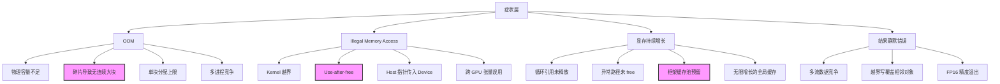
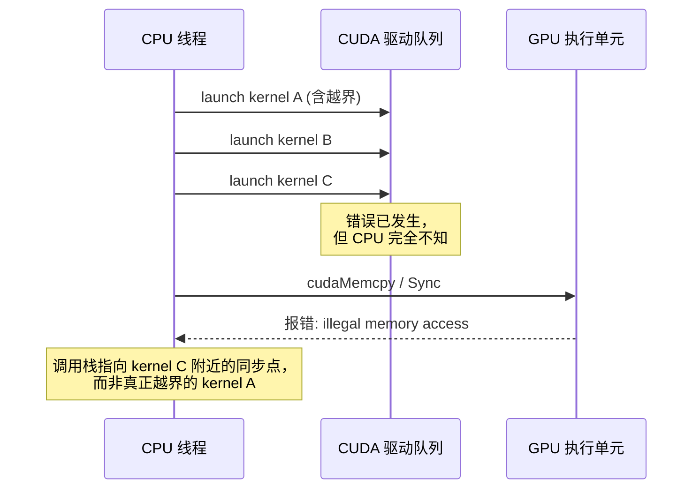

GPU 内存问题最折磨人的地方，往往不是报错本身，而是**报错信息与根因之间的巨大鸿沟**。当你看到 `CUDA out of memory` 时，物理显存可能还有余量；当你看到 `illegal memory access` 时，真正的越界可能发生在几百个 kernel 之前；当你发现 `nvidia-smi` 显示占用飙升时，那可能只是框架缓存池的正常预留，而非内存泄漏。本章不介绍新的 API，而是围绕四大高频故障与五大典型误区，建立从"现象"到"根因"的映射关系，帮助你在复杂的异步执行与多层抽象中快速定位问题本质。

Sources: [gpu_memory_management_tutorial.md](gpu_memory_management_tutorial.md#L7422-L7433)

## 故障的根因拓扑：为什么症状会撒谎

GPU 内存故障的排查困难，本质上源于两个结构性矛盾：**异步执行导致错误在时间轴上漂移**，以及**多层抽象导致统计数字在语义上失真**。物理显存、驱动 reserved 区、运行时缓存池、框架张量池，每一层都有自己的"空闲"定义；而 kernel 的启动、执行、报错可能分布在完全不同的代码位置。下面的概念关系图展示了常见症状与真实根因之间的多对多映射：

图中以高亮标注了三个最易被误判的根因：框架缓存池预留常被误认为泄漏，碎片导致的分配失败常被误认为容量不足，而 use-after-free 的错误则常在完全无关的后续同步点才暴露。

Sources: [gpu_memory_management_tutorial.md](gpu_memory_management_tutorial.md#L7436-L7442)

## 四大高频故障：现象、根因与排查锚点

### 故障一：CUDA Out of Memory

`RuntimeError: CUDA out of memory. Tried to allocate X GB` 是深度学习开发者最熟悉的报错之一，但"out of memory"这个表述具有强烈的误导性——它暗示物理容量耗尽，而实际情况却可能有五种完全不同的根因。按出现频率排序，分别是：**活跃对象总和超过物理容量**、**碎片导致无连续大块可用**、**单次分配超过系统限制**、**地址空间耗尽**（常见于 32 位进程或特定驱动版本）、以及**多进程共享 GPU 时的竞争**。这意味着，当你调小 batch size 后仍然 OOM，或者 `nvidia-smi` 显示仍有几百 MB 空闲却无法分配一个几十 MB 的张量时，问题很可能落在碎片或竞争上，而非简单的"模型太大"。排查的首要动作永远是分层确认：先用 `nvidia-smi` 看全局占用，再用框架工具区分 allocated（实际张量）与 reserved（缓存池），最后检查是否存在异常大对象或未释放的临时张量。

Sources: [gpu_memory_management_tutorial.md](gpu_memory_management_tutorial.md#L7445-L7467)

### 故障二：显存泄漏与缓存保留的辨析

显存泄漏和框架缓存保留在 `nvidia-smi` 上的外在表现几乎一致——进程显存占用高且不轻易下降，但二者的性质截然不同。泄漏是 bug，缓存是策略；泄漏会导致无限增长直至 OOM，缓存则会增长到一个上限后稳定。下面的对比表提供了四个维度的快速鉴别方法：

| 鉴别维度 | 显存泄漏 | 框架缓存保留 |
|---|---|---|
| 增长趋势 | 随时间/迭代持续增长 | 达到平台期后稳定 |
| 释放语义 | 对象引用未释放，物理不可复用 | 对象在池中，逻辑上可快速复用 |
| 引用持有方 | 用户代码、闭包、全局变量 | 框架/池的 allocator |
| 重启后表现 | 恢复基线 | 恢复基线（因此需结合趋势判断） |

常见泄漏根因包括：Python 循环中创建的 tensor 被循环变量持续引用、C++ 异常路径绕过 `cudaFree`、事件回调闭包捕获大对象、以及缺乏 eviction 策略的全局缓存。如果你观察到显存随训练轮次线性增长，就应该优先审查这些代码模式，而不是怀疑 PyTorch 的 caching allocator。

Sources: [gpu_memory_management_tutorial.md](gpu_memory_management_tutorial.md#L7470-L7491)

### 故障三：非法内存访问

`CUDA error: an illegal memory access was encountered` 是 GPU 领域的段错误（Segmentation Fault），但它的调试难度远高于 CPU 版本，根源在于**执行异步性**。Kernel 的启动是立即返回的，真正的内存访问发生在 GPU 执行引擎上，而错误则通常在后续的某个同步点（如 `cudaDeviceSynchronize` 或下一次 CUDA API 调用）才被抛出。这导致调用栈指向的往往是"受害者"代码，而非"肇事者"代码。根因通常有四类：kernel 内索引计算错误导致的越界、对象已释放但 kernel 仍在访问的 use-after-free、将主机端指针误传至设备端执行、以及在多 GPU 环境下张量位于卡 A 但 kernel 在卡 B 上执行。调试的黄金法则是设置 `CUDA_LAUNCH_BLOCKING=1` 强制同步执行，使错误立即在调用点暴露，再配合 `compute-sanitizer` 进行内存检查。

Sources: [gpu_memory_management_tutorial.md](gpu_memory_management_tutorial.md#L7494-L7518)

### 故障四：静默数据损坏

如果说非法内存访问还会以崩溃的形式提醒你，那么**静默数据损坏（Silent Data Corruption）**则是生产环境中最危险的敌人——程序不崩溃，但结果偶尔或持续错误。这类问题的根因往往与内存竞争和生命周期管理相关：多个 CUDA 流同时读写同一块内存而无正确同步、use-after-free 后该地址被新分配的对象覆盖、kernel 越界写破坏相邻对象的数据结构。此外，FP16 运算的溢出与下溢、非确定性算子（如某些 reduce 实现）也会表现为"数值漂移"而非显式的内存错误。由于 GPU 执行的高度并行性，这类错误往往具有偶发性：在单流顺序执行时消失，在多流并发或特定输入尺寸下复现，进一步增加了排查难度。

Sources: [gpu_memory_management_tutorial.md](gpu_memory_management_tutorial.md#L7521-L7537)

## 五大典型误区：看似正确的错误直觉

如果说故障是"知道有问题但找不到原因"，那么误区就是"以为没问题但其实埋了雷"。下面五个误区覆盖了从底层 CUDA 运行时到上层训练策略的常见认知陷阱。

### 误区一：`cudaFree` 后内存立即可用

很多从 CPU 内存管理转过来的开发者会直觉地认为，`cudaFree(ptr)` 返回后，`ptr` 指向的物理内存已经可以被重新分配。但**`cudaFree` 在默认流中是异步提交的**，这意味着：如果其他流中仍有正在执行的 kernel 在使用这块内存，或者驱动内部存在延迟释放机制，立即在该指针上分配新对象或让其他流访问，都会导致未定义行为。正确的做法是在释放前确保所有使用该内存的 kernel 已完成，或在释放后对相关流执行同步。

Sources: [gpu_memory_management_tutorial.md](gpu_memory_management_tutorial.md#L7540-L7554)

### 误区二：显存占用高就是内存泄漏

这是社区中最频繁出现的误判之一。看到 `nvidia-smi` 中进程占用几 GB 显存，就断定存在泄漏，却忽略了现代深度学习框架（PyTorch、TensorFlow 等）普遍采用**缓存分配器（Caching Allocator）**策略：释放的张量不会立即归还给操作系统，而是保留在进程内部的池中，以便下一次分配时快速复用。这些内存在框架视角是"空闲"的，在系统视角却是"进程占用"。区分二者的关键在于观察**趋势**——泄漏是单调递增的，缓存是增长后稳定的。应使用 `torch.cuda.memory_summary()` 查看 reserved 与 allocated 的差值，而不是仅凭系统级工具下结论。

Sources: [gpu_memory_management_tutorial.md](gpu_memory_management_tutorial.md#L7557-L7572)

### 误区三：统一内存可以当普通内存用

`cudaMallocManaged` 带来的"统一内存"（UVM）体验极具欺骗性：代码里不再需要显式 `cudaMemcpy`，指针可以在 CPU 和 GPU 代码间无缝传递。但这并不意味着数据传输消失了——它只是**被推迟到了 page fault 时刻自动执行**。对于访问模式不确定、数据局部性良好的场景，UVM 确实降低了开发复杂度；但如果数据频繁在 CPU 与 GPU 间来回访问，隐式迁移带来的 page fault 开销和 PCIe 往返延迟将远超过显式管理。性能关键路径上，预取（prefetch）和显式迁移提示仍然不可或缺。

Sources: [gpu_memory_management_tutorial.md](gpu_memory_management_tutorial.md#L7575-L7592)

### 误区四：零拷贝内存一定更快

零拷贝内存（Zero-copy / Mapped Pinned Memory）通过页锁定主机内存的映射，让 GPU kernel 可以直接通过 PCIe 访问 CPU 内存，省去了显式 `cudaMemcpy` 的调用代码。但这不代表性能更优——**每一次设备端访问都是一次 PCIe 事务**。对于只读一次或极低频访问的数据，零拷贝避免了完整的拷贝开销；但对于被频繁访问的数据集或中间结果，一次性拷贝到设备显存后的高带宽本地访问，远比反复走 PCIe 总线快得多。选择零拷贝的标准不是"省一行代码"，而是访问频率。

Sources: [gpu_memory_management_tutorial.md](gpu_memory_management_tutorial.md#L7595-L7609)

### 误区五：batch size 越大效率越高

在训练和推理场景中，增大 batch size 确实能摊销 kernel 启动开销、提高计算单元利用率，但这只是故事的一半。另一半是：**显存占用与 batch size 近似线性增长**，过大的 batch 会直接导致 OOM；在训练端，某些优化算法的收敛特性对 batch size 敏感，过大可能损害模型质量；在推理端，batch size 增加意味着首 token 延迟（TTFT）或服务延迟的上升。正确的策略是在显存容量、计算效率和业务延迟/收敛性之间寻找**帕累托前沿**，而非盲目追求最大 batch。显存受限时，gradient accumulation 是一种在有限容量内模拟大 batch 的有效手段。

Sources: [gpu_memory_management_tutorial.md](gpu_memory_management_tutorial.md#L7612-L7629)

## 异步执行：所有故障的共同放大器

回顾上述四大故障与五大误区，你会发现它们背后有一个共同的技术根源——**CUDA 的异步执行模型**。下面的时序图展示了错误发生与错误暴露之间的典型错位：

这种时空错位意味着，GPU 内存问题的排查不能依赖"报错位置即问题位置"的直觉。无论是 OOM 的碎片根因、非法访问的越界根因，还是静默损坏的竞争根因，都需要你有意识地将排查视角从**同步调用栈**转移到**异步执行流与内存生命周期**的全局视图上。

Sources: [gpu_memory_management_tutorial.md](gpu_memory_management_tutorial.md#L7494-L7512)

## 下一步：从"知道误区"到"系统排障"

本章建立了故障与误知的认知框架，但真正的工程能力体现在**将认知转化为可复现的排查动作**。当你在实际环境中遇到上述任何问题时，下一步应当进入系统化的工具链使用与流程化排查——从 `nvidia-smi` 的全局视图，到框架级内存统计的分层透视，再到 `compute-sanitizer` 与 `Nsight` 的微观定位。关于如何按层次使用这些工具、如何解读 `torch.cuda.memory_summary()` 中的 reserved/allocated/active 指标、以及如何建立从现象到根因的标准排查路径，请参阅下一章 [排障方法与工具链](21-pai-zhang-fang-fa-yu-gong-ju-lian)。如果你想在编码阶段就建立防御性习惯，也可以提前浏览 [实战优化清单](22-shi-zhan-you-hua-qing-dan) 中的内存设计 checklist。