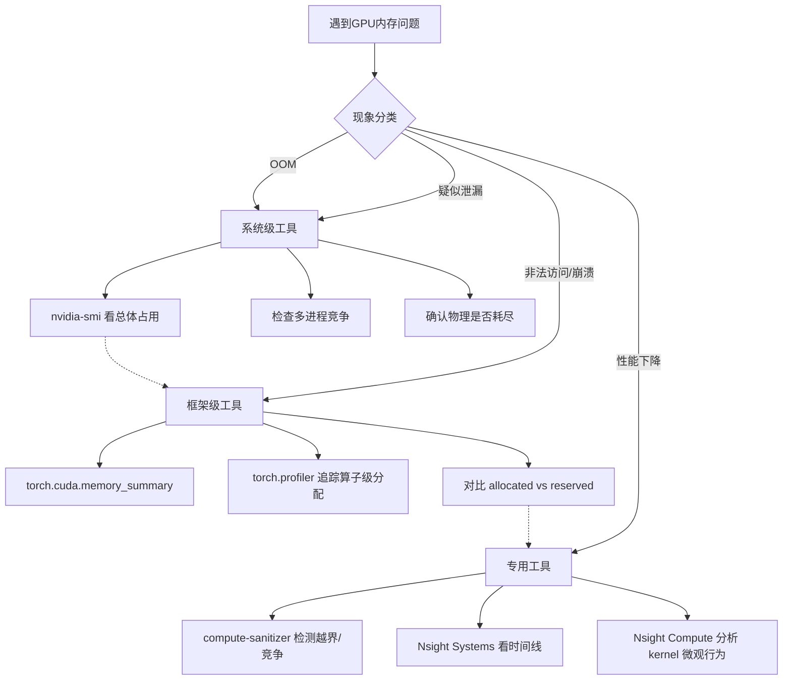

遇到 GPU 内存问题时，盲目猜测根因是最低效的做法。本章建立在 [常见故障与典型误区](20-chang-jian-gu-zhang-yu-dian-xing-wu-qu) 的认知基础之上，将"知道故障长什么样"转化为"知道用什么工具、按什么顺序、解读什么指标来定位根因"的系统能力。核心逻辑是：**先确认现象类别，再选择对应工具，最后按分层漏斗从高到低逐级聚焦**。

Sources: [gpu_memory_management_tutorial.md](gpu_memory_management_tutorial.md#L7654-L7660)

## 核心原则：三层漏斗模型

GPU 内存问题的排查遵循一个从宏观到微观的分层漏斗。第一层用系统级工具确认"物理世界"发生了什么——显存是否真的耗尽、是否有其他进程竞争；第二层用框架级工具进入"逻辑世界"——张量分配、缓存池状态、活跃对象生命周期；第三层用专用工具深入"微观世界"——kernel 越界、数据竞争、带宽瓶颈。跳过第一层直接深入第三层，往往会因为忽略多进程竞争或框架缓存策略而南辕北辙。



这种分层不是教条，而是工程效率的保障。`nvidia-smi` 能在十秒内告诉你是不是隔壁进程吃光了显存；如果这一步没做，直接在 PyTorch 里分析张量碎片就是浪费时间。同样，如果框架级工具已经确认没有活跃张量泄漏，显存却被大量 reserved，那问题可能出在缓存分配器策略而非用户代码，此时继续用 compute-sanitizer 查找越界也毫无意义。

Sources: [gpu_memory_management_tutorial.md](gpu_memory_management_tutorial.md#L7666-L7668)

## 系统级工具：nvidia-smi

`nvidia-smi` 是每一个 GPU 开发者的第一道防线，它的价值不在于提供精细的诊断，而在于**快速排除或确认系统性因素**。

最基础的静态快照命令是 `nvidia-smi`，它会列出所有 GPU 的 `Memory-Usage`（已用 / 总量）、`Volatile GPU-Util`（计算利用率，注意不是显存利用率！）以及当前占用显存的进程列表。如果你的程序报错 OOM，但 `nvidia-smi` 显示该卡还有大量空闲，你就已经排除了"物理容量耗尽"这个最简单的根因，转而需要考虑碎片、缓存预留或多卡误用。

对于持续监控场景，有两条高频率使用的子命令：

| 命令 | 用途 | 典型场景 |
|---|---|---|
| `nvidia-smi dmon` | 按时间间隔持续监控 GPU 总体指标 | 观察显存占用随训练迭代的变化趋势 |
| `nvidia-smi pmon` | 按进程级别监控资源占用 | 多租户环境中定位哪个进程在吃显存 |

`nvidia-smi` 的局限也同样关键：**它只能看到进程级粒度，看不到进程内部的分配细节**。例如，PyTorch 进程占用了 8GB 显存，`nvidia-smi` 无法告诉你其中 3GB 是活跃张量、4GB 是缓存池预留、1GB 是碎片。这个盲区正是框架级工具存在的理由。

Sources: [gpu_memory_management_tutorial.md](gpu_memory_management_tutorial.md#L7707-L7725)

## 框架级工具（以 PyTorch 为例）

深度学习框架在 CUDA 驱动之上构建了复杂的内存管理层——缓存分配器、张量生命周期跟踪、自动微分图的隐式引用。当 `nvidia-smi` 告诉你"某个进程占了大量显存"之后，框架级工具负责回答"这些显存具体是谁的、为什么还在"。

### torch.cuda.memory_summary()

这是训练场景下最常用的诊断入口。执行 `print(torch.cuda.memory_summary(device=0))` 会得到一份结构化报告，其中最关键的三个指标是：

- **Allocated memory**：当前真正被张量占用的显存量
- **Reserved memory**：CUDA 缓存池从驱动申请的总显存（包含了 allocated + 池内空闲块）
- **Active memory**：当前有 Python 引用指向的张量所占显存

当 `Reserved` 远大于 `Allocated` 时，说明缓存池预留了大量未使用的块，这通常是碎片或框架缓存策略导致的"伪耗尽"。当你看到 `Reserved` 接近物理上限而 `Allocated` 很小，就可以确定问题不在张量过多，而在分配器层面。

### torch.cuda.memory_stats()

如果你需要程序化分析而不是人眼阅读，`memory_stats()` 返回一个嵌套字典，包含 allocation、segment、pool 级别的统计。适合集成到自动化监控或异常报警逻辑中。

### torch.profiler

当需要定位"哪个算子在什么时间分配了多少显存"时，`torch.profiler` 是首选工具。通过启用 `profile_memory=True`，profiler 会记录每个算子执行前后的显存变化：

```python
with torch.profiler.profile(
    activities=[
        torch.profiler.ProfilerActivity.CPU,
        torch.profiler.ProfilerActivity.CUDA,
    ],
    profile_memory=True,
) as prof:
    # 你的训练/推理代码
    output = model(input)

print(prof.key_averages().table(sort_by="cuda_memory_usage"))
```

输出表格会按 CUDA 显存使用量排序，让你一眼看到显存峰值是由哪个前向算子、哪个反向算子或哪个优化器状态更新引起的。这在排查"为什么某一步突然 OOM"时极为有效。

Sources: [gpu_memory_management_tutorial.md](gpu_memory_management_tutorial.md#L7731-L7761)

## CUDA 专用工具

当系统级和框架级工具都无法解释问题时——例如程序崩溃、结果静默错误、或者 kernel 性能远低于理论带宽——就需要进入 CUDA 专用工具的领域。这些工具直接作用于驱动和硬件层面，代价是更高的使用门槛和更大的性能开销。

### compute-sanitizer

前身是 `cuda-memcheck`，它是检测 GPU 内存错误的金标准。包含四个子工具，对应不同的问题类型：

| 子工具 | 检测目标 | 典型使用场景 |
|---|---|---|
| `memcheck` | 越界访问、未初始化访问 | 非法内存访问崩溃 |
| `racecheck` | 共享内存数据竞争 | 多线程 kernel 结果不稳定 |
| `initcheck` | 未初始化内存读取 | 静默数据损坏 |
| `synccheck` | 同步错误（如 warp divergence 中的 `__syncthreads`） | 自定义 CUDA kernel 挂死 |

基础用法是：
```bash
compute-sanitizer --tool memcheck ./your_program
```

注意，compute-sanitizer 会让程序执行速度下降数十倍，它只应该在调试阶段使用，绝不应出现在生产环境或性能基准测试中。

### Nsight Systems

Nsight Systems（`nsys`）回答的问题是"时间都去哪了"。它以时间线形式展示整个应用的执行过程：CPU 端的 API 调用、kernel 启动、内存传输（H2D / D2H / D2D）、同步事件。如果你怀疑性能问题是由于"不必要的内存传输"或"同步点过多"导致的，Nsight Systems 的时间线视图能让你直观看到传输与计算的重叠情况。

### Nsight Compute

Nsight Compute（`ncu`）回答的问题是"这个 kernel 为什么不够快"。它针对单个 kernel 进行微观分析，输出内存带宽利用率、合并访问效率（coalescing）、cache hit rate、指令级吞吐量等指标。如果你已经通过 Nsight Systems 锁定了某个耗时 kernel，下一步就是用 Nsight Compute 深入分析它的内存访问模式是否符合 [访问模式优化：合并访问与局部性](10-fang-wen-mo-shi-you-hua-he-bing-fang-wen-yu-ju-bu-xing) 中的最佳实践。

Sources: [gpu_memory_management_tutorial.md](gpu_memory_management_tutorial.md#L7766-L7797)

## 调试技巧：让异步错误现形

CUDA 的异步执行模型是排障的最大障碍。Kernel 启动后立即返回 CPU，真正的执行和错误暴露被推迟到后续的同步点。这导致调用栈上的报错位置往往与真正的错误源完全无关。

### 技巧1：CUDA_LAUNCH_BLOCKING=1

这是调试异步 GPU 问题的第一把钥匙。设置环境变量 `CUDA_LAUNCH_BLOCKING=1` 后，所有 CUDA 调用变为同步执行——kernel 完成后 CPU 才继续，错误会立即在发起调用的代码位置抛出。代价是性能大幅下降，但它能把"在某次无关的 `cudaMemcpy` 时报错"转换为"在真正有 bug 的 kernel 启动时报错"，节省数小时的猜测时间。

```bash
CUDA_LAUNCH_BLOCKING=1 python train.py
```

### 技巧2：逐步缩小范围

面对复杂程序，使用二分法快速定位问题模块：先注释掉后半段代码，看问题是否消失；再对有问题的一半继续二分。这种"最小复现单元"的提取方法，对于区分"模型结构问题"和"数据加载问题"尤其有效。

### 技巧3：对比基线

建立可复现的对比维度能快速隔离变量：
- 小模型 vs 大模型：确认是否仅在大模型上出现
- 小 batch vs 大 batch：确认是否与显存压力阈值相关
- 旧版本代码 vs 新版本代码：确认是否为近期回归

### 技巧4：记录分配日志

在调试模式下，可以通过钩子或封装记录每次 `cudaMalloc` / `cudaFree` 的地址、大小和调用栈。当怀疑存在 use-after-free 或重复释放时，分配日志是唯一能还原时间线的证据。

Sources: [gpu_memory_management_tutorial.md](gpu_memory_management_tutorial.md#L7800-L7824)

## 典型排查案例

以下三个案例覆盖了最常见的排障场景，每个案例都展示了"用什么工具、先看什么指标、再验证什么假设"的完整推理链。

### 案例1：PyTorch OOM，但 nvidia-smi 显示还有空闲

这是最经典的"假耗尽"场景。`nvidia-smi` 显示卡上还有 2GB 空闲，但 PyTorch 报 `CUDA out of memory. Tried to allocate 1.5 GB`。此时应执行：

```python
print(torch.cuda.memory_summary())
```

重点关注两个信号：
1. `Reserved memory` 减去 `Allocated memory` 的差值是否很大？如果是，说明缓存池中有大量碎片或预留空闲块，导致虽然总空闲大于 1.5GB，但没有单个连续块满足请求。
2. 输出中是否有 `num_alloc_retries` 或 `num_ooms` 的计数？这些字段记录了分配器尝试整理碎片和最终失败的次数，是确认"碎片导致 OOM"的直接证据。

对应的缓解手段不是增大物理显存，而是调用 `torch.cuda.empty_cache()` 强制归还碎片（代价是下次分配稍慢），或减小单次分配粒度。

### 案例2：训练过程中显存缓慢增长

如果每过一千个 step，`nvidia-smi` 中的进程显存就上升几十 MB，需要区分"泄漏"与"缓存策略"。排查步骤如下：

1. 记录每步的 `torch.cuda.memory_allocated()`，绘制趋势图。如果该值持续增长，说明有张量未被释放，属于真泄漏；如果该值稳定但 `nvidia-smi` 的总占用增长，说明是框架缓存池在扩张，属于策略行为。
2. 如果是真泄漏，用 `torch.profiler` 对比早期 step 和晚期 step 的算子级显存占用，找到增量来源。
3. 检查数据加载器：序列长度是否随迭代逐渐增加？变长序列会导致 padding 膨胀，进而导致激活值显存增长。

### 案例3：非法内存访问，但调用栈指向无辜代码

崩溃时的 Python 调用栈指向一个普通的 `loss.backward()`，但这几乎不可能是真正的越界位置——异步执行让错误延迟暴露到了后续的同步点。正确的排查流程是：

```bash
CUDA_LAUNCH_BLOCKING=1 python train.py
```

同步模式下的报错会直接指向真正越界的 kernel。如果仍然不明确，再用 compute-sanitizer 运行：
```bash
compute-sanitizer --tool memcheck python train.py
```

它会报告具体的内存地址、访问大小和越界方向（读还是写），结合代码中的索引计算即可定位根因。

Sources: [gpu_memory_management_tutorial.md](gpu_memory_management_tutorial.md#L7826-L7864)

## 工程实践建议

工具链的价值不仅在于事后排障，更在于事前预防和持续监控。以下三条建议能将排障能力嵌入日常开发流程。

### 建议1：建立显存监控基线

在模型稳定运行后，记录以下指标作为正常基线：
- 启动后基线显存（模型权重 + 优化器状态）
- 每步活跃显存（前向 + 反向的峰值）
- 峰值显存（整个训练步的最大值）
- 缓存比例（reserved / allocated 的比值）

当异常发生时，对比当前值与基线的偏差，能快速判断是"新模型结构导致"还是"代码变更引入"。

### 建议2：自动化测试中加入显存检查

在单元测试或集成测试的 teardown 阶段，加入显存断言：
```python
final_mem = torch.cuda.memory_allocated()
assert final_mem - initial_mem < threshold, \
    f"显存泄漏: {final_mem - initial_mem} bytes"
```

这能在代码合并前就捕获循环引用、异常路径未释放等问题。

### 建议3：生产环境暴露显存指标

通过 Prometheus / Grafana 等监控体系持续采集：
- GPU 显存使用率（`nvidia-smi` 暴露的指标）
- 每进程显存占用
- OOM 事件次数

生产环境的显存问题往往是渐进的——缓存池膨胀、请求长度分布变化、模型版本升级——持续监控能在 OOM 发生前触发预警。

Sources: [gpu_memory_management_tutorial.md](gpu_memory_management_tutorial.md#L7867-L7893)

## 排障 Checklist 速查

以下清单可直接用于代码审查或线上排障时的逐项核对。

**OOM 排查**
- [ ] `nvidia-smi` 看总体占用，确认是否物理耗尽
- [ ] 检查是否有其他进程占用同一块 GPU
- [ ] 框架工具看 `allocated` vs `reserved`，确认是缓存还是真的用完
- [ ] 检查单次分配大小是否超过剩余最大连续块
- [ ] 怀疑碎片：尝试 `empty_cache` 或减小分配粒度
- [ ] 检查是否有异常大的 tensor（如广播膨胀）

**泄漏排查**
- [ ] 记录显存占用趋势：持续增长 vs 稳定平台
- [ ] 框架工具看 active 对象数量和大小
- [ ] 检查循环中的 tensor 创建和引用释放
- [ ] 检查异常路径是否跳过了释放逻辑
- [ ] 检查全局缓存是否有无限增长或缺少 eviction
- [ ] 对比重启前后的基线占用

**非法访问排查**
- [ ] `CUDA_LAUNCH_BLOCKING=1` 定位具体调用
- [ ] `compute-sanitizer --tool memcheck` 检测越界
- [ ] 检查所有索引计算和指针算术
- [ ] 确认张量在正确的设备上
- [ ] 检查是否有 use-after-free

**性能排查**
- [ ] Nsight Systems 看时间线，找瓶颈
- [ ] Nsight Compute 分析关键 kernel 的带宽和计算利用率
- [ ] 检查是否有不必要的 H2D/D2H 传输
- [ ] 检查内存访问模式（coalescing、bank conflict）
- [ ] 检查同步点是否过多

Sources: [gpu_memory_management_tutorial.md](gpu_memory_management_tutorial.md#L8408-L8442)

## 本章小结

GPU 内存排查的精髓不是记住所有工具的参数，而是建立**分层诊断的思维习惯**。`nvidia-smi` 确认物理现实，PyTorch 内存工具解析逻辑状态，compute-sanitizer 和 Nsight 挖掘硬件微观行为。在异步执行的迷雾中，`CUDA_LAUNCH_BLOCKING=1` 是唯一能立即拉齐 CPU 与 GPU 时间线的手段。最终，将显存监控纳入自动化测试和生产观测体系，才能把"事后救火"转变为"事前预警"。

Sources: [gpu_memory_management_tutorial.md](gpu_memory_management_tutorial.md#L7896-L7908)

---

## 阅读路径

- **上一步**：如果你还没系统了解 GPU 内存故障的症状与根因拓扑，请先阅读 [常见故障与典型误区](20-chang-jian-gu-zhang-yu-dian-xing-wu-qu)。
- **下一步**：当你已经掌握排障方法，准备将优化策略落地为可执行的清单时，请继续阅读 [实战优化清单](22-shi-zhan-you-hua-qing-dan)。