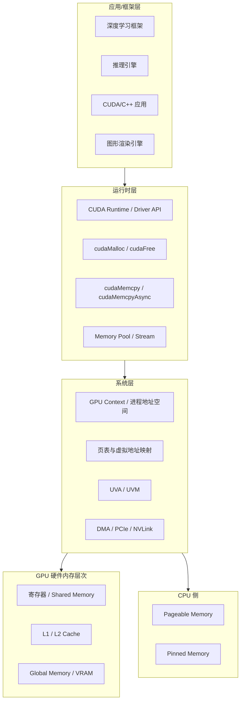

GPU 内存管理之所以值得系统学习，不是因为它 API 多，而是因为它涉及的问题维度非常多元。很多初学者一上来就把所有"内存问题"混为一谈，结果调参方向完全错误。本页的目标是在你深入任何细节之前，先把**五个最核心、最常出现的概念**建立清晰直觉，并给出一张**系统分层总图**。这样当你在后面章节读到寄存器、页表、`cudaMalloc`、缓存分配器时，都能立刻知道它们各自在解决哪一类问题。

---

## 一、GPU 内存系统的五层总图

在理解五个核心概念之前，你需要先建立一张"地图"。GPU 内存管理从来不是"显存够不够"这一个问题，而是从 CPU 内存、总线、地址空间、运行时 API、硬件缓存一直到上层框架的完整链路。教程把这条链路抽象成五层结构，任何问题都可以先定位到某一层，再往下追踪。

这张图表达了一个基本事实：**你在 PyTorch 里创建一个张量，最终可能触发物理显存页分配、虚拟地址映射、DMA 传输和硬件缓存命中等一系列跨层动作**。如果一开始就只看到"显存占用"这一个数字，后面遇到 OOM、碎片、同步卡顿都会难以理解。Sources: [gpu_memory_management_tutorial.md](gpu_memory_management_tutorial.md#L460-L498)

---

## 二、五个核心概念：一张速查表

教程全篇围绕下面五个关键词展开。它们分别对应不同类型的瓶颈，不能互相替代。下面这张表帮你快速建立对应关系。

| 核心概念 | 一句话定义 | 典型症状 | 常见根因 | 主要关联层级 |
|---------|-----------|---------|---------|------------|
| **容量** | 能放多少数据 | OOM、batch size 上不去、长上下文爆显存 | 峰值过高、生命周期重叠、碎片导致连续大块不足 | 硬件层、框架层 |
| **带宽** | 单位时间能运多少数据 | kernel 不重但很慢、ALU 空转、增加计算不影响总时间 | 访存密度高、cache 命中低、数据量本身巨大 | 硬件层、系统层 |
| **延迟** | 一次访问从发起到返回要多久 | 线程等待数据、occupancy 不足 | 显存访问天然比片上存储慢，需靠并发隐藏 | 硬件层 |
| **访问模式** | 线程如何组织数据的读写 | 随机访问慢、改布局后性能巨变、bank conflict | 未合并访问、未对齐、AoS 不适合并行、跨步大 | 硬件层 |
| **分配开销** | 申请/释放/管理内存本身的成本 | 频繁分配卡顿、长时间运行后变抖、框架不释放显存 | `cudaMalloc` 涉及驱动交互和同步、缓存分配器策略 | 运行时层、框架层 |

这张表最重要的作用是**纠偏**：当你遇到 GPU 程序变慢时，先不要笼统地说是"内存问题"，而应该先归到五个概念之一。例如，`nvidia-smi` 显示显存很高未必是容量问题，而可能是框架缓存分配器的分配开销策略；kernel 算术简单但运行慢，更可能是带宽或访问模式问题，而不是算力不足。Sources: [gpu_memory_management_tutorial.md](gpu_memory_management_tutorial.md#L154-L217)

---

## 三、逐个建立直觉

### 1. 容量：不只是"显存够不够"

容量是最直观的概念，但也是最容易被误判的。很多人以为只要 `nvidia-smi` 显示还有空闲显存，就还能继续分配。实际上，GPU 内存分配需要**连续虚拟地址**和**物理页映射**的配合，碎片、生命周期重叠、框架内部缓存都会让"看起来有空"变成"实际分配失败"。

容量的核心问题是**放得下与放不下**，但它通常不是静态的，而是与时间强相关。同一块 16GB 显存，生命周期管理好的程序可以稳定运行，管理差的程序可能频繁 OOM。因此教程强调要用**生命周期思维**替代**静态盒子思维**。Sources: [gpu_memory_management_tutorial.md](gpu_memory_management_tutorial.md#L160-L172)

### 2. 带宽：路很宽，但车不一定跑得快

GPU 显存带宽在纸面上往往非常惊人，但"有带宽"和"用满带宽"是两回事。可以把显存带宽想象成一条很宽的高速公路：路再宽，如果车流组织混乱、上下匝道频繁、车辆零散分布，实际通行效率依然很差。

带宽问题的判断标准很直接：如果你的 kernel 计算量不大但执行时间很长，或者增加计算量几乎不影响总时间，说明程序很可能已经**带宽受限**。此时再去优化算法复杂度意义不大，更应该关注数据搬运效率和缓存命中率。Sources: [gpu_memory_management_tutorial.md](gpu_memory_management_tutorial.md#L173-L183)

### 3. 延迟：GPU 选择"隐藏"而不是"消除"

延迟是指从发起一次内存访问到真正拿到数据之间的时间。GPU 的显存延迟远高于寄存器和 shared memory，但 GPU 的设计哲学与 CPU 完全不同：**CPU 追求单次低延迟，GPU 追求整体高吞吐**。

GPU 不主要靠复杂缓存或乱序执行来缩短每一次等待，而是靠**挂起大量线程、在线程间快速切换**来隐藏延迟。当某个 warp 在等待数据时，硬件立刻换另一个 warp 执行。这意味着"延迟"在 GPU 上不是孤立的数值，而是与**occupancy（并发度）**紧密耦合的概念。如果你的 kernel 占用了过多寄存器或 shared memory，导致同时驻留的线程块减少，延迟隐藏能力就会下降。Sources: [gpu_memory_management_tutorial.md](gpu_memory_management_tutorial.md#L184-L191)

### 4. 访问模式：决定你能不能"把路走对"

访问模式可能是五个概念中最被低估、但影响最大的一个。它指的是线程群体如何组织对数据的读写。GPU 以 warp 为执行粒度，如果一个 warp 内的线程访问的是相邻地址，硬件可以把这些访问**合并（coalesce）**成少量高效事务；反之，如果每个线程跳到不同位置，事务数就会暴涨。

同样的数据量、同样的带宽硬件，仅仅因为访问模式从连续变为跨步或随机，性能就可能相差数倍。这也是为什么 GPU 上数据布局（SoA vs AoS）、对齐方式、bank conflict 会成为核心优化点。很多所谓"带宽利用率低"的问题，本质上是访问模式差。Sources: [gpu_memory_management_tutorial.md](gpu_memory_management_tutorial.md#L192-L203)

### 5. 分配开销：内存管理本身也能成为瓶颈

最后一个概念最容易被忽略，因为它不直接表现为"计算慢"或"搬运慢"，而表现为**抖动、卡顿和不稳定**。在 GPU 上，一次 `cudaMalloc` 或 `cudaFree` 远不是简单的"记账"操作，它通常涉及运行时与驱动的交互、虚拟地址管理、物理页分配与映射，甚至可能触发隐式同步。

真实工程中，深度学习框架之所以常常"不释放显存"，并不是 bug，而是因为它们在运行时层之上实现了**缓存分配器（caching allocator）**，通过预先申请大块、内部切分、延迟归还的方式来摊平昂贵的系统级分配开销。理解这一点，才能正确解读 `nvidia-smi` 的显存数字。Sources: [gpu_memory_management_tutorial.md](gpu_memory_management_tutorial.md#L204-L217)

---

## 四、前置思维切换：CPU 低延迟 vs GPU 高吞吐

在深入这五个概念的细节之前，还有一层更底层的思维切换必须完成：**不要用 CPU 的直觉理解 GPU**。

CPU 的设计目标是通用计算，偏好单线程性能、低延迟、复杂分支和灵活控制流；GPU 的设计目标是数据并行吞吐，偏好大量相似线程、批量处理和规则访问。这个根本差异决定了为什么 GPU 对"访问模式"如此敏感、为什么"大量线程"不是万能药、为什么指针追逐和小对象分配在 GPU 上代价特别高。如果你带着 CPU 的低延迟思维去读后面的硬件层次和 CUDA API，很多设计会显得"反直觉"；但一旦切换到高吞吐思维，它们就会变得非常合理。Sources: [gpu_memory_management_tutorial.md](gpu_memory_management_tutorial.md#L1016-L1074)

---

## 五、从概念到实践：推荐阅读路径

这五个核心概念不是孤立的知识点，而是贯穿全教程的分析框架。建议你按下面的顺序继续阅读，把每一个概念放到具体的层级和场景中去落地：

1. **先完成思维切换** — [CPU与GPU内存思维差异](6-cpuyu-gpunei-cun-si-wei-chai-yi)：理解高吞吐设计哲学，这是后面所有概念的底层透镜。
2. **理解物理基础** — [GPU硬件内存层次解析](4-gpuying-jian-nei-cun-ceng-ci-jie-xi)：把容量、带宽、延迟对应到寄存器、shared memory、L2、VRAM 的具体硬件实现上。
3. **理解地址空间** — [地址空间、页表与虚拟内存](5-di-zhi-kong-jian-ye-biao-yu-xu-ni-nei-cun)：明白"容量"不只是物理显存大小，还涉及虚拟地址、页映射和碎片。
4. **理解运行时机制** — [内存分配全链路：从cudaMalloc到驱动](7-nei-cun-fen-pei-quan-lian-lu-cong-cudamallocdao-qu-dong)：把"分配开销"从抽象概念落地到 `cudaMalloc` 到底做了什么。
5. **理解数据流动** — [CPU与GPU数据流动机制](8-cpuyu-gpushu-ju-liu-dong-ji-zhi)：把带宽概念落地到 H2D/D2H 拷贝、pinned memory、DMA 和异步流。
6. **理解访问优化** — [访问模式优化：合并访问与局部性](10-fang-wen-mo-shi-you-hua-he-bing-fang-wen-yu-ju-bu-xing)：把"访问模式"从直觉转化为可操作的 coalescing、对齐和局部性优化。
7. **进入场景实战** — 根据你的方向选择 [训练场景GPU内存构成分析](13-xun-lian-chang-jing-gpunei-cun-gou-cheng-fen-xi)、[推理场景GPU内存管理](15-tui-li-chang-jing-gpunei-cun-guan-li) 或 [通用CUDA/C++内存设计模式](17-tong-yong-cuda-c-nei-cun-she-ji-mo-shi)。

---

## 六、本章小结

1. GPU 内存问题至少可以归为五类：**容量、带宽、延迟、访问模式、分配开销**。看到现象时，先归类，再下手。
2. GPU 内存管理横跨**应用层、运行时层、系统层、硬件层和 CPU 侧**，不要只盯着显存占用一个数字。
3. 一块 GPU 内存从申请、映射、拷贝、访问、复用到回收，贯穿整条软硬件栈。用**生命周期**而不是**静态容量**去思考。
4. 理解 GPU 的**高吞吐思维**（靠并发隐藏延迟、靠规则访问放大带宽）是掌握后续所有细节的前提。