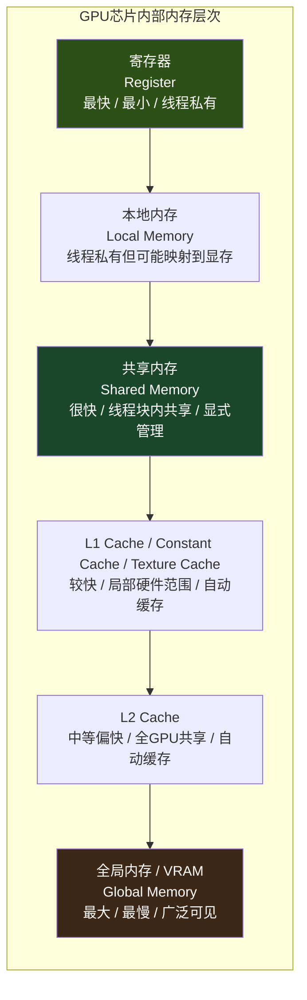

当你编写一个 CUDA kernel 时，数据可能出现在寄存器、共享内存、L1/L2 缓存或全局显存中的任意一层。这些层次不是简单的"快与慢"之分，而是各自拥有不同的容量、可见范围、管理方式和资源约束，并直接决定了一个 kernel 能并发多少线程、能否隐藏延迟、以及最终能否逼近硬件的理论算力。本页将逐层拆解 GPU 芯片内部的内存体系，建立从寄存器到 VRAM 的完整硬件认知框架，为后续理解 CUDA 内存分配、访问模式优化和性能瓶颈定位打下基础。

Sources: [gpu_memory_management_tutorial.md](gpu_memory_management_tutorial.md#L1405-L1437)

## 整体架构：GPU内存层次金字塔

GPU 的内存层次可以抽象为一个**离计算单元越近则越快、越小、越稀缺**的金字塔结构。这和 CPU 的多级缓存思路有相似之处，但设计目标不同：CPU 更强调让单线程尽量少等待，GPU 更强调让大批线程持续有活可干，因此其内存层次深度参与并行度管理。

如果只用一句话记住这张图的精髓：**越靠近计算单元的层次，访问延迟越低，但容量越有限；越往下走，容量越大，但访问代价越高，且性能越来越依赖访问模式是否规律。** 很多初学者谈"GPU 内存"只想到最底层的显存，但对一个 kernel 的实际执行效率而言，数据停留在金字塔的哪一层，往往比"能不能放下"更能决定性能。

Sources: [gpu_memory_management_tutorial.md](gpu_memory_management_tutorial.md#L1440-L1470)

## 寄存器：最快也是最稀缺的资源

寄存器是离计算单元最近的临时工作台，线程的局部变量、循环计数器和中间结果如果都能放进寄存器，访问代价最低。然而，寄存器的真正瓶颈不是速度，而是**极度稀缺**。一个 Streaming Multiprocessor（SM）上的寄存器总量是固定的，如果某个 kernel 中每个线程消耗了大量寄存器，即使线程块规模不大，也可能因为寄存器预算耗尽，导致同一时间只能驻留极少数线程块。

这直接引出了一个反直觉的结论：**寄存器用得越多，不一定越快。** 更多寄存器意味着单个线程状态更"豪华"，但并发度（occupancy）会因此下降。当活跃 warp 数量不足时，GPU 隐藏显存延迟的能力就会削弱，整体性能反而可能倒退。因此在优化时，不能只看"变量是否进了寄存器"，还要关注编译器生成的寄存器使用量是否把 occupancy 压得过低，以及是否值得为了更多并发而让部分值落到共享内存等层次。

Sources: [gpu_memory_management_tutorial.md](gpu_memory_management_tutorial.md#L1473-L1517)

## Local Memory：名字像"本地"，实际未必本地

Local memory 是 GPU 学习中最容易被误解的概念之一。"Local"在这里指的是**线程私有可见**，而不是"物理上很近"。当线程需要的私有数据超出寄存器容量时，编译器会发生 register spilling，将部分内容溢出到 local memory。在很多实现中，local memory 的底层访问路径接近 global memory（显存路径），而非寄存器路径。

这意味着一个看似简单的局部数组或临时变量，如果导致 spilling，其实际访问代价可能远高于直觉中的"本地临时变量"。如果你发现一个算术操作并不复杂的 kernel 运行异常缓慢，一个常见的排查方向就是检查编译器是否发生了寄存器溢出，导致部分变量落到了 local memory 中。在 GPU 上，**"线程私有"不等于"访问便宜"**。

Sources: [gpu_memory_management_tutorial.md](gpu_memory_management_tutorial.md#L1519-L1555)

## Shared Memory：线程块内协作的高速工作台

如果把寄存器理解为每个线程自己的小工作台，那么 shared memory 就是**同一线程块内所有线程共享的一张大工作台**。它的速度通常远快于显存，且由程序员显式分配和管理，生命周期与线程块绑定。Shared memory 的经典用法是：先把会被多次访问的数据从 global memory 搬运进来，在线程块内部反复复用，从而减少对显存的重复访问。矩阵乘法的 tile 优化、卷积中的分块计算、图像处理中的邻域复用，都是这一思路的典型应用。

但 shared memory 不是免费午餐。它的容量有限，用多了会压低 occupancy；需要显式同步（`__syncthreads()`）来保证数据一致性；访问不当还会触发 bank conflict，导致原本可以并行的读写被串行化。因此，shared memory 的优化精髓不在于"用得越多越好"，而在于**精准识别可复用数据、合理分块、并避免访问冲突**。关于 bank conflict 的具体机制与规避方法，将在下一节展开。

Sources: [gpu_memory_management_tutorial.md](gpu_memory_management_tutorial.md#L1558-L1598)

## Bank Conflict：Shared Memory 的典型陷阱

Shared memory 在硬件上被拆分为多个并行 bank，理想情况下不同线程同时访问不同 bank，读写可以并行进行。但如果多个线程在同一时刻访问**同一个 bank 的不同地址**，就会触发 bank conflict，导致这些访问被部分串行化，性能收益大打折扣。

很多人优化时的直觉是"shared memory 比 global memory 快，搬进去肯定更快"，但这并不总成立。如果访问模式导致严重的 bank conflict，shared memory 的优势会被显著削弱。工程上的应对策略包括：关注数据在 shared memory 中的排布方式、检查线程索引与数据索引的映射关系、通过 padding 打破固定跨步访问、以及避免让大量线程同时撞到同一个 bank。这再次说明，GPU 内存优化不仅是"选择哪一层"，还包括**在同一层内部如何布局数据**。

Sources: [gpu_memory_management_tutorial.md](gpu_memory_management_tutorial.md#L1602-L1628)

## 硬件自动缓存层：L1、Constant Cache 与 Texture Cache

在寄存器和 shared memory 之下，GPU 还包含若干由硬件自动管理的缓存层，它们试图在不需要程序员显式控制的前提下，提升一部分访问效率。

**L1 cache** 离执行单元较近，用于缓存最近或局部访问的数据，降低部分访存延迟。但不应将它理解为"像 CPU L1 那样可以兜住一切"——GPU 的总体设计仍然更依赖大规模并行和规律的访问模式，L1 只是辅助。

**Constant cache** 适合小规模只读数据，尤其是多个线程反复读取同一个常量值的场景，例如参数表、固定配置等。当一个 warp 内大量线程访问同一常量地址时，广播式的读取非常高效。

**Texture cache** 最早源于图形处理管线，后来也被用于通用只读访问。它对空间局部性良好的只读访问模式很有帮助，在图像处理和采样类问题中经常出现。

这三类缓存的共同点是：它们能自动提高部分访问效率，但前提是访问模式足够友好。**你不能指望"有缓存"就自动救活糟糕的数据布局**，GPU 缓存更像是锦上添花，而非替代访问优化的万能药。

Sources: [gpu_memory_management_tutorial.md](gpu_memory_management_tutorial.md#L1632-L1665)

## L2 Cache：全 GPU 共享的重要缓冲层

L2 cache 是整个 GPU 范围内更大、共享的一层缓存，它不属于某个特定线程块，也不只服务局部执行单元，而是为更广范围的访存活动提供缓冲。L2 的核心作用包括：缓存 global memory 的热点数据、降低对 VRAM 的直接访问压力、以及在多个 SM 之间充当共享缓冲。

很多 global memory 访问是否真的"贵到极致"，很大程度上取决于是否命中 L2、访问模式是否产生复用、以及多个线程块是否在读取相同或邻近的数据。如果访问完全随机、工作集极大且局部性很差，L2 的帮助就非常有限。这揭示了一个关键事实：**global memory 访问不一定每次都直达最慢路径，但是否能受益于缓存，取决于你的访问模式是否值得被缓存。**

Sources: [gpu_memory_management_tutorial.md](gpu_memory_management_tutorial.md#L1669-L1698)

## Global Memory / VRAM：容量最大的后备层

Global memory 通常就是程序最常接触到的"设备内存"，底层对应显存 VRAM。你通过 `cudaMalloc` 拿到的设备指针，本质上最终都是在使用这一层。它的特点是容量最大、对所有合适范围内的线程可见、但访问延迟远高于片上存储，且性能高度依赖访问模式。

一个常见的误区是认为"数据能放进显存就行，算法主要由算术复杂度决定"。但在 GPU 上，global memory 的性能不是一个常数，而是一个由访问模式决定的结果：合并、连续、对齐的访问可能逼近理想带宽；零散、随机、跨步的访问则可能浪费大量事务带宽。因此显存不是"最后的答案"，而是**必须谨慎使用的大容量后备层**，优化目标始终是让热点数据尽可能停留在更高层次，并以规律的方式访问显存。

Sources: [gpu_memory_management_tutorial.md](gpu_memory_management_tutorial.md#L1701-L1740)

## Occupancy：为什么并发能力与内存资源绑在一起

Occupancy 可以粗略理解为：某个时刻，一个 SM 上实际能维持的活跃 warp 数量与理论上限的比例。它反映的不是"程序绝对快不快"，而是"硬件同时挂了多少活"。Occupancy 受多种资源共同限制，其中与内存层次最密切相关的是**每线程寄存器使用量**和**每线程块 shared memory 使用量**。如果一个 kernel 每个线程消耗大量寄存器、每个线程块占据大量共享内存，同一时刻能驻留的线程块数量就会减少。

GPU 需要靠大量活跃线程来隐藏延迟。当 occupancy 太低时，一批线程因等待显存而挂起后，调度器能切换到的其他线程也不够多，延迟就更容易暴露出来。但 occupancy 并非越高越好——为了提高 occupancy 而过度削减寄存器使用，可能导致更多 spilling 到 local memory，或因共享内存不足而无法实现数据复用，反而降低单线程执行效率。因此，occupancy 本质上是一个**资源约束与性能平衡**的问题，而非单一追求的分数。

Sources: [gpu_memory_management_tutorial.md](gpu_memory_management_tutorial.md#L1744-L1782)

## Latency Hiding：GPU 如何"假装不怕慢内存"

显存访问的延迟很高，远慢于寄存器和 shared memory，但 GPU 并未因此彻底变慢，因为它采用的是**隐藏延迟**而非消灭延迟的策略。具体而言：当一个 warp 发起访存后，如果数据尚未返回，该 warp 会被挂起，调度器转而去执行其他已准备好的 warp。只要这类"备选 warp"足够多，计算单元就不会闲下来，这就是 latency hiding。

成功隐藏延迟的前提是：足够多的活跃 warp、不是所有 warp 都同时卡在同类等待上、有足够独立的工作可切换、以及内存系统没有差到把所有线程一起堵死。这也解释了为什么 occupancy 与内存资源用量如此紧密地绑定在一起——它们共同决定了 GPU 是否有足够的"候选项"来填补等待间隙。如果你发现某个访存密集型 kernel 表现不佳，首要排查方向往往不是"算术够不够重"，而是**并发度是否足以掩盖显存延迟**。

Sources: [gpu_memory_management_tutorial.md](gpu_memory_management_tutorial.md#L1785-L1817)

## 带宽与延迟：两个必须严格分开的概念

延迟和带宽是 GPU 内存优化中最常被混淆的两个概念，但它们的含义截然不同。**延迟**回答的是"一次访问要等多久"，类似于包裹从发货到签收的时间；**带宽**回答的是"单位时间能运多少数据"，类似于物流线路一小时能吞吐多少吨货。一个系统完全可以单次访问延迟很高，但只要请求足够多、组织得足够好，总吞吐仍然很高——这正是 GPU 的典型特征。

在优化实践中，两者对应的策略也不同。优化延迟通常关注：是否使用更近层次的存储、是否提高 occupancy 隐藏等待、是否减少同步阻塞。优化带宽则关注：是否实现合并访问、是否减少不必要流量、是否提高数据复用、是否降低事务浪费。理解这两者的区别，才能避免在调优时把"带宽没吃满"误判为"延迟太高"，反之亦然。

Sources: [gpu_memory_management_tutorial.md](gpu_memory_management_tutorial.md#L1820-L1864)

## 层次对比总览

下表汇总了 GPU 硬件内存层次的核心特征，帮助你快速建立定位直觉：

| 层次 | 速度 | 容量 | 可见范围 | 管理方式 | 典型风险与注意点 |
|:---|:---|:---|:---|:---|:---|
| 寄存器 | 最快 | 极小（KB级/SM） | 单线程私有 | 编译器自动分配 | 用量过多会压低 occupancy，反而降低整体吞吐 |
| Local Memory | 接近显存 | 依赖显存 | 单线程私有 | 编译器溢出时自动使用 | 看似"本地"，实际可能走显存路径，代价高昂 |
| Shared Memory | 很快 | 有限（KB~百KB/SM） | 同一线程块内 | 程序员显式管理 | bank conflict、同步开销、用量过多影响并发 |
| L1 / 只读缓存 | 较快 | 较小 | 局部硬件范围 | 硬件自动管理 | 不能兜住所有不规则访问，依赖局部性 |
| L2 Cache | 中等偏快 | 较大（MB级/GPU） | 全 GPU 共享 | 硬件自动管理 | 随机访问或大工作集下命中率骤降 |
| Global Memory / VRAM | 最慢之一 | 最大（GB级/GPU） | 广泛可见 | 运行时分配 | 性能高度依赖访问模式，合并 vs 随机差异巨大 |

这张表不追求架构细节的绝对精确（不同代际 GPU 的具体参数差异很大），但足以作为后续分析访问模式、资源约束和性能瓶颈的统一参照框架。

Sources: [gpu_memory_management_tutorial.md](gpu_memory_management_tutorial.md#L1868-L1880)

## 本章核心结论

综合以上各层的分析，可以提炼出六条贯穿 GPU 硬件内存优化的核心结论：

1. **GPU 内存不是只有显存，而是一个明确的分层系统。** 从寄存器到 VRAM，每一层都有其特定的速度、容量和约束。
2. **越靠近计算单元的层次通常越快，但容量越小、资源越稀缺。** 优化的核心目标之一就是让热点数据尽可能停留在上层。
3. **寄存器和 shared memory 不仅影响访问速度，也直接影响并发度和 occupancy。** 它们是资源约束与性能平衡的关键杠杆。
4. **Local memory 虽然在线程语义上私有，但性能上往往不能被当成便宜存储。** 警惕编译器的 register spilling。
5. **Global memory 容量大，但性能高度依赖访问模式。** 不能把它当成"随便读都一样快"的统一大仓库。
6. **GPU 的核心策略是通过高并发去隐藏内存延迟。** 因此资源占用、并发能力和访存效率始终绑在一起，调优时需要统筹考虑。

Sources: [gpu_memory_management_tutorial.md](gpu_memory_management_tutorial.md#L1884-L1894)

## 阅读路径建议

理解 GPU 硬件内存层次后，你已经掌握了"数据在芯片内部如何分层存储"的底层认知。接下来建议按以下路径继续深入：

- 如果你希望理解这些硬件层次之上的系统视角——GPU 显存如何被地址空间、页表和虚拟内存机制组织——请继续阅读 [地址空间、页表与虚拟内存](5-di-zhi-kong-jian-ye-biao-yu-xu-ni-nei-cun)。
- 如果你想对比 CPU 与 GPU 在内存思维上的根本差异，建立"高吞吐 vs 低延迟"的设计直觉，可回顾 [CPU与GPU内存思维差异](6-cpuyu-gpunei-cun-si-wei-chai-yi)。
- 如果你准备从硬件层次进入 CUDA 编程实践，了解 `cudaMalloc` 等 API 如何与这些硬件层次交互，可前往 [内存分配全链路：从cudaMalloc到驱动](7-nei-cun-fen-pei-quan-lian-lu-cong-cudamallocdao-qu-dong)。
- 如果你已经准备优化 kernel 的访问模式，学习合并访问（coalescing）与局部性的具体技巧，可直接跳到 [访问模式优化：合并访问与局部性](10-fang-wen-mo-shi-you-hua-he-bing-fang-wen-yu-ju-bu-xing)。