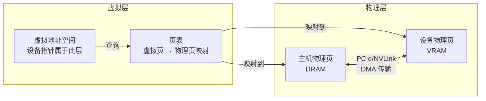

GPU 显存常常被直觉地理解为"设备上的一块连续大数组"——程序申请一段空间，GPU 直接读写即可。但这个图景过于粗糙。在真实的系统视角下，一块"GPU 内存"至少涉及虚拟地址空间、物理显存页、地址映射关系、CPU 与 GPU 之间的数据通路，以及 DMA、IOMMU、BAR、UVA、UVM 等协作机制。本章的目标正是从系统层出发，讲清**地址空间**、**页表映射**与**虚拟内存**这三根支柱，为后续理解 `cudaMalloc` 的分配语义、`cudaMemcpyAsync` 的传输条件、统一内存的迁移代价建立必要的概念地基。

Sources: [gpu_memory_management_tutorial.md](gpu_memory_management_tutorial.md#L1899-L1930)

---

## 核心三要素：主机内存、显存与地址空间

在深入映射机制之前，必须先拆清三个常被混为一谈的概念。

**主机内存**通常指 CPU 所在系统的 DRAM，操作系统管理其虚拟地址空间、物理页、分页与缓存。**显存**指 GPU 设备上的 VRAM，供 kernel 执行、张量与缓冲区存储使用。**地址空间**则不是某块物理内存，而是**程序看到的地址视图**——一个指针首先属于某个地址空间视图，它到底映射到主机物理页、设备物理显存页，还是需要迁移/转换后才能访问，都由地址空间机制决定。

很多 GPU 内存问题的根源并非"物理上有没有空间"，而是：这个地址属于谁的视图、谁可以访问它、访问路径经过什么、虚拟地址与物理页如何建立关系、访问时是否需要迁移或拷贝。将这三者分开思考，是定位 OOM、非法访问和性能异常的第一步。

Sources: [gpu_memory_management_tutorial.md](gpu_memory_management_tutorial.md#L1933-L1966)

---

## 虚拟地址：程序看到的从来不是真实物理位置

在普通 CPU 编程中，你拿到的 C/C++ 指针一般也不是真实物理地址，而是进程虚拟地址空间中的地址；操作系统通过页表将其映射到物理页。GPU 世界遵循同样的抽象逻辑：设备指针本质上也要通过某种地址空间机制来解释，并非简单等价于"某颗显存芯片上的裸物理位置"。

这意味着设备内存同样通过虚拟地址管理，运行时和驱动需要保留地址区间，物理显存页与虚拟地址之间必须建立映射。虚拟地址带来的好处包括：简化编程模型、让地址管理更灵活、方便重映射和页迁移、使 CPU 与 GPU 之间的统一地址视图成为可能，以及支持更复杂的内存管理策略。因此，GPU 内存管理从来不是在裸金属显存上直接切块那么简单。

Sources: [gpu_memory_management_tutorial.md](gpu_memory_management_tutorial.md#L1969-L1998)

---

## 页与页表：按页组织，非逐字节管理

**页**是内存管理中的基本块单位。无论是 CPU 内存还是 GPU 相关地址映射，系统都不会逐字节管理，而是按固定大小的页来组织。**页表**记录的是虚拟地址页到物理页的映射关系——程序看到的是虚拟地址，硬件或系统根据页表找到实际物理位置。

GPU 侧同样需要这套机制来组织大规模内存、支持地址空间抽象、让不同对象映射到合适位置，以及支撑统一地址视图和迁移。理解页和映射后，很多工程现象会变得更清晰：为什么分配不只是"拿块内存"那么简单、为什么统一内存会涉及 page migration、为什么某些访问会触发 page fault、为什么碎片化和可用连续块是两个不同的问题。

下图展示了地址空间、页表与物理显存之间的核心关系：

这张图的要点在于：**设备指针首先是虚拟地址空间中的逻辑实体**，它通过页表才与物理显存页或主机物理页产生关联，而跨设备的数据移动则依赖 DMA 与总线通路完成。

Sources: [gpu_memory_management_tutorial.md](gpu_memory_management_tutorial.md#L2001-L2033)

---

## UVA：统一虚拟地址空间

UVA（Unified Virtual Addressing）可以粗略理解为：**让 CPU 和 GPU 在编程视角上尽量共享一个统一的虚拟地址体系**。它并不等于 CPU 和 GPU 从此没有边界，也不等于任何地址都能被无成本直接访问。UVA 更像是一种"统一地址表达方式"，降低了主机地址和设备地址之间的割裂感，为 peer access、managed memory 等更高级机制铺路。

在没有 UVA 的时代，主机指针和设备指针可能处于两套割裂的地址体系，程序和运行时必须更明确地区分两者。有了 UVA 后，很多情况下可以更一致地识别地址属于哪一侧，让某些 API 交互更自然。但 UVA **不等于**自动消除数据拷贝、自动让所有访问都高效、自动解决 CPU/GPU 一致性和迁移问题。它是"统一视图"，不是"统一物理现实"。

Sources: [gpu_memory_management_tutorial.md](gpu_memory_management_tutorial.md#L2036-L2068)

---

## Pinned Memory 与 Pageable Memory：异步传输的分水岭

这是 GPU 编程中必须吃透的一对概念。**Pageable memory** 是普通主机内存的默认状态，可被操作系统分页、迁移或换出，物理位置并不总是稳定固定。从 CPU 程序角度看，虚拟内存系统会帮你处理这一切，通常没有问题。

**Pinned memory**（又称 page-locked memory）则意味着这块主机内存的物理页被"钉住"，不会随意被操作系统移动或换出，因此更适合 DMA 直接访问。GPU 做主机到设备传输时，常常依赖 DMA；而 DMA 高效工作的一个重要前提是数据源或目标的物理位置足够稳定、可直接访问。如果主机内存是 pageable 的，运行时往往需要先把数据临时搬到一个适合 DMA 的固定区，再由 DMA 传到 GPU。

这意味着：**真正高效的异步 H2D / D2H 传输，通常离不开 pinned memory**。很多人调用了 `cudaMemcpyAsync` 却发现效果不明显，原因往往不是"异步 API 失效"，而是数据源本身不满足高效异步传输条件。

但 pinned memory 也不是越多越好。它会增加主机内存管理压力，被钉住的页对操作系统更不灵活，过量使用可能影响系统整体行为。因此 pinned memory 是一种高性能资源，不是普通内存的无脑替代品。

| 特性 | Pageable Memory | Pinned Memory |
|:---|:---|:---|
| 物理位置稳定性 | 可能被 OS 迁移/换出 | 固定不动 |
| 对 DMA 的友好度 | 差，常需 staging 缓冲区 | 好，可直接 DMA |
| `cudaMemcpyAsync` 效率 | 通常无法真正异步 | 支持真正的异步传输 |
| 对 OS 内存压力 | 低，OS 可灵活管理 | 高，减少分页灵活性 |
| 典型使用场景 | 通用 CPU 计算、小数据量传输 | 高频大数据量 H2D/D2H 传输 |

Sources: [gpu_memory_management_tutorial.md](gpu_memory_management_tutorial.md#L2072-L2115)

---

## 系统支撑机制：DMA、IOMMU 与 BAR

上述地址空间和映射机制要真正运转，还需要几项关键的系统级支撑。

**DMA（Direct Memory Access）** 让某些数据传输不必由 CPU 核心逐字节搬运，而由专门的数据通路和控制机制完成。CPU 和 GPU 之间的大块传输如果全靠 CPU 搬运，成本极高且会占用大量 CPU 资源；DMA 使传输更高效，并为异步传输和计算重叠提供基础。DMA 想高效读取主机内存，通常更需要主机侧提供稳定的固定物理页——这正是 pinned memory 与 DMA 经常一起出现的原因。

**IOMMU** 可以粗略理解为面向 I/O 设备访问的一套地址转换和保护机制，它帮助设备侧访问主机内存时也能拥有更灵活和更安全的地址转换能力。**BAR（Base Address Register）** 则可理解为设备暴露给系统的一部分地址映射窗口，帮助 CPU 或系统软件与设备资源建立访问关系。

在以 GPU 内存管理为主线的学习路径中，这些机制不必展开到操作系统内核或总线协议级别，但你必须知道：GPU 和主机之间的访问不是"天然直接无缝"，中间有设备访问路径、地址转换和系统级机制在支撑。这解释了为什么很多看似简单的内存访问，背后其实是复杂系统协作。

Sources: [gpu_memory_management_tutorial.md](gpu_memory_management_tutorial.md#L2119-L2167)

---

## UVM 与 Managed Memory：统一视图的进阶

UVM（Unified Virtual Memory），通常也称为 managed memory，目标是进一步降低 CPU 和 GPU 内存管理的割裂感。理想效果是：程序员不必总是手动决定什么时候执行 `cudaMemcpy`，数据可以按需在 CPU 和 GPU 之间迁移，访问模型更统一。

它的吸引力显而易见：少写很多显式拷贝代码、更容易写原型、更容易管理复杂数据结构、更容易让程序先"跑起来"。但真正的代价在于，**它把复杂性从代码层转移到了运行时行为层**。访问时可能触发按需页迁移、可能出现 page fault、迁移时机变得不那么可预测、程序延迟可能抖动；在高性能路径中，自动迁移往往不如手动管理高效。

一个典型的误区是认为"统一内存 = 不用管内存了"。更准确的说法是：**统一内存 = 你少管了一部分显式操作，但必须理解背后的迁移和访问代价**。UVM 的详细机制、预取策略与性能代价分析将在 [统一内存UVM机制与代价](12-tong-nei-cun-uvmji-zhi-yu-dai-jie) 中展开。

Sources: [gpu_memory_management_tutorial.md](gpu_memory_management_tutorial.md#L2170-L2212)

---

## Page Migration：数据不一定在你以为的地方

如果一段 managed memory 当前驻留在 CPU 侧，而 GPU 开始访问它，系统可能需要把对应页面迁移到 GPU 更适合访问的位置；反之亦然。这揭示了一个关键现实：**在统一内存模型下，"地址能访问"不等于"数据已经在最合适的地方"。** 地址视图可以统一，但物理驻留位置仍然是动态的。

如果程序访问模式非常稳定、迁移可预测，统一内存可能表现不错。但如果程序存在 CPU/GPU 交替访问同一批页面、访问范围跳跃大、工作集超过设备合适容量、迁移节奏频繁等特征，page migration 就会成为明显成本。

Sources: [gpu_memory_management_tutorial.md](gpu_memory_management_tutorial.md#L2215-L2243)

---

## Page Fault：GPU 也可能缺页

Page fault 可以理解为：当前访问的虚拟页没有按照当前访问者所需的方式就绪，系统需要先处理映射、迁移或调页，然后访问才能继续。很多人习惯了 CPU 上 page fault 的概念，但不太会把它和 GPU 访问联系起来。

实际上，在统一内存或更复杂的虚拟内存场景下，GPU 侧同样可能因为某页尚未就位而触发处理流程。这意味着某些访问延迟可能不是平滑稳定的，而是"突然慢一下"；在吞吐型程序里，这种不可预测性尤其值得警惕。统一内存虽然省代码，但它可能把"显式 copy 的可见成本"变成"运行时 page fault 的隐式成本"。

Sources: [gpu_memory_management_tutorial.md](gpu_memory_management_tutorial.md#L2246-L2265)

---

## 核心原则："统一视图"不等于"统一性能"

这是本章最重要的提醒。无论是 UVA 还是 UVM，它们都在努力减少编程视角上的割裂，但你必须记住：

- **统一地址，不等于统一物理位置**
- **统一访问方式，不等于统一成本**
- **统一编程模型，不等于统一性能结果**

你可以在逻辑上把某块数据当成"统一可访问"，但工程上仍然要关心它到底驻留在哪、什么时候迁移、访问路径经过什么、是否适合当前工作负载。这些原则会在后续讨论 `cudaMemcpyAsync`、`cudaMallocManaged`、`cudaMemPrefetchAsync` 时不断出现。

Sources: [gpu_memory_management_tutorial.md](gpu_memory_management_tutorial.md#L2268-L2284)

---

## 本章核心结论

综合以上分析，可以提炼出七条贯穿地址空间与虚拟内存管理的核心结论：

1. **GPU 显存不是"简单的一块大数组"，而是处在地址空间、页映射和系统访问路径中的资源。**
2. **程序看到的地址首先是虚拟地址视图，不应直接等同于裸物理位置。**
3. **UVA 统一的是地址表达和视图，不是物理现实和访问成本。**
4. **Pinned memory 是高效 DMA 和真正异步主机设备传输的重要前提。**
5. **UVM / managed memory 让编程更方便，但会引入迁移、缺页和不可预测延迟等代价。**
6. **Page migration 和 page fault 告诉我们：数据"能被访问"不代表"已经在最合适的地方"。**
7. **GPU 内存管理从一开始就是系统问题，而不只是 API 问题。**

Sources: [gpu_memory_management_tutorial.md](gpu_memory_management_tutorial.md#L2287-L2297)

---

## 阅读路径建议

理解地址空间、页表与虚拟内存后，你已经掌握了"GPU 内存如何被系统组织和看见"的关键视角。接下来建议按以下路径继续深入：

- 如果你希望把本章的系统概念落到具体 API 上，理解一次 `cudaMalloc` 到底如何与地址空间、物理页和映射关系交互，请继续阅读 [内存分配全链路：从cudaMalloc到驱动](7-nei-cun-fen-pei-quan-lian-lu-cong-cudamallocdao-qu-dong)。
- 如果你想深入理解 CPU 与 GPU 在内存思维上的根本差异——为何 CPU 追求低延迟而 GPU 追求高吞吐——可前往 [CPU与GPU内存思维差异](6-cpuyu-gpunei-cun-si-wei-chai-yi)。
- 如果你准备了解 CPU 与 GPU 之间数据流动的具体机制、DMA 传输路径与异步拷贝的实现条件，可阅读 [CPU与GPU数据流动机制](8-cpuyu-gpushu-ju-liu-dong-ji-zhi)。
- 如果你对 UVM 的预取策略、page migration 的触发条件与性能陷阱感兴趣，可前往 [统一内存UVM机制与代价](12-tong-nei-cun-uvmji-zhi-yu-dai-jie)。
- 如果你已经准备好优化 kernel 的访存效率，学习合并访问与局部性的具体技巧，可直接跳到 [访问模式优化：合并访问与局部性](10-fang-wen-mo-shi-you-hua-he-bing-fang-wen-yu-ju-bu-xing)。