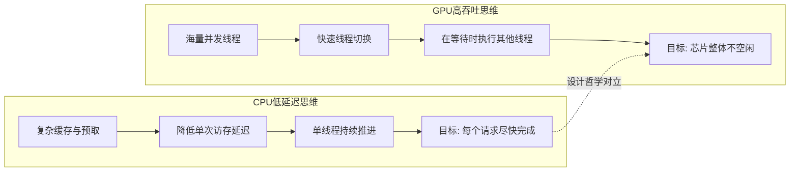
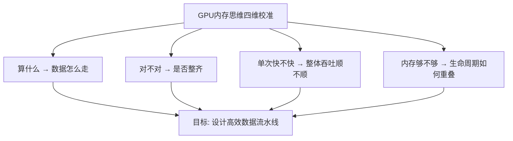

学习GPU内存管理时，最大的障碍往往不是API或硬件术语，而是**你在用CPU的直觉理解GPU**。这会导致很多特性看起来"不自然"：为什么GPU如此怕随机访问？为什么数据布局的微小改动能带来数倍性能差异？为什么大量线程并不能自动掩盖所有问题？本章的目标不是罗列硬件规格，而是帮你完成一次根本性的思维切换——从"低延迟优先"切换到"高吞吐优先"，从"单次快不快"切换到"整体顺不顺"。如果这一章真正理解了，后续关于内存层次、合并访问、occupancy与带宽瓶颈的内容都会顺理成章。

Sources: [gpu_memory_management_tutorial.md](gpu_memory_management_tutorial.md#L991-L1013)

---

## 设计目标的本质分野：低延迟 vs 高吞吐

CPU与GPU从诞生之初就服务于完全不同的计算范式。CPU面向的是通用计算，需要处理操作系统调度、文件系统、网络协议栈、数据库事务等控制流复杂且分支密集的任务。为了应对这种多样性，CPU的设计偏好是**单线程性能强、单次访问延迟低、分支预测激进、缓存层次丰富**。换句话说，CPU追求的核心指标是"任何一个任务都能尽快完成"。

GPU则起源于图形渲染，后来扩展到数据并行计算。它最擅长的是**大量相似计算、规则的数据并行和高吞吐处理**。为此，GPU的设计偏好是**并行线程极多、单个线程相对轻量、强调整体吞吐而非单次低延迟、依赖规则访问和批量处理来摊薄成本**。GPU追求的核心指标不是"某个线程多快"，而是"整个芯片在单位时间内完成了多少工作"。

可以把CPU想象成一支高技能小队：人数不多，但每个人都是多面手，能灵活应对突发状况。GPU则更像一条超大规模流水线：工位极多，每个工位的动作简单重复，效率最高的前提是原料供应整齐、流程高度规律。一旦原料混乱或流程分叉，整条流水线的吞吐就会急剧下降。这个类比虽然简化，但足以锚定后续所有讨论的核心直觉：**CPU用复杂架构服务不规则任务，GPU用规模化架构服务规则任务。**

Sources: [gpu_memory_management_tutorial.md](gpu_memory_management_tutorial.md#L1016-L1075)

---

## 两种内存思维：延迟消除 vs 延迟隐藏

这一分歧直接决定了CPU和GPU面对内存延迟时采取的根本不同策略。

**CPU的低延迟思维**追求让单次访存尽快完成。为此，CPU投入大量晶体管预算去降低每一次访问的等待时间：更复杂的缓存替换策略、更激进的乱序执行、更精准的分支预测和预取。在CPU的世界里，"一次访存花了多久"是核心关切，因为线程数量少，一个线程卡住就意味着计算单元闲置。

**GPU的高吞吐思维**则不把重点放在"缩短每一次等待"上，而是放在"在等待时让别人先上"。GPU同时维护海量线程，当某个warp因等待显存数据而挂起时，调度器立即切换到另一个就绪warp继续执行。通过这种方式，计算单元在统计意义上几乎不会空闲。这意味着**GPU并不试图消灭延迟，而是试图隐藏延迟**。显存访问的物理延迟依然很高，但只要总有其他线程可以执行，这个延迟就不会暴露为芯片级的吞吐损失。

下图展示了两套思维的核心差异：

这种思维差异解释了为什么GPU优化中反复出现**occupancy**（占用率）和**latency hiding**（延迟隐藏）这两个概念。Occupancy本质上衡量的是一个SM上同时能驻留多少活跃warp——驻留越多，可供切换的"候补"越多，隐藏延迟的能力就越强。而occupancy又与每线程的寄存器用量、shared memory用量等内存资源直接挂钩。这正是GPU内存管理与并发能力深度绑定的根源：**内存资源用量不仅影响访存速度，还直接影响你有多少线程可以用来隐藏延迟。**

Sources: [gpu_memory_management_tutorial.md](gpu_memory_management_tutorial.md#L1078-L1117)

---

## 规模化并行与规则访问的共生关系

GPU的高吞吐设计不是免费的，它有一个前提条件：**线程必须以硬件友好的方式协同工作**。GPU通常以warp（例如32个线程）为执行粒度进行调度，同一个warp内的线程在硬件层面共享取指和调度逻辑。如果这32个线程访问的是相邻地址，硬件就能把这些访存请求合并成少量高效事务，一次搬回整组数据。这种**合并访问（coalescing）**是GPU能吃满显存带宽的关键。

反之，如果同一个warp内的线程各自跳到完全不同的地址，原本可以合并的事务就会拆成大量零散请求，通路利用率暴跌。更严重的是，当访问模式差时，线程越多反而越会放大问题：内存事务爆炸、cache压力激增、L2冲突加剧、带宽更快被打满。因此，**"大量线程"不是万能药，它只是把高效模式放大，也把低效模式放大。**

GPU依赖规模化并行来摊薄一切成本：批量发起访存、批量切换线程、批量利用cache line、批量吃满带宽。这意味着零散、不规则、不可预测的访问会直接破坏GPU的核心经济模型。规则访问与规模化并行是一对共生关系——没有规则访问，规模化并行就无法转化为实际吞吐。

Sources: [gpu_memory_management_tutorial.md](gpu_memory_management_tutorial.md#L1120-L1201)

---

## CPU自然写法在GPU上的五大低效模式

很多从CPU迁移到GPU的代码性能不理想，根源不是算法错误，而是编程风格与硬件偏好错位。以下是五种在CPU上自然、在GPU上代价高昂的常见模式。

| CPU自然写法 | 在GPU上的核心问题 | 为什么GPU更敏感 |
|:---|:---|:---|
| **指针追逐**（链表、树、图遍历） | 不同线程跳到完全不同的地址，访问缺乏连续性 | 破坏合并访问，cache效果极差，难以利用warp级并行 |
| **小对象频繁分配释放** | 分配调用本身更贵，容易引入隐式同步 | GPU分配器路径更长，碎片化和抖动问题更严重 |
| **随机访问模式** | 事务数上升，带宽利用率下降 | GPU缺乏CPU那样的大容量复杂缓存来兜住随机性 |
| **零散控制流与深层分支** | 同一warp内线程走不同路径，导致串行化执行 | SIMD执行模型下分支发散直接降低有效并行度 |
| **面向对象式分散布局**（AOS、层层封装） | 数据分散在内存各处，cache line利用率低 | GPU偏好紧凑、可预测步长、面向数组的结构化布局 |

以数据布局为例，CPU上常见的Array of Structures（AOS）把同一对象的不同字段放在一起，这在CPU缓存中通常表现尚可，因为单个对象的多个字段可能被同时访问。但GPU上更常见的优化是Structure of Arrays（SOA）或类似扁平化布局——把同一类字段提取成独立连续数组，让相邻线程访问相邻数据，最大化合并访问收益。**这不是风格之争，而是硬件经济模型的必然要求。**

Sources: [gpu_memory_management_tutorial.md](gpu_memory_management_tutorial.md#L1205-L1273)

---

## GPU算法设计：不只是复杂度，更是访问模式

在CPU编程中，算法复杂度通常是最决定性的优化杠杆：从O(n²)降到O(n log n)往往意味着质的飞跃。在GPU上，复杂度当然仍然重要，但现实经常更复杂：**一个复杂度优秀的算法，如果访问模式糟糕，可能远不如一个复杂度稍高但访存整齐的算法跑得快。**

这导致GPU上一种常见现象：算法理论没问题，但为了更好的内存访问，你需要重排计算顺序、把数据切成tile、将中间结果暂存到shared memory、甚至牺牲一点重复计算来换取更好的局部性。矩阵乘法中的分块（tiling）就是一个经典例子——小块数据被显式载入shared memory后在块内复用，显著降低对global memory的重复访问。

因此，GPU上的算法设计本质上是**算术、访存、并行度三者之间的折中最优**，而非单纯的算术最优。这对深度学习算子开发、图像卷积、排序、稀疏计算等场景都成立。当你看到一个kernel的算术强度并不高却运行缓慢时，首要排查方向往往不是"算得太多"，而是"数据搬得太乱"。

Sources: [gpu_memory_management_tutorial.md](gpu_memory_management_tutorial.md#L1276-L1295)

---

## 建立GPU内存思维的四个维度

完成思维切换并非一蹴而就，但可以通过四个具体维度逐步校准你的设计直觉。

**第一，不只问"算什么"，还要问"数据怎么走"。** 设计kernel时，除了输入输出和公式，更要追问：数据从哪一层内存来？是否能连续访问？是否值得搬到shared memory？是否会产生过多事务？GPU编程本质上是在设计一条数据如何被高效组织、搬运、访问和复用的流水线。

**第二，不只问"对不对"，还要问"是否整齐"。** 整齐意味着相邻线程访问相邻数据、相似线程做相似工作、缓冲区生命周期可预测、分配和回收可以批量化。整齐不是代码风格问题，而是直接影响硬件能否规模化执行的问题。

**第三，不只问"单次快不快"，还要问"整体吞吐顺不顺"。** GPU优化常常不是把一个点做到极致，而是让整条流水线尽量平顺：传输和计算能否重叠？中间buffer能否复用？kernel是否太碎？是否有不必要的同步？是否总有线程可执行？

**第四，不只问"内存够不够"，还要问"生命周期如何重叠"。** 显存预算不是静态表格，而是时间曲线。你需要思考哪些对象必须同时存在、哪些可分阶段复用、哪些可以通过分块降低峰值、哪些缓存该常驻而哪些该按需生成。

Sources: [gpu_memory_management_tutorial.md](gpu_memory_management_tutorial.md#L1298-L1348)

---

## 对比总览：CPU思维 vs GPU思维

下表汇总了贯穿本章的核心差异，可作为后续分析具体问题的参照框架。

| 维度 | CPU思维 | GPU思维 |
|:---|:---|:---|
| **核心目标** | 低延迟，单线程快速响应 | 高吞吐，芯片整体饱和 |
| **面对延迟的策略** | 尽量缩短单次等待（缓存、预取、乱序） | 用并发隐藏等待（线程切换、occupancy） |
| **线程视角** | 线程重、能力强、数量少 | 线程轻、动作简单、数量极多 |
| **数据访问偏好** | 容忍一定随机性，缓存兜底 | 强烈偏好规则、连续、合并访问 |
| **数据布局偏好** | AOS、对象封装、指针引用 | SOA、扁平数组、索引代替指针 |
| **内存分配风格** | 按需分配，细粒度管理 | 预分配、池化、复用、避免频繁申请释放 |
| **算法优化重心** | 降低算术复杂度 | 算术、访存、并行度三者折中 |
| **性能瓶颈常见形态** | cache miss、分支预测失败 | 带宽未吃满、访问未合并、occupancy过低 |

Sources: [gpu_memory_management_tutorial.md](gpu_memory_management_tutorial.md#L1016-L1348)

---

## 本章核心结论

综合以上分析，可以提炼出五条贯穿CPU与GPU内存思维差异的核心结论。

1. **CPU和GPU的设计目标根本不同。** CPU强调低延迟、灵活控制和单线程能力；GPU强调大规模并行和高吞吐。这决定了它们面对内存问题时不可能有相同的解法。

2. **GPU面对内存延迟的方式不是降低单次访问时间，而是用大量线程和快速切换去隐藏等待。** Occupancy和latency hiding不是锦上添花的优化技巧，而是GPU核心设计哲学的直接体现。

3. **GPU对规则访问、连续布局和批量处理高度敏感。** 因为这决定了访存能否合并、带宽能否吃满、并行度能否真正转化为吞吐。访问模式是GPU内存优化中最常被低估的杠杆。

4. **CPU上自然的编程风格——指针追逐、小对象频繁分配、随机访问、复杂对象布局——在GPU上往往会带来显著性能问题。** 移植代码到GPU时，重构数据组织方式通常比简单翻译计算逻辑更重要。

5. **GPU编程本质上不是只写"计算逻辑"，而是在设计一条数据流水线。** 数据从哪里来、经过哪一层、如何被复用、生命周期如何重叠，这些问题与计算本身同等重要。

Sources: [gpu_memory_management_tutorial.md](gpu_memory_management_tutorial.md#L1384-L1398)

---

## 阅读路径建议

完成CPU与GPU的思维切换后，你已经掌握了理解后续所有GPU内存内容的"元框架"。接下来建议按以下路径继续深入：

- 如果你希望把这套思维落到具体的硬件事实上，理解寄存器、shared memory、L1/L2、global memory各自的速度、容量与约束，请继续阅读 [GPU硬件内存层次解析](4-gpuying-jian-nei-cun-ceng-ci-jie-xi)。
- 如果你准备从硬件层次进入系统视角，理解虚拟地址空间、页表映射、UVA与UVM如何组织GPU内存，可前往 [地址空间、页表与虚拟内存](5-di-zhi-kong-jian-ye-biao-yu-xu-ni-nei-cun)。
- 如果你已经准备好了解一次`cudaMalloc`到底如何与地址空间、物理页和映射关系交互，可阅读 [内存分配全链路：从cudaMalloc到驱动](7-nei-cun-fen-pei-quan-lian-lu-cong-cudamallocdao-qu-dong)。
- 如果你想深入理解CPU与GPU之间的数据如何实际流动、DMA传输路径与异步拷贝的实现条件，可前往 [CPU与GPU数据流动机制](8-cpuyu-gpushu-ju-liu-dong-ji-zhi)。
- 如果你已经准备好优化kernel的访存效率，学习合并访问与局部性的具体技巧，可直接跳到 [访问模式优化：合并访问与局部性](10-fang-wen-mo-shi-you-hua-he-bing-fang-wen-yu-ju-bu-xing)。