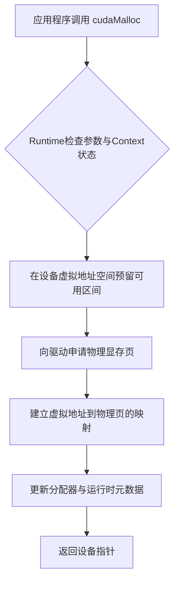
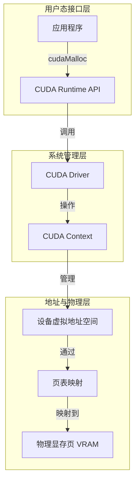
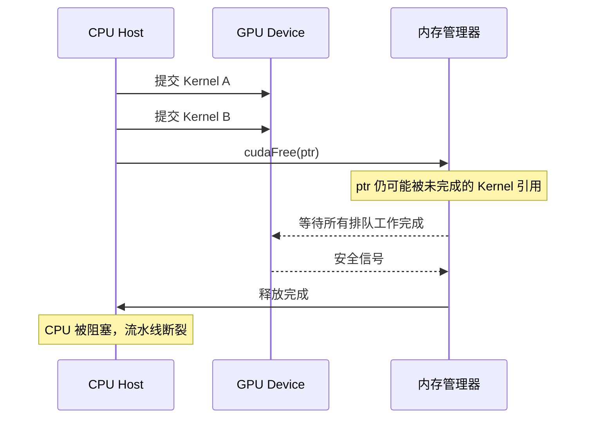

本章将 `cudaMalloc` 从"设备版 malloc"的直觉中剥离出来，还原它作为一次跨越多层系统组件的资源建立过程的真实面貌。它不是你向 GPU "切一块显存"那么简单，而是一次涉及 CUDA Runtime、Driver、Context、设备虚拟地址空间、物理显存页与页表映射的完整链路。理解这条链路，是解释"为什么分配慢、为什么释放会卡、为什么框架总像是占用着显存不还"的共同前提。在阅读本章之前，建议先建立对 GPU 硬件内存层次与地址空间机制的基础认知。

Sources: [gpu_memory_management_tutorial.md](gpu_memory_management_tutorial.md#L2303-L2336)

## API 表面与深层语义

从程序员视角看，`cudaMalloc(&ptr, size)` 的调用界面极其简洁：传入指针的地址与请求字节数，拿到一个设备指针即可。但这个指针背后至少隐含了五层语义：第一，它归属于某个特定的 CUDA Context；第二，它在设备虚拟地址空间中占据了一段有效范围；第三，底层已有真实的物理存储资源作为后盾；第四，后续 kernel 可以合法地使用该地址进行访存；第五，运行时和驱动已经记录了与之相关的分配状态、对齐信息与生命周期元数据。因此，`cudaMalloc` 返回的不是裸物理显存偏移，而是一个由系统多层组件共同管理的资源句柄。

Sources: [gpu_memory_management_tutorial.md](gpu_memory_management_tutorial.md#L2339-L2358)

## 分配全链路的六步拆解

虽然具体实现会因 CUDA 版本、驱动版本与 GPU 架构而异，但从架构教学视角，一次设备内存分配可以稳定地拆解为六个协调步骤。第一步，运行时进行参数检查与上下文准备，确认当前设备、Context 与请求大小的合法性。第二步，在设备虚拟地址空间中预留一段可用区间，程序最终拿到的指针首先是这个虚拟地址空间中的逻辑地址。第三步，向底层申请物理显存页，确保有真实存储资源可供映射。第四步，建立虚拟地址到物理显存页的映射关系，使 GPU 访存时能正确寻址。第五步，更新分配器与运行时元数据，包括大小、所属 Context、状态与池化信息。第六步，将设备指针返回给调用方。以下流程图展示了这六步的先后顺序与依赖关系。

这套流程的复杂度远超用户态堆内存的一次指针偏移，也决定了为什么 `cudaMalloc` 本质上是一次系统级资源建立过程，而不是单纯的"数组切片"。

Sources: [gpu_memory_management_tutorial.md](gpu_memory_management_tutorial.md#L2395-L2436)

## Runtime、Driver 与 Context 的协作关系

要理解分配链路，必须先理清三层核心组件的边界与协作方式。**CUDA Runtime** 提供面向开发者的高级接口（如 `cudaMalloc`），负责参数封装与编程模型抽象；**CUDA Driver** 位于更底层，直接管理设备资源、命令提交与硬件交互；**CUDA Context** 则是进程在某个 GPU 设备上的执行与资源环境，持有内存、流、模块等大量状态。一次分配请求从应用发出后，依次经过 Runtime 的接口层、Driver 的设备管理层，最终落实到具体 Context 的地址空间与物理资源体系中。下图展示了这一分层协作结构。

Context 的存在意味着内存不是脱离执行环境而独立存在的孤立对象。初始化 CUDA 环境本身就有固定成本，某些操作在首次调用时会更慢，而内存、流与内核模块之间存在紧密的生命周期耦合。脱离 Context 去谈分配性能，往往会得出错误结论。

Sources: [gpu_memory_management_tutorial.md](gpu_memory_management_tutorial.md#L2362-L2392)

## 分配与释放的成本解剖

既然分配需要跨越 Runtime、Driver、Context、地址空间、物理页与映射表这么多层，它的成本自然远高于用户态堆分配。具体而言，`cudaMalloc` 的昂贵来源于：与设备状态的协调开销、驱动级交互、页映射的建立、资源表的维护，以及对齐与管理开销。如果仅在程序启动时分配几块大 buffer，这些固定成本可以被充分摊销；但如果在热路径中频繁发起小块申请，固定管理成本将被无限放大，导致吞吐下降、延迟抖动与表现不稳定。因此，工程上极少建议"边算边频繁 `cudaMalloc`"。

Sources: [gpu_memory_management_tutorial.md](gpu_memory_management_tutorial.md#L2439-L2468)

与直觉相反，`cudaFree` 往往不是廉价操作，甚至可能比分配更麻烦。其原因有三：第一，系统必须确认这块内存不再被任何未完成的 kernel、拷贝或其他异步操作使用，否则回收会导致访问错误；第二，如果设备端仍有排队中的工作，释放就必须与执行流做同步协调，这就是 `cudaFree` 常与隐式同步挂钩的根源；第三，释放本身也需要更新分配器元数据、地址映射状态、可复用块管理以及可能的碎片合并逻辑。下表对比了两者的主要成本来源。

| 成本维度 | cudaMalloc | cudaFree |
|:---|:---|:---|
| 上下文与参数校验 | 确认 Context 与设备状态合法 | 确认内存归属 Context，检查引用状态 |
| 地址空间操作 | 预留虚拟地址区间 | 解除映射，回收虚拟地址区间 |
| 物理资源协调 | 申请并绑定物理显存页 | 归还物理页到系统可用池 |
| 页表维护 | 建立虚拟页到物理页的映射 | 更新或拆除页表项 |
| 运行时元数据 | 记录大小、对齐、池化信息 | 更新分配器状态，执行碎片合并 |
| 异步安全协调 | 通常不直接涉及 | 常需等待未完成设备工作结束 |

Sources: [gpu_memory_management_tutorial.md](gpu_memory_management_tutorial.md#L2472-L2511)

## 隐式同步：释放为何能卡住流水线

GPU 编程的一个核心特征是异步执行：CPU 提交命令后并不等待 GPU 完成，而是继续推进。然而，当你调用 `cudaFree` 时，内存管理器必须回答一个关键问题：**"这块内存后面还会不会被设备上尚未完成的工作用到？"** 如果答案不确定，系统就只能等待。这种等待打破了原本并行的 CPU-GPU 流水线节奏——CPU 被迫停下来等 GPU，后续分配与执行也被迫串行化。对于追求高吞吐的推理服务或训练流水线而言，一次不合时宜的 `cudaFree` 足以让整体性能断崖式下跌。以下序列图展示了隐式同步如何打断流水线。

工程上的直接后果是：必须将分配与释放移出热路径，优先采用缓存分配器或内存池，必要时引入 stream-ordered 的异步分配机制来规避全局同步。

Sources: [gpu_memory_management_tutorial.md](gpu_memory_management_tutorial.md#L2514-L2546)

## 频繁小块分配的陷阱

频繁小块分配是 GPU 内存管理中最常见的坏味道之一，因为它同时叠加了四个问题：固定管理开销被高频放大、更容易产生显存碎片、更容易触发同步协调，以及更难进行稳定的复用与调优。其中碎片化的危害尤为隐蔽：长期运行后，总空闲量看起来充足，但大块连续可用区域被切割得七零八落，导致某次大分配因找不到连续空间而失败。这种现象在推理服务、图形引擎等长期在线系统中尤为致命。下表对比了频繁动态分配与预分配/池化策略的工程差异。

| 维度 | 频繁小块 cudaMalloc / cudaFree | 预分配 / 池化策略 |
|:---|:---|:---|
| 固定管理开销 | 高频触发，成本被持续放大 | 均摊到大量复用中，边际成本趋近于零 |
| 碎片化风险 | 不同大小交替申请，易产生不可用的内存空洞 | 由框架或应用统一控制粒度，碎片可控 |
| 同步干扰 | 释放极易触发隐式同步 | 回收不归还底层，避免全局同步 |
| 吞吐稳定性 | 延迟抖动大，性能难以预测 | 可预测、低抖动，适合高并发场景 |
| 工程维护难度 | 分配轨迹分散，难以追踪与调优 | 生命周期集中管理，便于审计与优化 |

解决这一问题的典型方向包括：预分配大 buffer 后内部分片、使用 Arena / Slab / Ring buffer 等结构化分配器、按计算阶段复用同一块内存，以及统一分配粒度以减少异形块。

Sources: [gpu_memory_management_tutorial.md](gpu_memory_management_tutorial.md#L2549-L2583)

## 框架"借而不还"的工程逻辑

理解了上述成本结构，你就能解释一个常见现象：深度学习框架在释放张量后，显存占用并不会立刻下降，`nvidia-smi` 看到的数值常常居高不下。这不是内存泄漏，而是一种经过权衡的设计选择。如果每次张量析构都直接调用 `cudaFree`，程序将反复承受昂贵的底层释放路径与隐式同步开销，下次再申请时又要重新走一遍完整的六步链路。因此，框架更常见的策略是：从系统一次性申请较大的显存块，内部切割后分配给张量使用；张量释放时仅回收到框架自己的池中，而非立刻归还操作系统。这种权衡的代价是表观显存占用更高、外部更难判断真实活跃用量，以及碎片管理变成了框架自身的责任；但收益是显著降低了系统级分配频率、避免了大量同步、提升了吞吐稳定性。这也是后续 [内存池与缓存分配器原理](11-nei-cun-chi-yu-huan-cun-fen-pei-qi-yuan-li) 要深入展开的主题。

Sources: [gpu_memory_management_tutorial.md](gpu_memory_management_tutorial.md#L2586-L2625)

## 从同步分配到异步分配的演进

`cudaMallocAsync` 的出现并非为了增加 API 的花哨程度，而是对前述痛点的直接工程回应。既然传统 `cudaMalloc`/`cudaFree` 存在分配释放成本高、释放牵扯全局同步、热路径不友好、碎片与复用压力大等问题，更合理的方向自然是：与 stream 执行顺序深度绑定、内置内存池化机制、减少全局隐式同步、更高效地复用已释放块。`cudaMallocAsync` 将分配和释放都纳入 stream 的事件序中，内存管理器可以更安全地判断一块内存在何时真正不再被后续工作引用，从而避免不必要的 CPU-GPU 串行等待。这并不意味着传统接口已经"过时"，而是为不同场景提供了更精细的工具选择，也为理解现代 GPU 内存子系统的演进方向提供了窗口。

Sources: [gpu_memory_management_tutorial.md](gpu_memory_management_tutorial.md#L2663-L2684)

## 心智模型与关键结论

将本章内容压缩为一个可用的心智模型：**`cudaMalloc` 不是单纯"拿一块显存"，而是在某个 Context 下，协调 Runtime、Driver、设备地址空间和物理显存资源，建立一段后续可安全访问的设备内存对象。** 而 **`cudaFree` 不是单纯"删掉一块显存"，而是在确保不破坏现有异步执行和访问正确性的前提下，回收这段设备内存对应的资源与元数据。** 只要记住这个版本，后续关于同步、碎片、缓存池与异步分配的内容都会变得顺理成章。

以下是本章最核心的八条结论：
1. `cudaMalloc` 不是简单的"设备版 malloc"，而是一次系统级资源建立过程。
2. 一次分配通常涉及 Runtime、Driver、Context、地址空间、物理页和映射关系。
3. 设备指针首先是地址空间中的可用地址，不应被简单理解成裸物理显存位置。
4. `cudaMalloc` 往往比想象中贵，因为它涉及多层管理和资源维护。
5. `cudaFree` 也可能很贵，尤其因为它常常要和未完成的异步工作做安全协调。
6. 释放可能引入隐式同步，这会打断流水线并造成性能抖动。
7. 频繁小块分配释放是 GPU 程序中的常见坏味道，会放大管理成本并加重碎片问题。
8. 缓存分配器、内存池和 `cudaMallocAsync` 的存在，本质上都是对上述痛点的直接回应。

Sources: [gpu_memory_management_tutorial.md](gpu_memory_management_tutorial.md#L2687-L2718)

## 阅读导航

至此，你已经掌握了从 `cudaMalloc` 到驱动的完整分配链路。这条知识链需要前置的硬件与地址空间基础，也为后续的数据流动、API 选型与高级优化机制提供了必要的理解框架。

如果你尚未阅读前置章节，建议先回顾：
- [GPU硬件内存层次解析](4-gpuying-jian-nei-cun-ceng-ci-jie-xi)：理解分配最终落到的物理显存与各层缓存结构。
- [地址空间、页表与虚拟内存](5-di-zhi-kong-jian-ye-biao-yu-xu-ni-nei-cun)：理解虚拟地址、页表映射与 UVA 等前置概念。
- [CPU与GPU内存思维差异](6-cpuyu-gpunei-cun-si-wei-chai-yi)：理解为什么 GPU 上的分配策略与 CPU 有本质不同。

接下来建议继续阅读同一主题组内的后续内容，以完整构建 CUDA 内存管理的主线：
- [CPU与GPU数据流动机制](8-cpuyu-gpushu-ju-liu-dong-ji-zhi)：在理解分配之后，进一步理解数据如何在两端搬运。
- [CUDA内存API全景与选型](9-cudanei-cun-apiquan-jing-yu-xuan-xing)：系统对比各类 CUDA 内存接口及其适用场景。

若你对本章提到的内存池与异步分配机制有深入兴趣，可跳至高级内存机制章节：
- [内存池与缓存分配器原理](11-nei-cun-chi-yu-huan-cun-fen-pei-qi-yuan-li)：深入理解框架"借而不还"背后的工程实现。
- [统一内存UVM机制与代价](12-tong-nei-cun-uvmji-zhi-yu-dai-jie)：探索另一种由系统自动管理页迁移的内存模型。