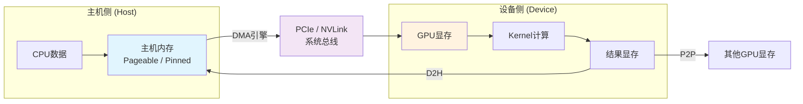
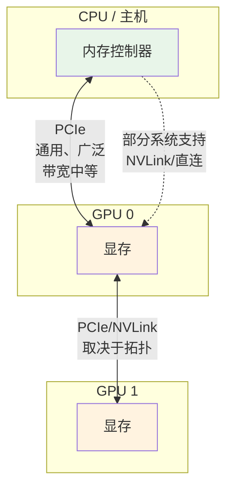
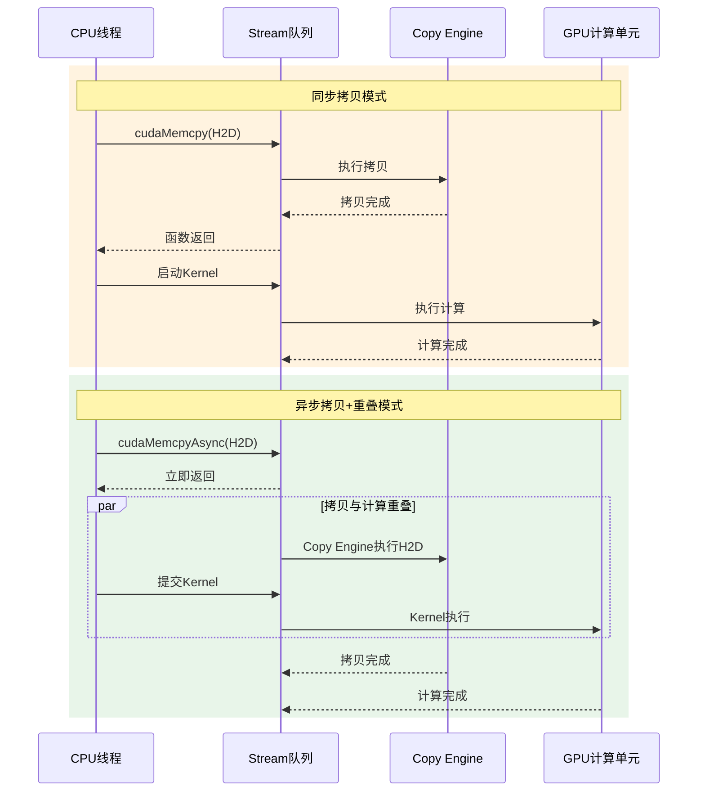

GPU程序的性能不仅由计算决定，更多时候由数据是否能及时、高效地抵达计算单元所决定。数据从主机内存进入设备显存、在设备间流转、再返回主机的过程，构成了GPU编程中最容易被低估却影响最大的系统瓶颈。本章聚焦CPU与GPU之间的数据流动全景，从物理通路、传输类型、异步引擎到流水线重叠，帮助你建立一条可工程化的传输优化思维链。理解这些机制后，你将能够判断程序中的瓶颈究竟出在算力、显存带宽，还是数据搬运路径本身。

Sources: [gpu_memory_management_tutorial.md](gpu_memory_management_tutorial.md#L2728-L2756)

## 数据流动的全景架构

在讨论任何优化之前，必须先建立对数据路径的系统认知。最直观的数据流向看似只是一次简单的内存拷贝：CPU准备数据，通过总线发送到GPU，kernel执行计算，结果可能再传回CPU。然而这条路径的每一环都嵌入了多重系统决策——主机内存是页可锁定（pageable）还是页锁定（pinned），传输走PCIe还是NVLink，拷贝由DMA执行还是CPU逐字节搬运，调用是同步阻塞还是异步提交，是否与某个stream绑定，能否与kernel执行重叠——这些因素共同决定了"把数据传到GPU"究竟是高效流水线还是串行阻塞点。

Sources: [gpu_memory_management_tutorial.md](gpu_memory_management_tutorial.md#L2758-L2782)

上图展示了CPU与GPU数据流动的核心链路。注意主机内存的性质、通路类型以及传输方向三者共同构成了性能分析的基础坐标系。任何单次传输的代价都不能脱离这三个维度孤立评估。

Sources: [gpu_memory_management_tutorial.md](gpu_memory_management_tutorial.md#L2782-L2783)

## 四类传输路径与适用语境

CPU与GPU之间的数据流动按方向可分为四种基本类型，它们的底层通路、适用场景和性能特征存在本质差异。下表从系统视角对比了这四类传输的核心属性。

| 传输类型 | 全称 | 方向 | 典型场景 | 关键依赖 |
|---------|------|------|---------|---------|
| H2D | Host to Device | CPU内存 → GPU显存 | 训练数据上传、参数初始化、纹理加载 | pinned memory、DMA、PCIe带宽 |
| D2H | Device to Host | GPU显存 → CPU内存 | 结果回传、调试读取、推理输出 | pinned memory、copy engine可用性 |
| D2D | Device to Device | GPU显存 ↔ GPU显存 | 同卡内缓冲区拷贝、跨卡数据交换 | P2P能力、NVLink/PCIe拓扑 |
| P2P | Peer-to-Peer | GPU A显存 ↔ GPU B显存 | 多GPU并行、模型并行、参数同步 | peer access支持、硬件拓扑 |

H2D和D2H是绝大多数GPU程序最先遇到的传输类型，也是最容易形成瓶颈的环节。D2D在同一块GPU内部发生时通常由设备侧调度完成，性能远高于跨设备传输；而跨GPU的D2D则高度依赖系统是否提供了P2P直连能力。如果没有P2P支持，跨卡数据传输可能被迫退化为"GPU A → 主机内存 → GPU B"的两段式路径，延迟和带宽损耗都会显著放大。

Sources: [gpu_memory_management_tutorial.md](gpu_memory_management_tutorial.md#L2786-L2816), [gpu_memory_management_tutorial.md](gpu_memory_management_tutorial.md#L3148-L3181)

## 物理通路的带宽鸿沟：PCIe与NVLink

数据流动的物理载体决定了理论带宽的上限，而程序的实际性能往往离这个上限还有很大距离。在CPU-GPU及GPU-GPU互联语境下，PCIe和NVLink是最关键的两条通路，它们的性能特征差异显著，直接影响系统架构决策。

PCIe作为CPU与GPU之间最广泛的通用互连通道，虽然带宽可观，但远低于GPU片内显存通路，延迟也显著高于本地显存访问。NVLink则是面向高性能GPU协作设计的专用高速互连，在高端多GPU系统中能够提供远高于PCIe的带宽和更低的通信开销。一个必须建立的强直觉是：GPU本地显存访问、CPU-GPU传输、GPU-GPU传输三者的代价根本不在同一数量级。这意味着系统设计者不应轻易将大量数据在CPU与GPU之间来回折返，也不应将跨设备传输视为几乎免费的抽象操作。

Sources: [gpu_memory_management_tutorial.md](gpu_memory_management_tutorial.md#L2824-L2858)

## 异步传输的四柱：DMA、Pinned Memory、Stream与Copy Engine

理解异步传输不能只停留在"调用了异步API"这个表层行为上。真正让数据搬运与计算并行起来的，是四个底层机制的协同：DMA引擎负责解放CPU，pinned memory为DMA提供可直接访问的稳定物理页，stream构建执行顺序与并发依赖图，copy engine作为GPU上的专用搬运硬件与计算单元并行运作。

### DMA与Pinned Memory：解放CPU的前提

如果每次CPU-GPU传输都由CPU核心逐字节拷贝，不仅速度极慢，还会严重浪费CPU算力。DMA（直接内存访问）的意义在于让专门的数据搬运机制替代CPU完成拷贝，为异步传输和计算重叠创造条件。然而DMA要高效读取主机内存，要求数据所在的物理页足够稳定、不会在传输中被操作系统迁移。这就是pinned memory（页锁定内存）成为关键前提的原因——当主机内存为pageable时，驱动往往需要先将数据复制到内部的pinned staging区，再发起真正的设备传输，这会引入额外延迟、增加CPU参与，并破坏异步链路的效率。因此，调用了`cudaMemcpyAsync`却观察不到预期的拷贝与计算重叠时，第一批需要排查的问题中必然包括主机内存是否为pinned。

Sources: [gpu_memory_management_tutorial.md](gpu_memory_management_tutorial.md#L2862-L2893), [gpu_memory_management_tutorial.md](gpu_memory_management_tutorial.md#L2963-L2995)

### Stream与Copy Engine：并发的调度语法

Stream可以粗略理解为GPU工作提交的一条有序队列。在同一条stream内，任务按提交顺序推进；在不同stream之间，若无显式依赖，操作可能并发执行。当拷贝请求被绑定到某个stream时，它不再是孤立的搬运动作，而是整条执行图的一部分——它可能先于某个kernel执行，也可能与另一条stream中的kernel时间重叠，还可能因事件依赖而等待特定条件。

GPU内部除了计算单元，通常还配备专门处理数据搬运的硬件资源即copy engine。在硬件和执行条件允许时，copy engine推进数据拷贝的同时，计算单元可以执行kernel，从而实现传输与计算的真正重叠。但这需要满足四个条件：存在可重叠的独立工作、有合适的硬件资源、有正确的stream调度关系、没有人为同步点将其打断。

Sources: [gpu_memory_management_tutorial.md](gpu_memory_management_tutorial.md#L2998-L3023), [gpu_memory_management_tutorial.md](gpu_memory_management_tutorial.md#L3026-L3056)

上图展示了同步拷贝与异步重叠拷贝在时序上的本质差异。同步模式下CPU、copy engine与计算单元串行工作；而异步模式下，CPU可以连续提交多个操作，copy engine与计算单元在stream调度的保障下并行推进。需要强调的是，异步只是提供了并发能力，不等于自动加速——如果程序很快调用同步等待，或者数据源不是pinned memory，或者stream依赖关系不允许重叠，那么异步API并不会带来实际收益。

Sources: [gpu_memory_management_tutorial.md](gpu_memory_management_tutorial.md#L2896-L2927), [gpu_memory_management_tutorial.md](gpu_memory_management_tutorial.md#L2931-L2959)

## 从异步到流水线：计算与传输重叠的艺术

真正高性能的GPU系统不会止步于"单次传输不阻塞CPU"，而是追求多批次数据在流水线上持续流转。理想的执行模式不是"拷入→等待→计算→等待→拷出"的串行节拍，而是让当前批次在计算的同时，下一批次正在拷入，上一批次结果正在拷出。这种重叠让copy engine、计算单元和CPU端的数据准备阶段同时有活干，系统整体的吞吐由最慢的阶段决定，而非各阶段时间简单相加。

实现这种流水线需要满足几个工程条件：数据必须被组织为足够大的连续块以摊薄每次传输的固定开销；传输方向与计算任务之间通过stream建立清晰的依赖顺序而不引入不必要的同步；主机端使用pinned memory消除staging延迟；硬件上存在独立的copy engine资源。很多深度学习推理服务和训练数据加载器的优化核心，本质上都是在精心编排这种H2D-计算-D2H的流水线重叠。

Sources: [gpu_memory_management_tutorial.md](gpu_memory_management_tutorial.md#L3059-L3093)

```mermaid
gantt
    title 计算与传输重叠的理想流水线
    dateFormat X
    axisFormat %s
    section Stream 1
    H2D批次1   :a1, 0, 2
    Kernel批次1 :a2, after a1, 5
    D2H批次1   :a3, after a2, 2
    section Stream 2
    H2D批次2   :b1, 2, 2
    Kernel批次2 :b2, after b1, 5
    D2H批次2   :b3, after b2, 2
    section Stream 3
    H2D批次3   :c1, 4, 2
    Kernel批次3 :c2, after c1, 5
    D2H批次3   :c3, after c2, 2
```

上图以甘特图形式展示了三批次数据在流水线上的时间重叠。可以看到，当第一批进入kernel计算时，第二批正在H2D传输，系统资源利用率远高于串行执行。这种流水线的工程价值在于：它把"昂贵的数据搬运"从关键路径上部分隐藏了起来。

Sources: [gpu_memory_management_tutorial.md](gpu_memory_management_tutorial.md#L3093-L3093)

## 工程陷阱：小块传输、NUMA与隐性代价

在理解了理想的重叠流水线之后，还必须认识几个现实中常见的效率陷阱。首先是小块传输问题：每次传输不仅包含纯数据流量，还附带调用开销、调度开销、协议管理开销和同步关系处理成本。当数据块太小时，固定开销占比会急剧升高，同时总线和DMA更擅长处理连续的大块数据流，零散小块难以打满链路带宽，也更难与计算形成稳定的重叠节奏。高性能GPU程序通常通过staging buffer聚合数据、以chunk或tile为单位组织工作来规避这一问题。

Sources: [gpu_memory_management_tutorial.md](gpu_memory_management_tutorial.md#L3096-L3127)

另一个常被忽视的因素是NUMA拓扑。在多路CPU服务器中，不同CPU socket各自连接一部分内存和I/O设备，"主机内存"不再是对所有设备完全等价的统一池子。如果GPU物理上更靠近某个CPU socket，而pinned host buffer却分配在另一个更远的NUMA节点上，那么H2D传输的实际路径会更绕、代价更高。这说明数据传输优化有时不仅是CUDA编程问题，更是系统拓扑问题。在高性能服务器环境中，数据预处理线程的绑核、主机缓冲区的分配位置与GPU拓扑应当协同设计。

Sources: [gpu_memory_management_tutorial.md](gpu_memory_management_tutorial.md#L3130-L3145)

## 常见误区与纠正

围绕CPU-GPU数据流动，工程实践中存在几个反复出现的认知偏差。下表总结了这些误区及其纠正思路。

| 误区 | 错误认知 | 纠正思路 |
|------|---------|---------|
| 传输不值一提 | "GPU计算很快，传输时间可以忽略" | 在计算量不大、输入输出频繁、小批量推理或多卡同步场景中，传输往往是主瓶颈 |
| 异步即加速 | "用了`cudaMemcpyAsync`就一定重叠了" | 异步只是提交方式，真正并发需要pinned memory、stream独立性和硬件资源共同配合 |
| 只看数据量 | "传输成本只和数据大小有关" | 连续性、切分粒度、staging需求、NUMA距离和同步点都会显著影响实际代价 |
| 来回拷贝无妨 | "CPU和GPU来回拷也没关系" | CPU-GPU通路的代价远高于GPU本地显存访问，应尽量减少来回折返 |

Sources: [gpu_memory_management_tutorial.md](gpu_memory_management_tutorial.md#L3185-L3216)

## 统一传输心智模型

将上述所有机制收敛为一条可记忆的链路，CPU-GPU数据传输可以抽象为以下七个环节：数据首先存在于某种主机内存中；主机内存是否为pinned直接影响DMA效率；拷贝请求被提交到运行时与特定stream；数据通过PCIe或NVLink等物理通路搬运；copy engine与调度机制决定能否和计算重叠；后续kernel在设备侧消费这些数据；整个系统性能最终取决于搬运是否批量、规律且可重叠。这条链路上的任何一环出现短板——pageable memory引发的staging、错误的同步点、拓扑错配的NUMA访问、过度碎片化的传输——都会把理论带宽拉低到远低于硬件上限的水平。

Sources: [gpu_memory_management_tutorial.md](gpu_memory_management_tutorial.md#L3219-L3231)

## 下一步阅读指引

本章从数据流动的视角建立了CPU-GPU传输的全景认知。若你希望深入理解主机内存分配与设备内存分配的系统链路，可继续阅读[内存分配全链路：从cudaMalloc到驱动](7-nei-cun-fen-pei-quan-lian-lu-cong-cudamallocdao-qu-dong)；若需要掌握具体API的选型策略与接口语义，请参考[CUDA内存API全景与选型](9-cudanei-cun-apiquan-jing-yu-xuan-xing)；当数据已经成功驻留显存后，如何组织线程访问模式以充分利用显存带宽，则是[访问模式优化：合并访问与局部性](10-fang-wen-mo-shi-you-hua-he-bing-fang-wen-yu-ju-bu-xing)的核心主题。对于希望从成本视角统一理解所有内存操作的同学，[统一心智模型：一切从"账单"出发](23-tong-xin-zhi-mo-xing-qie-cong-zhang-dan-chu-fa)提供了跨越单一章节的整合框架。