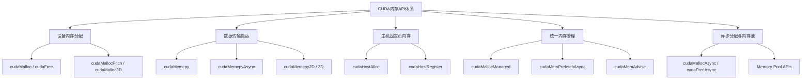

在掌握了GPU硬件层次、[地址空间与页表映射](5-di-zhi-kong-jian-ye-biao-yu-xu-ni-nei-cun)以及[内存分配全链路](7-nei-cun-fen-pei-quan-lian-lu-cong-cudamallocdao-qu-dong)之后，你已经具备了从系统视角审视CUDA内存API的底层基础。此时再看这些接口，不应将其视为孤立的函数名列表，而应理解它们各自回应的系统问题、带来的语义成本以及适用的工程场景。本章将从"职责角色"出发，系统梳理CUDA内存API的五大分类、核心接口的行为差异以及面向实际场景的选型逻辑，帮助你形成一套"先问场景需求，再选对应接口"的决策框架。

Sources: [gpu_memory_management_tutorial.md](gpu_memory_management_tutorial.md#L3756-L3781)

## API职责分层：五大类接口体系

CUDA内存相关API数量众多，但如果从"解决哪类系统问题"的维度进行归并，可以清晰地划分为五个职责层级。这种分类方式比按函数名字母顺序记忆更为有效，因为它直接对应到工程中的不同决策点：数据放在哪里、如何搬运、主机侧如何配合、是否接受统一内存的迁移模型、以及高频场景下如何复用。

**设备内存分配与释放**是最基础的层级，典型接口为`cudaMalloc`与`cudaFree`，解决的是在设备侧建立和回收显存对象的问题。**设备与主机之间的数据搬运**由`cudaMemcpy`系列负责，涵盖H2D、D2H、D2D以及多维数据的拷贝，它们往往是程序性能的核心路径而非附属功能。**主机侧固定页内存**通过`cudaHostAlloc`和`cudaHostRegister`管理，其重要性在于为高效DMA和异步传输创造条件。**统一内存**以`cudaMallocManaged`为主入口，配合`cudaMemPrefetchAsync`和`cudaMemAdvise`，目的是降低显式数据管理的复杂度，但代价是引入运行时迁移和缺页处理。**异步分配与内存池**则由`cudaMallocAsync`、`cudaFreeAsync`及相关池化接口构成，回应的是传统分配释放在高吞吐异步工作流中的同步痛点和碎片问题。

Sources: [gpu_memory_management_tutorial.md](gpu_memory_management_tutorial.md#L3784-L3850)

## Runtime API与Driver API的分工

CUDA提供两层API接口：Runtime API和Driver API。Runtime API是绝大多数开发者和框架直接接触的一层，包括`cudaMalloc`、`cudaMemcpy`、`cudaHostAlloc`等，其特点是语义直接、易于使用、抽象层次更高。Driver API则更贴近底层，提供更细粒度的控制能力，例如更直接的context管理和模块加载。对于内存管理心智模型的建立，关键在于认识到Runtime API并非"魔法"——它的每次调用依然需要借助底层驱动能力来完成资源管理、地址空间协调和物理页分配，这也解释了为什么某些Runtime调用会体现出明显的系统成本。因此，学习路径上建议先掌握Runtime API的语义和系统后果，在需要极致控制或深度调优时再下探Driver API。

Sources: [gpu_memory_management_tutorial.md](gpu_memory_management_tutorial.md#L3854-L3877)

## 设备内存分配接口：从基础到布局感知

`cudaMalloc`与`cudaFree`是设备显存管理的基础接口，从程序员视角看非常简单：传入大小，获得设备指针；用完释放即可。但这组接口的工程角色需要更准确的理解——`cudaMalloc`不是单纯的"设备版malloc"，而是在特定CUDA context下协调运行时、驱动、设备地址空间和物理显存资源，建立一段后续可安全访问的设备内存对象。相应地，`cudaFree`也需要在确保不破坏现有异步执行正确性的前提下回收资源，这常常涉及隐式同步。因此，这组接口适合结构简单的程序、初始化阶段的大块缓冲区分配，以及对底层显存对象有显式控制需求的场景；但它们不太适合热路径中的频繁小块分配、高吞吐服务中的动态生命周期对象，以及需要精细异步流水化的工作负载，因为频繁调用会放大分配开销、同步压力和碎片风险。

Sources: [gpu_memory_management_tutorial.md](gpu_memory_management_tutorial.md#L3880-L3919), [gpu_memory_management_tutorial.md](gpu_memory_management_tutorial.md#L2320-L2358)

对于二维和三维数据场景，CUDA提供了`cudaMallocPitch`和`cudaMalloc3D`。这类接口的存在揭示了一个常被忽视的维度：内存分配不只是"多大"的问题，还包括"怎么排布"。`pitch`表示每一行在内存中的实际步长，它可能大于该行数据本身的字节数，目的是满足底层硬件的对齐和访问组织偏好。在图像处理、矩阵运算和体数据应用中，使用带pitch的分配接口能够让数据布局更贴合GPU的合并访问要求，从而提升访存效率。

Sources: [gpu_memory_management_tutorial.md](gpu_memory_management_tutorial.md#L3922-L3945)

## 数据传输接口：拷贝不是附属，而是主角

`cudaMemcpy`系列负责在不同内存空间或设备对象之间搬运数据，典型包括H2D（Host to Device）、D2H（Device to Host）、D2D（Device to Device）以及二维/三维变体。这组接口之所以是核心性能路径的一部分，是因为很多GPU程序的真正瓶颈不在计算而在搬运——小batch场景、CPU预处理管线、频繁跨设备交换、图像视频流式处理以及多卡训练推理中，数据传输时间往往占据主导。理解这组接口的关键不在于记忆函数签名，而在于把握五个要素：数据源和目标分别位于哪个地址空间、主机内存是否为pinned、是否希望进入stream异步调度、是否有二维/三维步长需求、以及搬运本身是否会成为主瓶颈。同步拷贝`cudaMemcpy`在语义上需要等待完成条件满足后才返回，编程直觉简单但容易让CPU和GPU形成串行流水；异步拷贝`cudaMemcpyAsync`则将请求提交给指定stream，希望与流中其他操作一起调度并尽量形成重叠，但真正的重叠还取决于pinned memory条件、依赖关系、硬件copy engine资源以及传输组织方式。

Sources: [gpu_memory_management_tutorial.md](gpu_memory_management_tutorial.md#L3948-L3979), [gpu_memory_management_tutorial.md](gpu_memory_management_tutorial.md#L2931-L2960)

## 主机固定页内存接口：决定传输上限的关键

`cudaHostAlloc`和`cudaHostRegister`之所以重要，是因为高性能CPU-GPU数据路径中，主机内存的性质经常决定传输上限。`cudaHostAlloc`直接分配一块页锁定（pinned）主机内存，适合从一开始就明确需要高频与GPU交互的缓冲区；`cudaHostRegister`则将一块已有的普通主机内存注册为页锁定状态，让它后续更适合设备访问或高效传输。如果主机内存是pageable而非pinned，系统通常无法直接将其作为理想DMA数据源，可能需要先复制到临时staging区再发起设备传输，这会带来更高延迟、更多CPU参与，并难以形成真正高效的异步链路。因此，当你调用`cudaMemcpyAsync`却观察不到预期的拷贝与计算重叠时，主机内存是否为pinned应列入第一批检查项。不过需要保持平衡：pinned memory是高性能资源，无节制滥用会增加主机内存管理压力，影响系统弹性，甚至让整体行为变差。

Sources: [gpu_memory_management_tutorial.md](gpu_memory_management_tutorial.md#L3983-L4013), [gpu_memory_management_tutorial.md](gpu_memory_management_tutorial.md#L2963-L2995)

## 统一内存接口：便利与代价的权衡

`cudaMallocManaged`提供的是managed memory，也就是统一内存编程模型中的主要入口。它允许程序员获得一个"统一可访问"的指针，CPU代码和GPU kernel都可以直接操作它，从而大幅减少显式`cudaMemcpy`的代码量。这种模型在原型开发、复杂数据结构管理以及某些CPU/GPU共享访问场景中非常有价值。然而，统一内存不等于性能最优——它可能引入page migration、page fault和不可预测延迟，尤其在CPU与GPU交替访问同一块数据时，运行时的被动迁移机制会带来显著额外成本。正因为完全依赖运行时按需处理会导致性能不稳定，CUDA提供了`cudaMemPrefetchAsync`和`cudaMemAdvise`来让程序员表达更多"意图信息"。`cudaMemPrefetchAsync`的作用是将managed memory提前迁移到更可能马上使用它的处理器侧，减少真正访问时才触发的迁移和缺页；`cudaMemAdvise`则用于告知运行时这块内存更可能被谁访问、是否偏向某类访问模式、是否值得按某种策略处理。这两个接口共同说明：**统一内存并非"全自动、你完全别管"的模型**，高性能使用时仍然需要显式引导数据驻留和迁移策略。

Sources: [gpu_memory_management_tutorial.md](gpu_memory_management_tutorial.md#L4017-L4079), [gpu_memory_management_tutorial.md](gpu_memory_management_tutorial.md#L2280-L2283)

## 异步分配与内存池：现代GPU内存管理的演进

`cudaMallocAsync`与`cudaFreeAsync`的出现，直接回应了传统分配路径在异步工作流中的几大痛点：分配释放成本高、`cudaFree`容易牵扯隐式同步、热路径使用不友好、难以适应流式异步负载。这组接口的设计思路是更好地与stream顺序语义结合，让分配和释放成为异步执行图的一部分，同时借助底层内存池实现块的复用，减少全局同步压力。这意味着现代CUDA的内存管理思路已经不再只是"申请一块，用完释放"的简单模式，而是更接近"在异步工作流中复用和管理内存生命周期"。对训练框架、推理引擎和长期服务系统而言，这种模型尤为关键，因为它能显著降低分配抖动对延迟和吞吐的影响。内存池的核心思想也很简单：不要每次都向系统申请和归还，而是先拿一批资源在内部反复切分和复用。深度学习框架中常见的caching allocator，本质上与CUDA memory pool的思路一致，区别只在于谁在管理池、粒度多细、生命周期如何与stream或图执行绑定。因此，pool化不是"高级特性"，而是现代GPU内存管理在工程压力下的自然演进方向。

Sources: [gpu_memory_management_tutorial.md](gpu_memory_management_tutorial.md#L4082-L4146), [gpu_memory_management_tutorial.md](gpu_memory_management_tutorial.md#L2663-L2682)

## API选型决策：场景驱动的选择逻辑

面对具体工程场景时，选择哪组API应优先回答"我的系统需求是什么"，而不是"哪个接口更新或更高级"。以下是一套实用的场景化决策思路：

| 场景特征 | 推荐接口方向 | 核心考量 |
|---|---|---|
| 少量长期存在的大buffer | `cudaMalloc` / `cudaFree` | 初始化阶段一次性分配，动态压力小，传统接口足够直接 |
| 高效H2D/D2H传输 | `cudaHostAlloc` / `cudaHostRegister` + `cudaMemcpyAsync` | 主机缓冲区是否适合高效DMA和异步链路比拷贝函数名字更重要 |
| 减少手动copy代码，快速打通程序 | `cudaMallocManaged` | 以运行时迁移复杂性换开发便利性，明确其隐性代价 |
| 高吞吐异步系统，频繁分配释放 | `cudaMallocAsync` / `cudaFreeAsync` + memory pool | 避免传统分配释放路径的同步和抖动，优先吞吐稳定性 |
| 二维/三维规则数据（图像、矩阵、体数据） | `cudaMallocPitch` / `cudaMalloc3D` + 对应memcpy | 布局和pitch本身就是性能问题的一部分 |

这套决策逻辑的本质是将"放在哪里"、"怎么搬"、"谁来管"、"何时迁"、"怎样复用"这五个维度与具体场景需求进行匹配，而不是默认某组接口是万能最优解。

Sources: [gpu_memory_management_tutorial.md](gpu_memory_management_tutorial.md#L4150-L4201)

## 常见误区与纠正

在实际使用CUDA内存API时，存在四个典型误区值得警惕。**误区一**认为只要会`cudaMalloc`和`cudaMemcpy`就够了——这对最基本程序成立，但构建高性能系统远远不够，因为pinned memory、异步语义、统一内存迁移和池化复用都是性能路径上的关键变量。**误区二**将managed memory视为更高级因此应默认使用——实际上它更方便但不一定更快，其page fault和迁移代价在热路径中可能非常显著。**误区三**把异步分配理解为"更快一点的malloc"——`cudaMallocAsync`真正改变的是分配与执行图、stream语义和复用策略之间的关系，而非单纯加速单次分配。**误区四**认为主机内存接口不重要、重点都在显存——恰恰相反，高性能CPU-GPU数据路径中，host memory的性质经常决定传输上限，pageable与pinned的差异往往是异步传输能否真正生效的分水岭。

Sources: [gpu_memory_management_tutorial.md](gpu_memory_management_tutorial.md#L4203-L4221)

## 统一API心智模型

将本章内容收束后，CUDA内存API可以压缩为一套覆盖五个核心问题的系统接口体系：**设备分配接口**决定数据在GPU上有没有地方住；**传输接口**决定数据怎么进出GPU；**pinned host memory接口**决定主机侧是否适合高效搬运；**统一内存接口**决定是否用更统一但可能更不可预测的迁移模型；**异步分配器与pool接口**决定高吞吐系统中内存生命周期能否更稳定、更少同步。也就是说，CUDA内存API不是一个平面列表，而是一套围绕"放在哪里、怎么搬、谁来管、何时迁、怎样复用"的系统工程工具箱。掌握这套心智模型后，面对新出现的CUDA内存接口时，你可以迅速将其归类到上述五个维度之一，并判断它回应的是哪类工程痛点。

Sources: [gpu_memory_management_tutorial.md](gpu_memory_management_tutorial.md#L4224-L4242)

## 下一步阅读

完成本章后，你已经建立起从底层机制到接口选型的完整认知链路。接下来可以沿以下方向继续深入：

- 如果你希望深入理解训练框架和推理引擎"为什么不释放显存"的现象，以及内存池与缓存分配器的工程原理，继续阅读[内存池与缓存分配器原理](11-nei-cun-chi-yu-huan-cun-fen-pei-qi-yuan-li)。
- 如果你想系统掌握统一内存的page migration机制、缺页处理流程以及UVM在真实场景中的性能代价，前往[统一内存UVM机制与代价](12-tong-nei-cun-uvmji-zhi-yu-dai-jie)。
- 如果你更关注如何让线程访存模式打满显存带宽，包括coalescing、bank conflict和数据布局优化，参阅[访问模式优化：合并访问与局部性](10-fang-wen-mo-shi-you-hua-he-bing-fang-wen-yu-ju-bu-xing)。
- 若你从事深度学习训练或推理工程，可直接跳转到[训练场景GPU内存构成分析](13-xun-lian-chang-jing-gpunei-cun-gou-cheng-fen-xi)或[推理场景GPU内存管理](15-tui-li-chang-jing-gpunei-cun-guan-li)，将本章的API选型逻辑与具体业务场景结合。