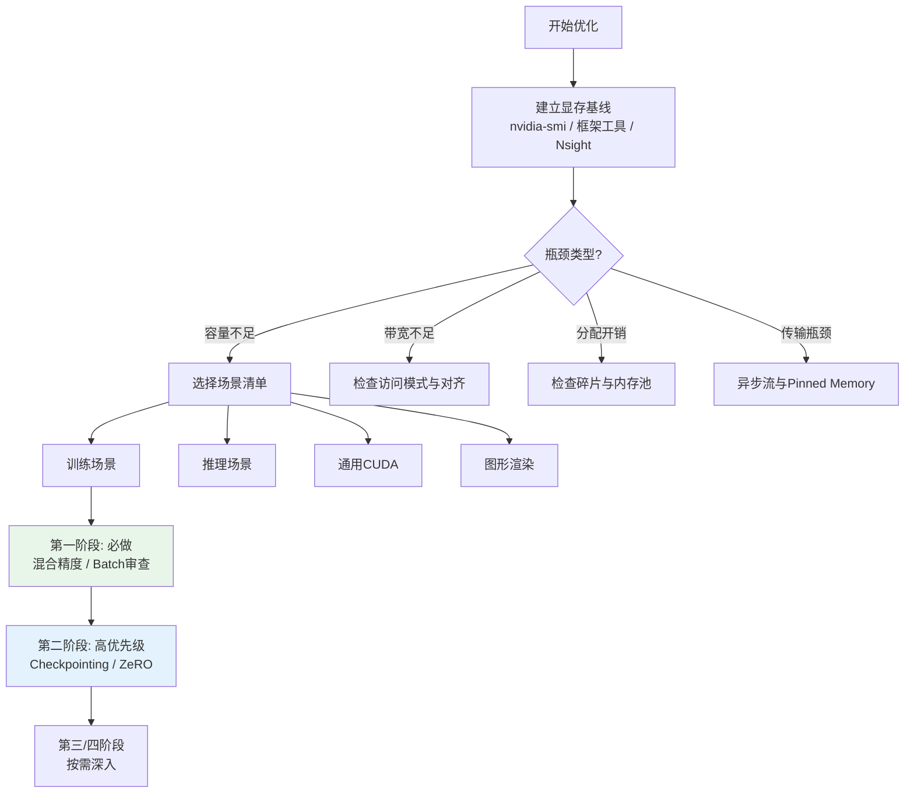

本章将前面20章涵盖的硬件原理、API机制、训练推理优化与排障方法，压缩为四个场景下可直接对照执行的优化清单。这份清单的目标不是重复解释技术原理——混合精度为什么有效、checkpointing如何工作、PagedAttention的内存布局等细节已在各自章节中展开——而是回答一个工程问题：**在有限时间内，按什么顺序、检查哪些事项、做到什么程度**。它适用于代码审查（code review）、设计评审（design review）、上线前检查（pre-launch checklist）以及性能回归时的快速排查。每一项都标注了优先级和对应的详细原理页，供需要深入时跳转阅读。

Sources: [gpu_memory_management_tutorial.md](gpu_memory_management_tutorial.md#L7911-L7924)

## 核心原则：测量与优先级

在展开具体清单之前，必须建立三条元规则。第一，**测量先于优化**：在动用任何策略前，先用`nvidia-smi`、框架内存工具或Nsight确认瓶颈类型是容量、带宽、访问模式还是分配开销。盲目优化不仅无效，还可能引入新的复杂度。第二，**四阶段优先级模型**：将优化动作按"必做→高优先级→按需做→深度优化"四级排序，确保高收益低代价的动作先执行，避免在自定义内存池上耗费精力时却发现batch size还没调对。第三，**单一变量原则**：每次只引入一个重大改动，记录显存和吞吐的变化，否则无法归因。下面的流程图展示了从测量到选择优先级的完整决策路径。

Sources: [gpu_memory_management_tutorial.md](gpu_memory_management_tutorial.md#L7926-L7932)

## 收益/代价矩阵总览

下面的矩阵是整个清单的导航图。它将本章涉及的主要优化策略按收益高低和代价大小分类，帮助你快速判断当前阶段最值得投入的方向。

| 策略 | 收益 | 代价 | 优先级 | 适用场景 |
|:---|:---|:---|:---|:---|
| 混合精度（FP16/BF16） | 高（容量↓50%，带宽↑） | 低（框架开关） | 必做 | 训练、推理 |
| Activation Checkpointing | 高（激活显存↓） | 中（计算↑20-30%） | 高 | 训练（深模型/长序列） |
| ZeRO / FSDP | 高（优化器状态分片） | 中（通信↑） | 高 | 训练（大模型数据并行） |
| 权重量化 / KV Cache量化 | 高（显存↓25-75%） | 中（精度校准） | 高 | 推理 |
| PagedAttention | 高（碎片消除，吞吐↑） | 中（调度复杂度↑） | 高 | 推理（流式服务） |
| 连续批处理 | 高（GPU利用率↑） | 中（调度器重写） | 高 | 推理（在线服务） |
| Gradient Accumulation | 中（单步峰值↓） | 低（超参调整） | 中 | 训练（显存受限） |
| Offload（CPU/NVMe） | 中（突破单卡容量） | 高（速度↓显著） | 中 | 训练（容量硬约束） |
| CUDA Graph捕获 | 中（启动开销↓） | 低（图形态需稳定） | 中 | 训练/推理（稳定图） |
| 自定义内存池 | 中（碎片↓，分配开销↓） | 高（维护成本） | 低 | 通用CUDA（高频分配） |
| 算子融合 | 中（中间激活↓） | 高（kernel开发） | 低 | 训练/推理 |
| 纹理压缩与流送 | 高（纹理显存↓80%+） | 低（工具链支持） | 必做 | 图形渲染 |

Sources: [gpu_memory_management_tutorial.md](gpu_memory_management_tutorial.md#L8027-L8045)

## 训练场景优化清单

### 第一阶段：最高优先级（必做）

训练显存优化的最高优先级动作是"低成本、高覆盖"的基础调整。这四项在任何训练任务启动前都应被检查，即使它们听起来很基础，却是生产环境中最常见的遗漏点。

- [ ] **启用混合精度训练（FP16/BF16）**：在PyTorch中通过`torch.cuda.amp`或`torch.autocast`开启。这不仅将参数、梯度、激活的位宽减半，还降低了带宽压力和分布式通信量。混合精度是现代训练的默认基线，不做它等于主动放弃大量显存和吞吐。详见[训练优化：混合精度、重计算与ZeRO](14-xun-lian-you-hua-hun-he-jing-du-zhong-ji-suan-yu-zero)。
- [ ] **审查batch size是否合理**：batch size不是越大越好。过大的batch会线性增加激活值显存，而吞吐量收益在达到饱和点后迅速递减。找到"显存占用-训练速度"的拐点，而非一味追求极限。
- [ ] **检查并消除意外的大张量或广播膨胀**：某些操作（如广播后的中间张量）会静默创建巨大的临时tensor。通过`torch.profiler`或分配日志检查峰值分配，确认没有形状为`[batch, seq, vocab]`级别的意外张量。
- [ ] **使用框架推荐的默认内存池配置**：在确认是碎片问题前，不要调整PyTorch的`max_split_size_mb`或TensorFlow的allocator策略。过早的调优会掩盖真正的结构问题。

Sources: [gpu_memory_management_tutorial.md](gpu_memory_management_tutorial.md#L7936-L7942)

### 第二阶段：高优先级（通常要做）

当基础调整完成后，如果显存仍然紧张，进入高优先级动作。这一阶段的策略以"用计算或通信换显存"为核心，对深层网络、长序列或大模型训练有决定性作用。

- [ ] **启用activation checkpointing**：当模型较深或序列较长时，激活值通常是显存最大贡献者。通过`torch.utils.checkpoint`或框架内置选项，以约20-30%的重复计算换取激活显存的大幅下降。详见[训练优化：混合精度、重计算与ZeRO](14-xun-lian-you-hua-hun-he-jing-du-zhong-ji-suan-yu-zero)。
- [ ] **评估optimizer state sharding（ZeRO/FSDP）**：大模型训练必做。ZeRO将优化器状态、梯度甚至参数在多卡间分片，使单卡显存从"持有全量"降级为"持有分片"。FSDP是PyTorch中更现代的实现。详见[训练优化：混合精度、重计算与ZeRO](14-xun-lian-you-hua-hun-he-jing-du-zhong-ji-suan-yu-zero)。
- [ ] **检查数据加载器是否产生过大或不均匀的batch**：变长序列的padding策略会导致激活值波动。优先使用长度分桶（bucketing）或动态padding，避免某一步因超长序列而突发OOM。
- [ ] **清理不必要的中间变量和梯度保留**：及时对不需要梯度的张量调用`.detach()`，避免反向图过大。检查是否有变量在循环中被意外累积引用。

Sources: [gpu_memory_management_tutorial.md](gpu_memory_management_tutorial.md#L7943-L7949)

### 第三阶段：中优先级（按需做）与第四阶段：低优先级（深度优化）

当第一、二阶段用尽后，如果显存仍是硬约束，进入按需优化和深度优化。这一阶段的动作代价更高，需要结合具体硬件环境和时间预算评估。

**第三阶段（中优先级，按需做）**：

- [ ] **考虑gradient accumulation**：将逻辑batch拆分为多个micro-batch，多次前向后累积梯度、再执行一次参数更新。这能在有限显存内模拟大batch效果，代价是训练节奏变化和超参需重新调优。
- [ ] **评估offload（CPU/NVMe）**：当显存绝对不足且计算资源有富余时，将优化器状态或fp32主权重offload到CPU内存甚至NVMe SSD。代价是训练速度显著下降，仅在容量为绝对瓶颈时考虑。
- [ ] **检查通信buffer大小**：分布式训练中，NCCL的ring buffer和all-gather/all-reduce的scratch buffer会占用额外显存。在大规模集群中，这部分开销不可忽视。
- [ ] **启用CUDA graph捕获**：如果模型结构稳定（无动态控制流、无变长shape），graph可减少kernel启动开销和框架调度抖动，间接降低临时workspace的峰值。

**第四阶段（低优先级，深度优化）**：

- [ ] **自定义内存池策略**：仅在框架默认分配器已确认成为瓶颈（如`num_alloc_retries`过高）时实施。开发和维护成本高，通常只对高频小分配场景有效。
- [ ] **算子融合减少中间激活**：通过`torch.compile`、Triton或手写CUDA kernel将相邻操作融合，消除中间的读写和存储。收益中等，但开发门槛高。
- [ ] **手动管理大对象生命周期**：对超大张量（如注意力矩阵）实施显式的分配/释放调度，避开框架自动垃圾回收的不确定性。
- [ ] **考虑模型并行或流水线并行的重新划分**：当单卡容量是硬约束且上述手段用尽时，重新设计TP/PP/DP的切分维度。详见[多GPU、多进程与多租户环境](19-duo-gpu-duo-jin-cheng-yu-duo-zu-hu-huan-jing)。

Sources: [gpu_memory_management_tutorial.md](gpu_memory_management_tutorial.md#L7950-L7963)

## 推理场景优化清单

### 第一阶段：最高优先级（必做）

推理优化的起点是建立精确的显存预算模型。与训练不同，推理的显存构成相对静态（权重 + KV cache + 输入输出buffer），但KV cache随序列长度和batch size线性增长，容易成为隐性炸弹。

- [ ] **建立KV cache显存预算与公式估算**：上线前必须完成数学估算。推理峰值显存 ≈ 模型权重 + KV_cache × max_seq_len × batch_size × layers × heads × head_dim × 2(K+V) × 位宽。不要让服务在上线后才发现长请求会爆显存。详见[推理场景GPU内存管理](15-tui-li-chang-jing-gpunei-cun-guan-li)。
- [ ] **检查batch size与延迟/显存的平衡点**：增大batch提升吞吐但线性增加KV cache。找到服务SLA约束下的最优解，而非追求理论最大吞吐。
- [ ] **确认模型权重精度是否可接受**：在FP16、INT8、INT4之间做精度-容量权衡。精度验证应在代表性数据集上完成，而非仅看perplexity。详见[推理优化：量化、分页缓存与连续批处理](16-tui-li-you-hua-liang-hua-fen-ye-huan-cun-yu-lian-xu-pi-chu-li)。

Sources: [gpu_memory_management_tutorial.md](gpu_memory_management_tutorial.md#L7968-L7974)

### 第二阶段：高优先级（通常要做）

当预算模型建立后，高优先级动作聚焦于KV cache效率和请求调度效率。这四项对于高并发流式推理服务几乎是标配。

- [ ] **评估KV cache量化**：对长文本服务，KV cache可占推理显存的50%以上，INT8量化可将其减半。需注意精度衰减和底层kernel支持。详见[推理优化：量化、分页缓存与连续批处理](16-tui-li-you-hua-liang-hua-fen-ye-huan-cun-yu-lian-xu-pi-chu-li)。
- [ ] **使用PagedAttention或等效技术**：流式服务必做。将KV cache从连续预分配改为分页按需分配，消除内部碎片和外部碎片，使batch size不再受最长请求的拖累。详见[推理优化：量化、分页缓存与连续批处理](16-tui-li-you-hua-liang-hua-fen-ye-huan-cun-yu-lian-xu-pi-chu-li)。
- [ ] **启用连续批处理（Continuous Batching）**：在线服务必做。让新请求动态加入正在执行的batch，避免GPU因等待长请求完成而空闲。这是提升GPU时间维度利用率的关键。详见[推理优化：量化、分页缓存与连续批处理](16-tui-li-you-hua-liang-hua-fen-ye-huan-cun-yu-lian-xu-pi-chu-li)。
- [ ] **检查输入长度分布，设置合理的最大长度截断**：过长的tail请求会拖垮整个batch的显存预算。通过截断或拒绝策略保护系统，同时为正常长度的请求保留足够的batch空间。

Sources: [gpu_memory_management_tutorial.md](gpu_memory_management_tutorial.md#L7975-L7981)

### 第三阶段：中优先级（按需做）与第四阶段：低优先级（深度优化）

当流式服务的基础架构已就位，中优先级和低优先级动作指向更细粒度的调度策略和模型结构优化。

**第三阶段（中优先级，按需做）**：

- [ ] **实现请求级别的显存配额和拒绝策略**：当预估显存超过安全水位时提前拒绝新请求，避免级联OOM导致服务完全不可用。
- [ ] **优化prefill/decode调度策略**：分离prefill（计算密集型）和decode（内存密集型）阶段，避免prefill的突发计算峰值干扰decode的稳定延迟。
- [ ] **评估speculative decoding**：用小模型生成草稿、大模型验证，以额外显存和模型管理复杂度换取延迟降低。适合延迟敏感型场景。
- [ ] **长文本场景的KV cache压缩或驱逐策略**：如H2O、StreamingLLM等，在超长上下文中有选择地丢弃历史KV，以可控的精度损失换取长序列支持。

**第四阶段（低优先级，深度优化）**：

- [ ] **自定义kernel减少workspace**：针对特定模型结构手写kernel，消除框架通用kernel的临时buffer开销。
- [ ] **模型结构层面的KV cache优化（GQA/MQA）**：在模型设计阶段采用Grouped-Query或Multi-Query Attention，本质减少KV头的数量，直接降低KV cache基线。
- [ ] **多GPU tensor parallelism的显存优化**：注意all-reduce buffer和中间激活的跨卡分布，确保分片后单卡峰值仍在安全区内。
- [ ] **专用硬件优化策略**：如Grace-Hopper统一内存、TPU的显存管理策略等特殊架构适配。

Sources: [gpu_memory_management_tutorial.md](gpu_memory_management_tutorial.md#L7982-L7994)

## 通用CUDA/C++开发优化清单

通用CUDA开发没有框架为你兜底，每个`cudaMalloc`都是显式契约。以下十项覆盖了从所有权管理到访问效率的完整生命周期，适用于科学计算、视频处理、信号处理等场景。

- [ ] **所有显存分配使用RAII包装**：将`cudaMalloc`/`cudaFree`封装为具有所有权语义的C++对象，禁止拷贝、支持移动语义，确保异常安全路径自动释放。这是防止泄漏和use-after-free的第一道防线。详见[通用CUDA/C++内存设计模式](17-tong-yong-cuda-c-nei-cun-she-ji-mo-shi)。
- [ ] **高频小分配使用内存池**：当存在大量细粒度分配（如每帧创建临时buffer）时，使用`cudaMallocAsync`的内存池或自定义池化分配器，避免驱动级分配开销和碎片。详见[内存池与缓存分配器原理](11-nei-cun-chi-yu-huan-cun-fen-pei-qi-yuan-li)。
- [ ] **主机端pinned memory按需使用**：过度使用`cudaHostAlloc`会挤占操作系统可分页内存，影响整体系统稳定性。仅在H2D/D2H传输频繁且需要与计算重叠时使用。
- [ ] **数据传输与计算重叠**：使用多CUDA stream和`cudaMemcpyAsync`，让内存拷贝与kernel执行并行。注意流之间的同步点，避免不必要的全局同步。
- [ ] **检查内存对齐（256字节或更大）**：不对齐的分配会导致带宽利用率下降，特别是在使用Tensor Core或warp-level操作时。对齐粒度应不小于128字节，推荐256字节。
- [ ] **检查coalescing友好的数据布局**：确保相邻线程访问相邻地址。SoA（Structure of Arrays）通常比AoS（Array of Structures）更容易实现合并访问。详见[访问模式优化：合并访问与局部性](10-fang-wen-mo-shi-you-hua-he-bing-fang-wen-yu-ju-bu-xing)。
- [ ] **区分常驻数据和临时数据的管理策略**：常驻数据（如模型权重、查找表）应长期持有并尽量使用device-local memory；临时数据（如每帧的中间结果）应池化复用或延迟释放。
- [ ] **延迟释放确保异步安全**：在kernel可能仍在使用某块内存时，不要立即释放。使用`cudaEvent`或流同步确认GPU侧使用结束后再归还到池中或释放。
- [ ] **流式数据使用环形缓冲区**：视频处理、信号处理等流式场景中，用ring buffer在固定大小的显存窗口内循环复用，避免动态分配带来的抖动和碎片。
- [ ] **监控分配/释放的日志和统计**：在调试模式下记录每次分配的大小、调用栈和生命周期，用于事后定位泄漏、碎片和异常峰值。

Sources: [gpu_memory_management_tutorial.md](gpu_memory_management_tutorial.md#L7997-L8009)

## 图形渲染优化清单

渲染场景的显存优化围绕"纹理-几何-buffer"三条主线展开，核心思路是"能压则压、能流则流、能复用则复用"。

- [ ] **纹理使用压缩格式（ASTC/BC7/ETC2）**：未压缩纹理（如RGBA8）会占用4倍于压缩格式的显存，且现代GPU对压缩纹理有硬件解压支持，带宽收益显著。移动端优先ASTC/ETC2，桌面端优先BC7。
- [ ] **实施纹理流送和LOD**：根据相机距离和屏幕占比动态加载不同分辨率的mipmap，远距离物体使用低分辨率纹理，避免全分辨率常驻显存。
- [ ] **复用render target和中间buffer**：后处理链中的多个pass往往不需要同时持有各自的输出buffer，通过aliasing或pipeline barrier管理在同一物理显存上分时复用。
- [ ] **使用transient attachment减少全局显存**：在tiling GPU（移动设备）上，将中间attachment标记为transient，让硬件在tile内存内处理而不写回全局显存。这是移动端显存优化的杀手锏。
- [ ] **检查MSAA级别是否过度**：MSAA会成倍增加color/depth buffer的显存占用。在分辨率已经很高或边缘要求不严格的场景下，考虑FXAA、TAA等后处理抗锯齿。
- [ ] **按需选择memory heap**：在Vulkan等显式API中，区分device local、host visible、host cached等不同heap，将资源放在最匹配的物理堆上，避免不必要的拷贝和可见性开销。
- [ ] **监控每帧显存波动和峰值**：帧与帧之间的显存分配应趋于稳定，突发性的显存增长往往意味着某帧创建了未释放的大资源或发生了意外的中间buffer分配。
- [ ] **移动平台特别 aggressively 地控制显存**：移动端GPU的显存与系统内存共享且总量有限，必须实施严格的预算制度、动态质量降级和OOM回退策略。

Sources: [gpu_memory_management_tutorial.md](gpu_memory_management_tutorial.md#L8012-L8023)

## 多GPU与系统环境补充要点

跨多卡和多进程的场景有其特有的显存考量，这些补充要点适用于上述所有场景。

- [ ] **检查NCCL通信buffer的显存占用**：分布式集合通信会在每卡上预留ring buffer和scratch buffer，大集群中的总开销不可忽视。预留显存应纳入单卡预算。
- [ ] **实施进程级显存隔离**：多租户环境中，通过`CUDA_VISIBLE_DEVICES`限制设备可见性，或在支持的硬件上使用MIG（Multi-Instance GPU）实现硬件级显存隔离。一个未隔离的失控进程可能导致整卡OOM。详见[多GPU、多进程与多租户环境](19-duo-gpu-duo-jin-cheng-yu-duo-zu-hu-huan-jing)。
- [ ] **避免跨GPU的张量误引用**：在PyTorch等框架中，`.to(device)`的遗漏或错误device号会导致隐式的D2D拷贝（性能损失）或直接非法访问（崩溃）。在分布式代码审查中重点检查device一致性。
- [ ] **考虑使用MIG切分大容量GPU**：A100/H100等GPU支持MIG，将单卡切分为多个独立实例，每个实例拥有专属的SM和显存带宽保障。这适合多租户推理服务的QoS隔离，但注意MIG实例间不能NVLink直联通信。

Sources: [.zread/wiki/drafts/19-duo-gpu-duo-jin-cheng-yu-duo-zu-hu-huan-jing.md](.zread/wiki/drafts/19-duo-gpu-duo-jin-cheng-yu-duo-zu-hu-huan-jing.md#L160-L174)

## 清单落地执行策略

清单只有在正确的执行流程下才能产生价值。我们建议采用"基线-实验-验证"三步循环。第一步，建立未优化前的显存基线：记录模型权重占用、每步峰值、缓存比例（reserved/allocated）。第二步，按优先级从高到低逐项实施，每次只改动一个变量，记录显存变化和吞吐变化。第三步，使用[排障方法与工具链](21-pai-zhang-fang-fa-yu-gong-ju-lian)中的工具验证效果，确保优化没有引入精度回归、非法访问或稳定性问题。在工程团队中，建议将这份清单嵌入代码审查模板和上线前的设计评审流程中，使显存优化从"救火行为"变为"常规工序"。

Sources: [gpu_memory_management_tutorial.md](gpu_memory_management_tutorial.md#L8040-L8045)

## 本章小结与阅读路径

实战优化清单的本质不是提供"万能配方"，而是建立一套**有优先级、可测量、可验证**的优化工作流。训练场景的核心矛盾是激活值与优化器状态的爆炸，推理场景的核心矛盾是KV cache与服务效率的平衡，通用开发的核心矛盾是分配开销与异步安全，渲染场景的核心矛盾是画质与显存预算的取舍。无论哪个场景，都遵循同样的元规则：先测量确认瓶颈，再按收益/代价排序实施，最后验证实际效果。掌握这份清单后，你已具备将GPU内存管理理论转化为工程实践的能力。

**上一步**：如果你尚未系统了解如何定位显存问题的根因，请先阅读[排障方法与工具链](21-pai-zhang-fang-fa-yu-gong-ju-lian)。

**下一步**：当你需要将分散的知识点压缩为一个统一的心智模型时，请继续阅读[统一心智模型：一切从"账单"出发](23-tong-xin-zhi-mo-xing-qie-cong-zhang-dan-chu-fa)。