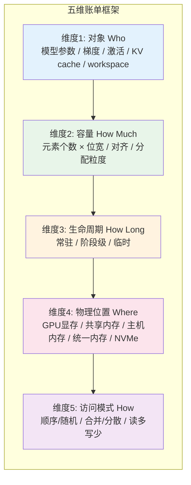

这是整套 GPU 内存管理教程的压轴章。前面的章节分别从硬件层次、地址空间、CUDA 运行时、深度学习框架、图形渲染和多 GPU 环境等角度展开了详尽的技术细节，但初学者在读完这些内容后，常常会面临一个困惑：遇到具体问题时，到底该从哪个角度切入？本章的目标就是消除这种"知识丰富但框架缺失"的状态，把前面 21 章的全部内容压缩成一个极简而统一的心智模型——**五维账单**。掌握了这张"账单"，你就能在面对任何 GPU 内存现象时，快速定位分析维度，做出有依据的决策。

Sources: [gpu_memory_management_tutorial.md](gpu_memory_management_tutorial.md#L8064-L8068)

## 为什么"账单"是一个好的心智模型

GPU 内存管理涉及的概念和工具非常庞杂：寄存器、共享内存、L2、全局显存、页表、UVA、DMA、`cudaMalloc`、内存池、缓存分配器、碎片、带宽、延迟、合并访问、bank conflict、OOM、量化、checkpointing、ZeRO、PagedAttention……如果把这些都当作孤立的知识点去记忆，很容易在真实问题面前迷失方向。

"账单"这个隐喻之所以有效，是因为它把复杂的技术系统还原为一个日常生活中人人熟悉的动作：**查账**。当你查看一张账单时，你会自然地关心五个问题——谁花的、花了多少、花了多久、花在哪儿、怎么花的。这五个问题恰好对应了 GPU 内存管理的五个核心维度。你不需要记住所有 API 和硬件细节，只需要学会对任何显存占用问这五个问题，就能推导出合理的优化方向。

更深层地看，GPU 内存管理的本质不是"记住规则"，而是**在约束条件下做资源分配决策**。无论是深度学习训练中的激活值爆炸，还是推理服务中的 KV cache 膨胀，抑或是 CUDA 程序中的带宽瓶颈，归根结底都是"某种对象在某个位置以某种方式占用了一定量的内存持续了一段时间"。把这句话拆解开来，就是五维账单。

Sources: [gpu_memory_management_tutorial.md](gpu_memory_management_tutorial.md#L8070-L8081)

## 核心结论：五维账单总览

GPU 内存管理的一切问题，都可以从下面五个维度理解：



这五个维度不是孤立 checklist，而是一张**相互关联的分析网络**。对象类型决定了容量计算方式；生命周期决定了能不能复用或释放；位置决定了访问延迟和迁移代价；访问模式决定了带宽能不能被充分利用。任何一个维度的改变，都可能影响其他维度。例如，把对象从 GPU 显存 offload 到 CPU 内存（改变位置），虽然节省了容量，但增加了传输开销和访问延迟，同时访问模式也可能从 device-local 的顺序读变成跨总线的随机读。

Sources: [gpu_memory_management_tutorial.md](gpu_memory_management_tutorial.md#L8085-L8137)

## 逐维详解：从问题到行动

下面这张表把五个维度、各自的子问题以及常见的优化杠杆汇总在一起，作为你分析任何显存问题时的速查框架。

| 维度 | 核心问题 | 子问题清单 | 常见优化杠杆 |
|:---|:---|:---|:---|
| **对象 Who** | 什么在占显存？ | 是模型参数、梯度、优化器状态、激活值、KV cache、workspace、通信 buffer 还是框架开销？ | 减少某类对象的数量或大小；用更高效的算法结构（如 GQA/MQA 减少 KV 头数） |
| **容量 How Much** | 占了多大？ | 元素个数 × 位宽 / 8 是多少？对齐填充浪费了多少？分配器粒度额外消耗了多少？ | 量化（FP32→FP16→INT8→INT4）、压缩、减小 batch size、截断序列长度、优化对齐 |
| **生命周期 How Long** | 占多久？ | 是常驻整个程序、只存在一个 epoch/请求、还是仅一个 kernel/算子？ | activation checkpointing（缩短激活值生命周期）、及时释放、内存复用、分块计算 |
| **位置 Where** | 存在哪儿？ | GPU 全局内存、共享内存、页锁定主机内存、统一内存、NVMe SSD 还是网络存储？ | offload 到 CPU/NVMe、使用统一内存自动迁移、梯度/状态 sharding 到多卡 |
| **访问模式 How** | 怎么访问？ | 顺序还是随机？合并访问还是分散访问？读多写少还是读写均衡？只读还是读写？ | 重构数据布局实现 coalescing、使用共享内存缓存、SoA 替代 AoS、对齐地址 |

这张表最重要的使用方式是**按列提问，按行行动**。当你遇到 OOM 时，先在"对象"列找出最大贡献者；然后在"容量"列判断能否压缩；如果容量压缩不够，再看"生命周期"列能否缩短；如果生命周期也无法缩短，再看"位置"列能否迁移；最后检查"访问模式"列是否把带宽用满。这个顺序也就是下一节决策树的核心逻辑。

Sources: [gpu_memory_management_tutorial.md](gpu_memory_management_tutorial.md#L8087-L8137)

## 实战演练：用五维账单分析三个经典问题

理论的价值在于落地。下面用三个 GPU 开发中最常见的真实问题，演示如何把五维账单转化为具体的诊断和优化动作。

### 例子 1：训练时发生 OOM

当你调高 batch size 或增加模型深度后，训练突然报 Out Of Memory，不要急着直接减半 batch。先用五维账单拆解：

| 维度 | 诊断 | 优化方向 |
|:---|:---|:---|
| **对象** | 通常是激活值（前向传播中间结果）占了大头，其次是优化器状态 | 确认真正的大头，不要凭直觉 |
| **容量** | batch size × 序列长度 × 隐藏维度 × 层数 × 位宽 | 启用混合精度（FP16/BF16）将位宽减半；适当减小 batch size 或序列长度 |
| **生命周期** | 激活值必须在前向期间常驻，直到反向传播用完才能释放 | 使用 activation checkpointing，以重复计算换取激活显存大幅下降；详见[训练优化：混合精度、重计算与ZeRO](14-xun-lian-you-hua-hun-he-jing-du-zhong-ji-suan-yu-zero) |
| **位置** | 默认全部在 GPU 全局内存 | 将优化器状态或 fp32 主权重 offload 到 CPU；使用 ZeRO/FSDP 分片到多卡 |
| **访问模式** | 通常是顺序读写，带宽利用率尚可 | 如果改布局不影响功能，可尝试更 cache-friendly 的数据排布 |

这个例子揭示了一个重要模式：**训练 OOM 的最优解往往不是单一维度的调整，而是"容量压缩 + 生命周期缩短 + 位置迁移"的组合拳**。只做量化可能不够，只做 checkpointing 也可能不够，但三者叠加往往能释放出数倍的空间。

Sources: [gpu_memory_management_tutorial.md](gpu_memory_management_tutorial.md#L8143-L8154)

### 例子 2：推理服务显存不足

在线推理服务中，显存不足的表现往往不是"一启动就爆"，而是"请求一多就爆"或"长上下文一进来就爆"。这通常意味着显存消耗与动态负载强相关。用五维账单分析 KV cache：

| 维度 | 诊断 | 优化方向 |
|:---|:---|:---|
| **对象** | KV cache（缓存历史 token 的 key/value 张量） | 确认是否使用了 GQA/MQA 减少 KV 头数；详见[推理场景GPU内存管理](15-tui-li-chang-jing-gpunei-cun-guan-li) |
| **容量** | 与并发请求数 × 平均序列长度 × 层数 × 头数 × 头维度 × 位宽 成正比 | KV cache 量化（INT8/INT4）可将其减半甚至更少；权重量化也能降低基线 |
| **生命周期** | 从请求开始到请求结束必须保持 | 请求完成立即释放；使用 PagedAttention 将连续预分配改为分页按需分配，避免过度预留；详见[推理优化：量化、分页缓存与连续批处理](16-tui-li-you-hua-liang-hua-fen-ye-huan-cun-yu-lian-xu-pi-chu-li) |
| **位置** | 默认在 GPU 全局内存 | 短请求可尝试 CPU offload（延迟敏感场景慎用）；多卡推理可 tensor parallelism 分片 |
| **访问模式** | 追加写（decode 阶段逐 token 写入）+ 随机读（attention 计算中读取历史 KV） | PagedAttention 把随机读转化为更规则的块级访问；连续批处理提高时间维度利用率 |

推理场景与训练场景有一个关键差异：**训练的生命周期相对确定（一个 epoch 的步数固定），而推理的生命周期完全由用户请求决定**。这意味着推理服务的显存管理更像"动态预算"——你必须为最坏情况（最长序列、最大并发）预留空间，或者用分页和调度技术把最坏情况平滑掉。

Sources: [gpu_memory_management_tutorial.md](gpu_memory_management_tutorial.md#L8156-L8167)

### 例子 3：CUDA 程序带宽利用率低

你的 CUDA kernel 算术操作并不复杂，但执行时间很长，而且增加计算量几乎不影响总时间。这说明程序很可能不是算力受限，而是内存受限。用五维账单分析：

| 维度 | 诊断 | 优化方向 |
|:---|:---|:---|
| **对象** | 输入数据或中间结果 buffer | 检查是否存在不必要的重复拷贝或冗余 buffer |
| **容量** | 数据总量很大 | 考虑数据压缩或在片内缓存子集 |
| **生命周期** | kernel 执行期间 | 无显著优化空间，除非能拆分 kernel 复用 buffer |
| **位置** | GPU 全局内存（延迟高、带宽虽高但需合并访问才能用满） | 将频繁访问的数据缓存到共享内存；确认是否误用了 pageable host memory |
| **访问模式** | 线程访问分散，coalescing 不好；或使用了 AoS 导致跨步访问 | **这是最关键的维度**。重构为 SoA 布局；确保相邻线程访问相邻地址；检查对齐是否达到 128/256 字节；详见[访问模式优化：合并访问与局部性](10-fang-wen-mo-shi-you-hua-he-bing-fang-wen-yu-ju-bu-xing) |

这个例子说明了一个常被忽视的事实：**同样大小的数据、同样的硬件带宽，仅仅因为访问模式不同，性能可能相差数倍甚至一个数量级**。在 CUDA 程序中，当带宽利用率低时，"对象、容量、生命周期、位置"四个维度往往没有明显问题，真正的突破口几乎总是在"访问模式"上。

Sources: [gpu_memory_management_tutorial.md](gpu_memory_management_tutorial.md#L8169-L8180)

## 从五维账单到决策树

把前面的分析逻辑固化为一张可执行的决策树。当你遇到任何 GPU 内存问题时，按下面的顺序逐项排查：

```mermaid
flowchart TD
    A[遇到显存问题] --> B[维度1: 什么对象占最多？]
    B --> C{能否用工具定位？}
    C -->|是| D[用 nvidia-smi / 框架 profiler / Nsight<br/>找出显存占用大头]
    C -->|否| E[检查最近新增的模型结构、batch size 或数据长度]
    D --> F[维度2: 能不能减少容量？]
    E --> F
    F --> G{容量优化空间？}
    G -->|有| H[量化、压缩、减小 batch、截断长度、降低位宽]
    G -->|无/不够| I[维度3: 能不能缩短生命周期？]
    I --> J{生命周期可优化？}
    J -->|有| K[checkpointing、及时释放、内存复用、分块计算]
    J -->|无/不够| L[维度4: 能不能放到更便宜的位置？]
    L --> M{位置可迁移？}
    M -->|有| N[offload到CPU/NVMe、统一内存、梯度/状态sharding]
    M -->|无/不够| O[维度5: 访问模式是否最优？]
    O --> P{访问模式有问题？}
    P -->|是| Q[重构数据布局实现coalescing、使用共享内存、优化对齐]
    P -->|否| R[进入深度排障：检查碎片、同步、框架行为<br/>详见[排障方法与工具链](21-pai-zhang-fang-fa-yu-gong-ju-lian)]

    style H fill:#e8f5e9
    style K fill:#e8f5e9
    style N fill:#e8f5e9
    style Q fill:#e8f5e9
```

这张决策树的核心原则是**先做低成本、高覆盖的优化，再做高成本、定向的优化**。容量压缩（如开混合精度）通常是零代码改动或一行配置的事，生命周期管理（如 checkpointing）需要少量代码调整，位置迁移（如 offload）会引入传输代价，访问模式重构（如改数据布局）可能涉及算法重写。按这个顺序推进，可以确保你在每一层都榨干了潜力，再进入下一层。

Sources: [gpu_memory_management_tutorial.md](gpu_memory_management_tutorial.md#L8184-L8203)

## 一些永恒的权衡

GPU 内存管理中没有免费午餐。每一项优化都伴随着某种代价，理解这些权衡是避免"优化过度"或"方向错误"的关键。下面这张表总结了最常见的六组权衡关系。

| 你想要 | 你可能需要付出 | 适用场景提示 |
|:---|:---|:---|
| **更少显存** | 更多计算（如 checkpointing 重复前向）、更多通信（如 ZeRO 分片）、或更低精度（如 INT8 量化带来的精度损失） | 容量是硬约束时优先做；注意精度和训练稳定性是否可接受 |
| **更快分配** | 更多碎片（粗粒度分配）或更多预留（内存池策略） | 高频小分配场景（如每帧创建 buffer）值得做；低频大分配收益不明显 |
| **更少碎片** | 更复杂的分配策略（如 best-fit、buddy allocator）或更多内部浪费（固定块大小） | 长时间运行服务（如推理服务）需要关注；短期训练脚本可忽略 |
| **更大容量** | 更慢的存储层级（CPU/NVMe 比显存慢 1-2 个数量级）或更多传输（跨总线拷贝） | 大模型训练突破单卡容量时使用；需评估传输是否掩盖计算收益 |
| **更高带宽** | 更严格的数据布局约束（SoA、对齐、合并访问）或更多共享内存管理（手动分块、bank conflict 避免） | 带宽瓶颈已确认时做；如果程序是计算密集型则收益有限 |
| **编程简单** | 运行时自动管理的隐性开销（如统一内存的页迁移、框架缓存分配器的预留） | 原型开发和算法验证阶段完全合理；生产环境需逐步显式化 |

理解这些权衡的目的，不是让你追求"完美"，而是让你追求"适合当前场景的平衡"。例如，在快速验证一个想法时，接受统一内存的隐性开销是完全合理的；但在部署高吞吐推理服务时，手动管理 KV cache 的分页和复用就是必要的。

Sources: [gpu_memory_management_tutorial.md](gpu_memory_management_tutorial.md#L8207-L8220)

## 给不同角色的建议

五维账单是一个通用框架，但不同角色面对的约束和工具链差异很大。下面按四种典型角色给出落地建议。

| 角色 | 核心关注点 | 推荐掌握的深度 | 关键行动 |
|:---|:---|:---|:---|
| **算法研究员** | 模型结构对显存的影响 | 理解对象和容量两个维度即可快速估算 | 在设计新结构时估算参数量和激活显存；了解不同精度、不同注意力结构的显存影响；能和工程团队用"KV cache 占了多少、激活值峰值在哪"这类共同语言讨论资源约束 |
| **系统工程师** | 分配器行为、并行策略、监控工具 | 五个维度全部掌握，尤其精通生命周期、位置和分配开销 | 掌握分配器原理和缓存策略；能定位 OOM、泄漏和性能瓶颈；理解框架底层行为（如 PyTorch caching allocator）和系统行为的差异；熟练使用 Nsight 和框架内存工具 |
| **图形开发者** | 纹理、几何、render target 的预算与复用 | 重点关注对象、容量、生命周期和位置 | 精通现代图形 API 的显存模型（Vulkan heap、D3D12 residency）；掌握纹理压缩（ASTC/BC7）、流送、mipmap 和 render target 复用；能在画质和性能间做可控的 trade-off |
| **全栈开发者** | 从硬件到应用的完整链条 | 建立五维账单的分析习惯，知道什么时候深入、什么时候用框架 | 理解每个决策的跨层影响；在原型阶段接受框架抽象，在部署阶段逐步显式化关键路径；知道什么时候该手写 CUDA，什么时候该用 PyTorch/TensorFlow |

不同角色之间最大的差异在于**需要显式管理的粒度**。算法研究员通常不需要关心 `cudaMalloc` 的内部实现，但需要准确估算激活值峰值；系统工程师必须理解内存池的碎片行为，但可能不需要重写 kernel 的 coalescing 逻辑；图形开发者对纹理压缩和 transient attachment 的精通，在深度学习场景里可能用不上，但在渲染管线里却是基本功。

Sources: [gpu_memory_management_tutorial.md](gpu_memory_management_tutorial.md#L8224-L8248)

## 本章小结与阅读路径

这一章最重要的结论可以归纳为六条：

1. **GPU 内存管理的一切问题都可以从"五维账单"理解**：对象、容量、生命周期、位置、访问模式。任何显存现象，无论看起来多复杂，拆解开来都落在这五个维度里。
2. **遇到问题时的标准排查顺序**：谁占最多 → 能不能减少容量 → 能不能缩短生命周期 → 能不能换位置 → 访问是否最优。这个顺序对应了从低成本到高成本、从高覆盖到定向优化的合理路径。
3. **所有优化都是权衡**：省显存通常要换计算、通信、精度或复杂度。没有免费午餐，关键是根据场景选择可接受的代价。
4. **"账单思维"是跨角色的通用语言**：不管你的角色是算法研究员、系统工程师、图形开发者还是全栈开发者，用五维账单的框架描述问题，都能让团队沟通更高效。
5. **工具和方法会演进，但底层维度是稳定的**：今天流行 PagedAttention，明天可能有新的分配策略，但"对象-容量-生命周期-位置-访问模式"这个分析框架不会改变。
6. **最好的优化是：在正确的时间，对正确的对象，做正确的决策**。这句话看起来是废话，但它强调的是"精准"而不是"全面"——你不需要在每个维度上都做到完美，只需要找到当前瓶颈维度并针对性解决。

**上一步**：如果你需要一份可直接对照执行的优化 checklist，请先阅读[实战优化清单](22-shi-zhan-you-hua-qing-dan)。

**下一步**：当你需要快速查阅术语定义或 CUDA API 用法时，请继续阅读[术语表与API速查手册](24-zhu-yu-biao-yu-apisu-cha-shou-ce)。