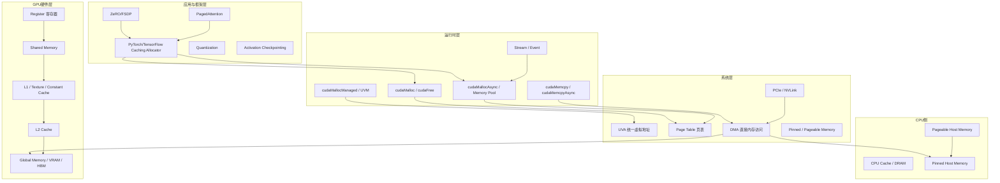

本页是整个教程的"字典"和"命令手册"。当你在阅读其他章节时遇到不熟悉的术语，或者需要在实际编码中快速确认某个 CUDA API 的语义和适用场景时，这里是最快的查阅入口。内容按"概念层"和"工具层"两条主线组织：术语表从硬件到应用逐层展开，API 速查表按功能职责分类，并配有场景化选型建议。建议先通读一遍建立索引印象，日后按需回查。

Sources: [gpu_memory_management_tutorial.md](gpu_memory_management_tutorial.md#L8265-L8304)

## 术语体系全景图

对于初学者，GPU 内存管理中最容易感到混乱的往往不是单个术语本身，而是不知道这些术语分别属于哪一层、彼此之间如何关联。下图将全教程涉及的核心术语映射到五个层次中，帮助你在遇到新概念时快速"定位"：

Sources: [gpu_memory_management_tutorial.md](gpu_memory_management_tutorial.md#L460-L494)

## 按层次组织的术语表

### 硬件与存储介质层

这些术语描述的是物理或近物理层面的存储资源，是理解一切内存行为的根基。

| 术语 | 英文 | 简明解释 |
|---|---|---|
| 显存 / VRAM | Video Memory | GPU 专属的高速内存，用于存储模型参数、激活值、纹理、帧缓冲等。现代 GPU 通常使用 HBM 或 GDDR 技术实现 |
| HBM | High Bandwidth Memory | 高带宽堆叠内存，通过 3D 堆叠和宽总线实现极高带宽，是当前高端 GPU（如 A100、H100）的主流显存技术 |
| GDDR | Graphics DDR | 图形双数据率内存，消费级 GPU（如 RTX 系列）常用的显存类型，带宽低于 HBM 但成本更优 |
| 寄存器 | Register | 每个线程私有的最快存储，容量极小。寄存器用量直接影响 SM 上可同时驻留的线程数（occupancy） |
| 共享内存 | Shared Memory | SM 上的高速片上内存，同一线程块（block）内的线程可共享访问。需手动管理，使用不当会产生 bank conflict |
| L1 缓存 | L1 Cache | 离 SM 执行单元最近的硬件自动缓存层，缓存局部访问的数据。不同架构组织方式不同，不应被理解为"能兜住一切" |
| L2 缓存 | L2 Cache | 整个 GPU 范围内共享的较大缓存层，服务多个 SM 的访存活动，对缓解全局内存带宽压力至关重要 |
| 常量缓存 | Constant Cache | 针对常量内存的只读广播缓存，当同 warp 内多个线程访问同一常量地址时效率极高 |
| 纹理缓存 | Texture Cache | 针对纹理/特殊数据布局优化的只读缓存，适合具有 2D 空间局部性的访问模式 |
| 全局内存 | Global Memory | GPU 上容量最大、延迟最高的内存空间，所有线程均可访问。通常即指代 VRAM |
| SM | Streaming Multiprocessor | 流式多处理器，GPU 的核心计算单元。每个 SM 拥有独立的寄存器文件、共享内存和计算资源 |
| Warp | Warp | 线程束，GPU 调度的基本执行单位（通常 32 个线程为一组）。同 warp 内线程以 SIMT 方式协同执行 |
| Occupancy | Occupancy | 占用率，指某个时刻 SM 上实际驻留的活跃 warp 数与理论上限的比例。受寄存器、共享内存和线程块大小制约 |

Sources: [gpu_memory_management_tutorial.md](gpu_memory_management_tutorial.md#L1405-L1713)

### 系统与地址空间层

这些术语描述的是操作系统、驱动和地址转换层面的概念，是理解"一次分配到底发生了什么"的关键。

| 术语 | 英文 | 简明解释 |
|---|---|---|
| UVA | Unified Virtual Addressing | 统一虚拟地址空间（CUDA 4.0+），使主机和所有设备的指针位于同一虚拟地址空间中，便于判断指针归属 |
| UVM | Unified Virtual Memory | 统一虚拟内存（Pascal+），支持自动页迁移的统一内存模型。由 `cudaMallocManaged` 分配，可在 CPU/GPU 间按需搬移 |
| 零拷贝内存 | Zero-Copy Memory | 将主机页锁定内存映射到设备地址空间，GPU 可直接通过 PCIe/NVLink 访问，无需显式拷贝 |
| 页锁定内存 / 固定内存 | Pinned Memory / Page-Locked Memory | 主机端不能被操作系统换出到磁盘的内存页，支持异步 DMA 传输，是 `cudaMemcpyAsync` 高效工作的前提 |
| 可分页内存 | Pageable Memory | 普通主机内存，可被操作系统换页。不能直接用于 GPU DMA，异步拷贝前需驱动先做一次临时锁定 |
| 页表 | Page Table | 操作系统和 GPU MMU 维护的虚拟地址到物理地址映射表。页表遍历是分配和地址转换的底层机制 |
| TLB | Translation Lookaside Buffer | 地址转换缓存，缓存最近用过的虚拟到物理地址映射，加速地址转换过程 |
| MMU | Memory Management Unit | 内存管理单元，负责虚拟地址到物理地址的转换、页表遍历和访问权限检查 |
| DMA | Direct Memory Access | 直接内存访问，允许 GPU 或其他设备在不占用 CPU 的情况下直接读写主机内存 |
| BAR | Base Address Register | 基地址寄存器，PCIe 设备暴露给主机的内存映射窗口，主机通过 BAR 访问设备显存 |
| IOMMU | Input-Output MMU | 输入输出内存管理单元，为设备 DMA 提供地址转换和隔离，常见于虚拟化和安全场景 |
| NUMA | Non-Uniform Memory Access | 非统一内存访问，多路服务器中不同 CPU socket 到不同内存/GPU 的距离和带宽不一致的架构 |
| PCIe | Peripheral Component Interconnect Express | 主机与 GPU 之间的标准高速互联总线，也是大多数 GPU 与 CPU 通信的物理通道 |
| NVLink | NVLink | NVIDIA 的高速点对点 GPU 互联技术，带宽远高于 PCIe，支持 GPU 间直接访问彼此显存 |

Sources: [gpu_memory_management_tutorial.md](gpu_memory_management_tutorial.md#L1701-L2300)

### 运行时与编程模型层

这些术语是 CUDA 编程中最常遇到的概念，直接关联代码写法。

| 术语 | 英文 | 简明解释 |
|---|---|---|
| Kernel | Kernel | 在 GPU 上执行的函数，由主机端启动，在设备端大量线程上并行执行 |
| 线程块 / Block | Thread Block | CUDA 中线程的组织单元，同 block 内的线程可共享共享内存，可同步 |
| 网格 / Grid | Grid | 由一个或多个 block 组成的 kernel 启动配置，覆盖整个并行计算空间 |
| Stream | Stream | CUDA 流，同一流中的操作按顺序执行，不同流之间可并发。是异步计算和内存拷贝调度的核心机制 |
| Event | Event | CUDA 事件，用于标记流中的某个时间点，可跨流同步和计时 |
| Context | Context | GPU 上下文，是驱动管理设备状态和资源的容器。每个使用 GPU 的进程至少有一个 context |
| 隐式同步 | Implicit Synchronization | 某些 CUDA 操作（如传统 `cudaFree`、默认流操作）会强制等待之前所有设备操作完成，打断流水线 |
| 合并访问 | Coalesced Access | warp 内线程访问连续地址时，硬件将这些访问合并为最少的事务次数，极大提升全局内存带宽利用率 |
| Bank Conflict | Bank Conflict | 共享内存被划分为多个 bank，当同一 warp 中多个线程同时访问同一 bank 的不同地址时产生冲突，导致访问串行化 |
| 内存碎片 | Fragmentation | 空闲内存不连续，导致后续大块分配失败的现象 |
| 内部碎片 | Internal Fragmentation | 已分配内存块内部未被使用的空间（如申请的块比实际需要的大） |
| 外部碎片 | External Fragmentation | 散布在整个地址空间的小块空闲内存，虽然总量足够但无法合并满足大块请求 |
| 内存池 | Memory Pool | 预先向系统申请一大块内存，在内部管理细粒度的分配和回收，减少系统调用和同步开销 |
| RAII | Resource Acquisition Is Initialization | 资源获取即初始化，一种用对象生命周期自动管理资源分配与释放的 C++ 编程惯用法 |

Sources: [gpu_memory_management_tutorial.md](gpu_memory_management_tutorial.md#L2303-L4514)

### 深度学习训练与推理专用术语

这些术语主要出现在训练优化和推理服务章节，是深度学习开发者需要重点掌握的概念。

| 术语 | 英文 | 简明解释 |
|---|---|---|
| 参数 / 权重 | Parameters / Weights | 神经网络的可学习变量，推理和训练都需常驻显存 |
| 梯度 | Gradients | 反向传播中为每个参数计算的导数，仅训练时需要，显存占用通常与参数量同阶 |
| 优化器状态 | Optimizer State | 优化器为每个参数维护的额外统计量（如 Adam 的动量 m 和二阶矩 v），训练显存的重要组成 |
| 激活值 | Activations | 前向传播各层产生的中间结果，反向传播时通常需要复用，是训练显存中最容易爆炸的部分 |
| 混合精度 | Mixed Precision | 训练中使用 FP16/BF16 代替 FP32 进行计算，显存和带宽均可接近减半，需配合损失缩放等技术 |
| Activation Checkpointing | Activation Checkpointing | 前向传播时丢弃部分中间激活，反向传播时重新计算，用更多计算换取更少显存 |
| ZeRO | Zero Redundancy Optimizer | DeepSpeed 提出的优化器状态分片技术，将训练状态从"每卡全持有"改为"多卡协同分摊" |
| FSDP | Fully Sharded Data Parallel | PyTorch 的全分片数据并行，将模型参数、梯度和优化器状态分片到多卡 |
| KV Cache | Key-Value Cache | 自回归 Transformer 推理中缓存历史 token 的 key/value 张量，避免重复计算 |
| PagedAttention | PagedAttention | vLLM 提出的分页式 KV cache 管理技术，借鉴操作系统分页思想解决碎片和过度预留问题 |
| 连续批处理 | Continuous Batching | 推理服务中请求动态进出的批处理策略，新请求可在旧请求完成后立即补位，提升吞吐量 |
| 量化 | Quantization | 用 INT8、INT4 等低位宽表示权重和/或激活，减少存储和计算量，典型如权重量化和 KV cache 量化 |
| GQA / MQA | Grouped-Query Attention / Multi-Query Attention | 多头注意力变体，让多个查询头共享同一组 key/value 头，显著降低推理 KV cache 容量 |
| Data Parallelism | 数据并行 | 每张 GPU 持有完整模型副本，各自处理不同数据子集，定期同步梯度 |
| Tensor Parallelism | 张量并行 | 将单层内的矩阵计算切分到多张 GPU，适合单 layer 参数量过大的场景 |
| Pipeline Parallelism | 流水线并行 | 将不同层分配到不同 GPU，形成计算流水线，可减少单卡模型状态占用 |

Sources: [gpu_memory_management_tutorial.md](gpu_memory_management_tutorial.md#L5251-L6300)

### 多GPU与系统环境术语

| 术语 | 英文 | 简明解释 |
|---|---|---|
| MIG | Multi-Instance GPU | NVIDIA 的 GPU 硬件虚拟化技术，将物理 GPU 切分为多个独立实例，各有独立显存和计算单元 |
| MPS | Multi-Process Service | CUDA 多进程服务，允许多个进程共享同一个 GPU context，减少上下文切换开销 |
| P2P | Peer-to-Peer | GPU 间直接显存访问，当 GPU 通过 NVLink 或支持 P2P 的 PCIe 互联时可启用 |
| Time-Slicing | Time-Slicing | GPU 时间片调度，多个工作负载分时复用同一块 GPU，不如 MIG 隔离性强 |
| TCC / WDDM | Tesla Compute Cluster / Windows Display Driver Model | Windows 下 GPU 的两种驱动模式。TCC 专注计算，WDDM 支持显示输出，TCC 通常更适合计算任务 |
| ECC | Error-Correcting Code | 纠错码内存，可检测并修正显存中的单比特错误，增加稳定性但会占用少量显存 |

Sources: [gpu_memory_management_tutorial.md](gpu_memory_management_tutorial.md#L7184-L7385)

## CUDA 内存 API 速查表

下面的 API 表按功能职责分为五类，每类列出最常见的接口、说明、同步性和典型使用场景。对于初学者，不必一次性记住所有函数，而应该先建立"哪类问题找哪类 API"的条件反射。

### 设备内存分配与释放

| API | 说明 | 同步性 | 典型场景 |
|---|---|---|---|
| `cudaMalloc(void** devPtr, size_t size)` | 分配设备全局内存 | 同步 | 初始化阶段分配长期 buffer，结构简单的程序 |
| `cudaFree(void* devPtr)` | 释放设备内存 | 同步（默认流隐式同步） | 与 `cudaMalloc` 配对，注意释放可能触发隐式同步 |
| `cudaMallocAsync(void** devPtr, size_t size, cudaStream_t stream)` | 异步分配，支持内存池复用 | 异步（指定 stream） | 高吞吐服务、频繁动态分配释放、需与计算流水线配合 |
| `cudaFreeAsync(void* devPtr, cudaStream_t stream)` | 异步释放 | 异步（指定 stream） | 与 `cudaMallocAsync` 配对，减少同步压力 |
| `cudaMallocPitch(void** devPtr, size_t* pitch, size_t width, size_t height)` | 按 pitch 分配 2D 内存 | 同步 | 2D 图像、矩阵等需要行对齐的场景 |
| `cudaMalloc3D(cudaPitchedPtr* pitchedDevPtr, cudaExtent extent)` | 分配 3D 内存 | 同步 | 体数据、3D 纹理等规则多维数据 |
| `cudaMallocManaged(void** devPtr, size_t size, unsigned int flags)` | 分配统一内存（managed memory） | 同步 | 原型开发、减少显式 copy 代码、CPU/GPU 共享访问模型 |

Sources: [gpu_memory_management_tutorial.md](gpu_memory_management_tutorial.md#L8307-L8323)

### 内存传输

| API | 说明 | 同步性 | 关键前提与注意事项 |
|---|---|---|---|
| `cudaMemcpy(void* dst, const void* src, size_t count, cudaMemcpyKind kind)` | 内存拷贝（H2D/D2H/D2D） | 同步 | 最基础的拷贝，调用返回时拷贝已完成 |
| `cudaMemcpyAsync(..., cudaStream_t stream)` | 异步内存拷贝 | 异步 | 主机端内存必须是 pinned memory，否则无法真正异步 |
| `cudaMemcpyPeer(void* dst, int dstDevice, void* src, int srcDevice, size_t count)` | 点对点 GPU 拷贝 | 同步 | 要求 GPU 间支持 P2P 访问 |
| `cudaMemcpyPeerAsync(..., cudaStream_t stream)` | 异步点对点拷贝 | 异步 | 同样需要 P2P 支持 |
| `cudaMemcpy2D(...)` / `cudaMemcpy3D(...)` | 多维数据拷贝 | 同步/异步 | 处理带 pitch 的 2D/3D 数据布局 |
| `cudaMemset(void* devPtr, int value, size_t count)` | 填充设备内存 | 同步 | 常用于初始化 buffer |
| `cudaMemsetAsync(..., cudaStream_t stream)` | 异步填充 | 异步 | 适合在 stream 中与计算重叠 |

Sources: [gpu_memory_management_tutorial.md](gpu_memory_management_tutorial.md#L8324-L8334)

### 主机侧页锁定内存管理

| API | 说明 | 同步性 | 典型场景 |
|---|---|---|---|
| `cudaMallocHost(void** ptr, size_t size)` | 分配页锁定主机内存 | 同步 | 需要高频 H2D/D2H 传输的 buffer |
| `cudaFreeHost(void* ptr)` | 释放页锁定主机内存 | 同步 | 与 `cudaMallocHost` 配对 |
| `cudaHostAlloc(void** ptr, size_t size, unsigned int flags)` | 分配页锁定内存（带标志，如可映射、可写合并） | 同步 | 需要更精细控制 pinned memory 属性时 |
| `cudaHostRegister(void* ptr, size_t size, unsigned int flags)` | 将已有的普通主机内存注册为页锁定 | 同步 | 已有内存无法重新分配，但需要支持 DMA 和异步传输 |
| `cudaHostUnregister(void* ptr)` | 取消注册 | 同步 | 与 `cudaHostRegister` 配对 |

Sources: [gpu_memory_management_tutorial.md](gpu_memory_management_tutorial.md#L8317-L8323)

### 统一内存操作

| API | 说明 | 典型场景 |
|---|---|---|
| `cudaMemPrefetchAsync(const void* devPtr, size_t count, int dstDevice, cudaStream_t stream)` | 异步预取数据到指定设备 | 提前将数据迁移到计算侧，减少访问时的 page fault 延迟 |
| `cudaMemAdvise(const void* devPtr, size_t count, int advice, int device)` | 给统一内存提供访问提示 | 告知运行时某块内存更可能被谁访问、是否只读等，辅助迁移决策 |
| `cudaMemRangeGetAttribute(...)` | 查询内存范围属性 | 调试或性能分析时查看某段 managed memory 的迁移状态 |

Sources: [gpu_memory_management_tutorial.md](gpu_memory_management_tutorial.md#L8335-L8342)

### 内存信息查询与其他

| API | 说明 | 典型场景 |
|---|---|---|
| `cudaMemGetInfo(size_t* free, size_t* total)` | 查询设备空闲/总内存 | 运行前判断是否有足够显存，或动态调整工作负载 |
| `cudaPointerGetAttributes(cudaPointerAttributes* attributes, const void* ptr)` | 查询指针属性 | 判断一个指针是设备指针、主机指针还是统一内存指针 |
| `cudaGraphAddMemAllocNode(...)` | 在 CUDA Graph 中添加内存分配节点 | 使用 CUDA Graph 捕获和重放执行流程时管理内存 |
| `cudaGraphAddMemFreeNode(...)` | 在 CUDA Graph 中添加内存释放节点 | 与分配节点配对，确保 Graph 内内存生命周期正确 |

Sources: [gpu_memory_management_tutorial.md](gpu_memory_management_tutorial.md#L8343-L8356)

## 场景化 API 选型速查

初学者面对众多 API 时最常问的问题是："我现在该用哪个？"下面的决策表按常见工程场景给出推荐组合，并标注需要优先阅读的相关章节。

| 你的场景 | 推荐 API 组合 | 核心关注点 | 延伸阅读 |
|---|---|---|---|
| 初始化阶段分配几个长期存在的大 buffer | `cudaMalloc` + `cudaFree` | 简单直接，分配压力不大 | [内存分配全链路：从cudaMalloc到驱动](7-nei-cun-fen-pei-quan-lian-lu-cong-cudamallocdao-qu-dong) |
| 需要高效主机↔设备数据传输 | `cudaHostAlloc` / `cudaHostRegister` + `cudaMemcpyAsync` | 主机 buffer 必须是 pinned，否则异步拷贝会退化为同步 | [CPU与GPU数据流动机制](8-cpuyu-gpushu-ju-liu-dong-ji-zhi) |
| 想减少手动 copy 代码，快速写通原型 | `cudaMallocManaged` | 以运行时迁移复杂性换开发便利性，不是天然最高性能 | [统一内存UVM机制与代价](12-tong-nei-cun-uvmji-zhi-yu-dai-jie) |
| 高吞吐异步系统，频繁分配释放对象 | `cudaMallocAsync` + `cudaFreeAsync` + Memory Pool | 避免传统分配释放的同步和抖动，适合流式工作负载 | [内存池与缓存分配器原理](11-nei-cun-chi-yu-huan-cun-fen-pei-qi-yuan-li) |
| 二维/三维规则数据（图像、矩阵、体数据） | `cudaMallocPitch` / `cudaMalloc3D` + 对应 memcpy | 布局和对齐本身就是性能问题的一部分 | [CUDA内存API全景与选型](9-cudanei-cun-apiquan-jing-yu-xuan-xing) |
| 多 GPU 间直接交换数据 | `cudaMemcpyPeer` / `cudaMemcpyPeerAsync` | 确认 GPU 拓扑是否支持 P2P（NVLink 或特定 PCIe 配置） | [多GPU、多进程与多租户环境](19-duo-gpu-duo-jin-cheng-yu-duo-zu-hu-huan-jing) |
| 统一内存 + 主动控制数据位置 | `cudaMallocManaged` + `cudaMemPrefetchAsync` + `cudaMemAdvise` | 统一内存高性能使用仍需显式引导迁移策略 | [统一内存UVM机制与代价](12-tong-nei-cun-uvmji-zhi-yu-dai-jie) |

Sources: [gpu_memory_management_tutorial.md](gpu_memory_management_tutorial.md#L4150-L4200)

## 典型场景显存构成速查表

显存占用不是"一个数字"就能说清的。下面按常见场景列出主要构成项及其估算方式，帮助你快速建立"账单"意识。

### 深度学习训练（单卡）

| 组件 | FP32 估算 | FP16/BF16 + Adam | 备注 |
|---|---|---|---|
| 模型参数 | 4 × params | 2 × params | 参数个数 × 每个字节数 |
| 梯度 | 4 × params | 2 × params | 训练特有，推理不需要 |
| 优化器状态 | 8 × params | 12 × params | Adam 的 m/v 状态，常被忽略但很重 |
| 激活值 | 可变 | 可变 | 与 batch size、序列长度、模型结构高度相关 |
| 峰值临时 buffer | 可变 | 可变 | workspace、算子内部临时分配 |
| 框架开销 | 1–2 GB | 1–2 GB | 缓存池、调度状态等 |

Sources: [gpu_memory_management_tutorial.md](gpu_memory_management_tutorial.md#L8359-L8371)

### 深度学习推理（单卡）

| 组件 | FP16 | INT8 权重 | INT4 权重 | 备注 |
|---|---|---|---|---|
| 模型权重 | 2 × params | 1 × params | 0.5 × params | 推理时通常为只读 |
| KV cache | 2 × cache | 2 × cache | 2 × cache | 除非 KV 也量化，否则不变 |
| 输入输出 buffer | 较小 | 较小 | 较小 | token IDs、logits 等 |
| Workspace | 数 GB | 数 GB | 数 GB | 取决于算子实现 |
| 框架开销 | 1–2 GB | 1–2 GB | 调度、队列等 |

Sources: [gpu_memory_management_tutorial.md](gpu_memory_management_tutorial.md#L8372-L8381)

### 通用 CUDA 程序显存结构

| 组件 | 说明 |
|---|---|
| 输入数据 buffer | 主机到设备的传输目标 |
| 输出数据 buffer | 设备到主机的回传源 |
| 中间结果 buffer | kernel 间的传递 buffer |
| 常量数据 buffer | 设备端只读数据 |
| Workspace | 算子内部临时分配 |

Sources: [gpu_memory_management_tutorial.md](gpu_memory_management_tutorial.md#L8394-L8403)

## 常用工具与环境变量速查

### 系统级工具

| 工具/命令 | 用途 | 关键输出 |
|---|---|---|
| `nvidia-smi` | 查看 GPU 整体状态 | Memory-Usage（已用/总量）、GPU-Util、进程列表 |
| `nvidia-smi dmon` | 持续监控 | 按时间序列的 GPU 利用率、显存、温度等 |
| `nvidia-smi pmon` | 按进程监控 | 每个进程的显存占用和计算利用率 |

### CUDA 调试与性能分析工具

| 工具 | 用途 | 典型用法 |
|---|---|---|
| `compute-sanitizer --tool memcheck` | 检测越界访问、未初始化访问 | `compute-sanitizer --tool memcheck ./program` |
| `compute-sanitizer --tool racecheck` | 检测数据竞争 | 排查共享内存或全局内存的竞争问题 |
| `compute-sanitizer --tool synccheck` | 检测同步错误 | 排查 `__syncthreads` 使用不当 |
| Nsight Systems | 系统级时间线分析 | 看 kernel 执行、内存传输、同步点的时间分布 |
| Nsight Compute | Kernel 级微观分析 | 分析带宽利用率、coalescing 效率、cache hit rate |

### 关键环境变量

| 环境变量 | 作用 | 典型使用场景 |
|---|---|---|
| `CUDA_LAUNCH_BLOCKING=1` | 强制所有 kernel 启动同步执行 | 定位异步错误、将崩溃定位到具体 CUDA 调用 |
| `CUDA_VISIBLE_DEVICES=0,1` | 限定进程可见的 GPU 设备 | 多卡服务器上的设备隔离与分配 |

### PyTorch 显存调试（框架级）

| API/命令 | 用途 |
|---|---|
| `torch.cuda.memory_summary(device=0)` | 查看 allocated / reserved / active / fragmentation 详情 |
| `torch.cuda.memory_stats(device=0)` | 字典格式的详细显存统计，适合程序化分析 |
| `torch.cuda.empty_cache()` | 释放当前未使用的缓存显存，用于排查碎片或验证泄漏 |
| `torch.profiler` (with `profile_memory=True`) | 按算子查看显存分配情况 |

Sources: [gpu_memory_management_tutorial.md](gpu_memory_management_tutorial.md#L7705-L7904)

## 面向初学者的使用建议

本页信息量较大，不建议一次性死记硬背。以下是推荐的使用策略：

第一遍浏览时，把重点放在"术语属于哪一层"和"API 属于哪一类"这两个维度上。遇到具体词汇不懂，先回到本页的术语体系全景图，判断它属于硬件层、系统层还是运行时层，再去对应章节找直觉解释。API 选型则直接查"场景化 API 选型速查"表，先建立"遇到什么问题用什么工具"的条件反射，而不是死记函数签名。

当你在实际编码或阅读框架源码时遇到具体困惑，再回来深入查阅对应表格。例如写 kernel 时遇到 shared memory 性能异常，就来查"Bank Conflict"的定义和解决方向；遇到 OOM 但 `nvidia-smi` 显示还有空闲，就来查"内部碎片"与"外部碎片"的区别，并跳到[内存池与缓存分配器原理](11-nei-cun-chi-yu-huan-cun-fen-pei-qi-yuan-li)深入理解。

Sources: [gpu_memory_management_tutorial.md](gpu_memory_management_tutorial.md#L8263-L8264)

## 继续阅读的推荐路径

术语表是"点"的集合，要形成"线"和"面"的理解，建议按以下路径深入：

如果你是**第一次系统学习 GPU 内存管理**，建议回到[五大核心概念速览](3-wu-da-he-xin-gai-nian-su-lan)建立整体认知，再按顺序阅读[GPU硬件内存层次解析](4-gpuying-jian-nei-cun-ceng-ci-jie-xi)和[地址空间、页表与虚拟内存](5-di-zhi-kong-jian-ye-biao-yu-xu-ni-nei-cun)。

如果你**正在写 CUDA 程序并需要选型指导**，下一站的优先阅读顺序是[CUDA内存API全景与选型](9-cudanei-cun-apiquan-jing-yu-xuan-xing)和[通用CUDA/C++内存设计模式](17-tong-yong-cuda-c-nei-cun-she-ji-mo-shi)。

如果你**在做深度学习训练或推理优化**，建议前往[训练场景GPU内存构成分析](13-xun-lian-chang-jing-gpunei-cun-gou-cheng-fen-xi)和[推理场景GPU内存管理](15-tui-li-chang-jing-gpunei-cun-guan-li)，那里有针对模型参数、激活值、KV cache 等具体对象的显存账单拆解。

如果你**遇到了具体的 OOM 或性能问题**，[常见故障与典型误区](20-chang-jian-gu-zhang-yu-dian-xing-wu-qu)和[排障方法与工具链](21-pai-zhang-fang-fa-yu-gong-ju-lian)将提供系统化的排查思路和工具使用指南。